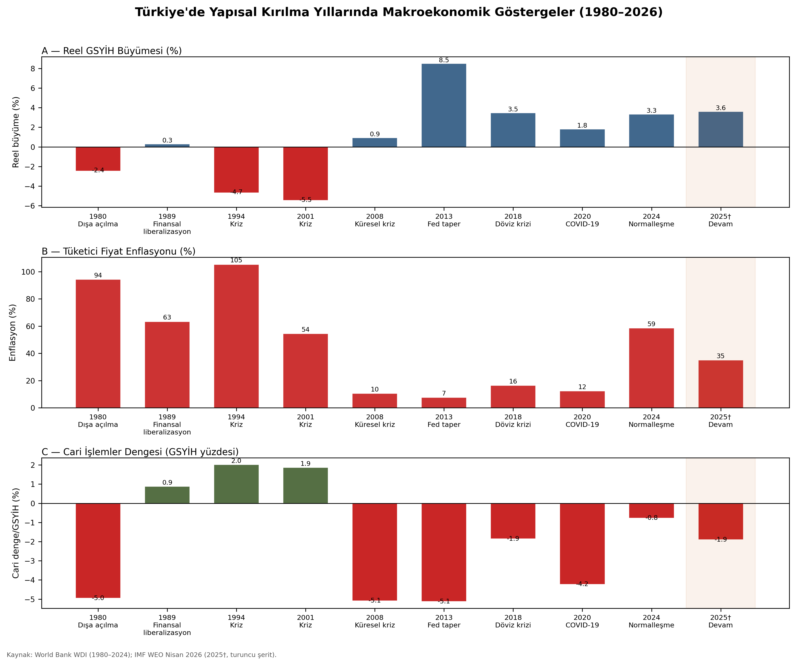
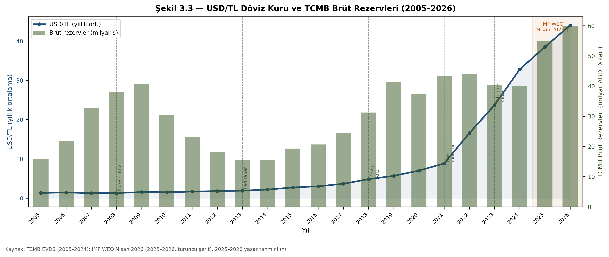
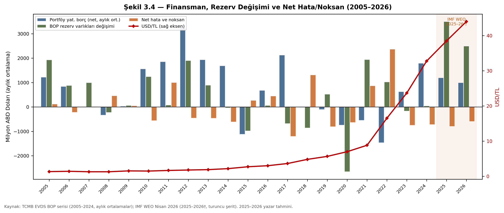

**TÜRKİYE'DE ÖDEMELER DENGESİ DİNAMİKLERİ: 1980 SONRASI DEĞERLENDİRME**

# YEMİN METNİ

# ÖZET

# ABSTRACT

# İÇİNDEKİLER

[YEMİN METNİ [1](#yemin-metni)](#yemin-metni)

[ÖZET [1](#özet)](#özet)

[ABSTRACT [1](#abstract)](#abstract)

[İÇİNDEKİLER [1](#içindekiler)](#içindekiler)

[KISALTMALAR [4](#kisaltmalar)](#kisaltmalar)

[TABLOLAR LİSTESİ [4](#tablolar-listesi)](#tablolar-listesi)

[ŞEKİLLER LİSTESİ [4](#şekiller-listesi)](#şekiller-listesi)

[GİRİŞ [5](#giriş)](#giriş)

[BİRİNCİ BÖLÜM](#birinci-bölüm)

[ÖDEMELER DENGESİ: KAVRAMSAL VE TEORİK ÇERÇEVE](#ödemeler-dengesi-kavramsal-ve-teorik-çerçeve)

[1.1. Ödemeler Dengesi Kavramı [5](#ödemeler-dengesi-kavramı)](#ödemeler-dengesi-kavramı)

[1.2. Ödemeler Bilançosu Özellikleri [6](#ödemeler-bilançosu-özellikleri)](#ödemeler-bilançosu-özellikleri)

[1.3. Ödemeler Dengesinin Yapısı [8](#ödemeler-dengesinin-yapısı)](#ödemeler-dengesinin-yapısı)

[1.3.1. Cari İşlemler Hesabı [8](#cari-işlemler-hesabı)](#cari-işlemler-hesabı)

[1.3.1.1. Dış Ticaret Dengesi Hesabı -- Mal Ticareti [12](#dış-ticaret-dengesi-hesabı-mal-ticareti)](#dış-ticaret-dengesi-hesabı-mal-ticareti)

[1.3.1.2. Hizmetler Dengesi Hesabı -- Hizmet Ticareti [13](#hizmetler-dengesi-hesabı-hizmet-ticareti)](#hizmetler-dengesi-hesabı-hizmet-ticareti)

[1.3.1.3. Gelir Dengesi Hesabı -- Diğer Gelir ve Giderler [13](#gelir-dengesi-hesabı-diğer-gelir-ve-giderler)](#gelir-dengesi-hesabı-diğer-gelir-ve-giderler)

[1.3.1.4. Cari Transferler Hesabı -- Karşılıksız Transferler [14](#cari-transferler-hesabı-karşılıksız-transferler)](#cari-transferler-hesabı-karşılıksız-transferler)

[1.3.2. Sermaye ve Finans Hesabı [14](#sermaye-ve-finans-hesabı)](#sermaye-ve-finans-hesabı)

[1.3.3. Resmi Rezervler Hesabı -- Rezerv Varlıklar [15](#resmi-rezervler-hesabı-rezerv-varlıklar)](#resmi-rezervler-hesabı-rezerv-varlıklar)

[1.3.4. Net Hata ve Noksan Hesabı [15](#net-hata-ve-noksan-hesabı)](#net-hata-ve-noksan-hesabı)

[1.4. Ödemeler Bilançosu Dengesizliklerini Gidermeye Yönelik Politikalar [15](#ödemeler-bilançosu-dengesizliklerini-gidermeye-yönelik-politikalar)](#ödemeler-bilançosu-dengesizliklerini-gidermeye-yönelik-politikalar)

[1.5. Ödemeler Dengesi ile Makroekonomik Değişkenler Arasındaki İlişkiler [18](#ödemeler-dengesi-ile-makroekonomik-değişkenler-arasındaki-ilişkiler)](#ödemeler-dengesi-ile-makroekonomik-değişkenler-arasındaki-ilişkiler)

[1.5.1. Döviz Kuru ve Ödemeler Dengesi [20](#döviz-kuru-ve-ödemeler-dengesi)](#döviz-kuru-ve-ödemeler-dengesi)

[1.5.2. Dış Ticaret Dengesi [23](#dış-ticaret-dengesi)](#dış-ticaret-dengesi)

[1.5.3. Sermaye Hareketleri [24](#sermaye-hareketleri)](#sermaye-hareketleri)

[1.6. Ödemeler Dengesinin Açıklarının Nedenleri [26](#ödemeler-dengesinin-açıklarının-nedenleri)](#ödemeler-dengesinin-açıklarının-nedenleri)

[1.6.1. Yapısal Nedenler [27](#yapısal-nedenler)](#yapısal-nedenler)

[1.6.2. İktisadi Dalgalanmalar [28](#iktisadi-dalgalanmalar)](#iktisadi-dalgalanmalar)

[1.6.3. Geçici Nedenler [29](#geçici-nedenler)](#geçici-nedenler)

[1.6.4. Mali Krizler [29](#mali-krizler)](#mali-krizler)

[1.7. Ödemeler Dengesi ile Bağlantılı Ekonomik Parametreler [30](#ödemeler-dengesi-ile-bağlantılı-ekonomik-parametreler)](#ödemeler-dengesi-ile-bağlantılı-ekonomik-parametreler)

[1.8. Ödemeler Dengesinin Sürdürülebilirliği ve Yapısal Kırılganlıklar [32](#ödemeler-dengesinin-sürdürülebilirliği-ve-yapısal-kırılganlıklar)](#ödemeler-dengesinin-sürdürülebilirliği-ve-yapısal-kırılganlıklar)

[İKİNCİ BÖLÜM](#ikinci-bölüm)

[1980 SONRASI TÜRKİYE EKONOMİSİNDE YAPISAL DÖNÜŞÜM VE DIŞ EKONOMİK AÇILIM](#sonrasi-türkiye-ekonomisinde-yapisal-dönüşüm-ve-diş-ekonomik-açilim)

[2.1. 1980 Sonrası Ekonomi Politikası Uygulamaları [34](#sonrası-ekonomi-politikası-uygulamaları)](#sonrası-ekonomi-politikası-uygulamaları)

[2.1.1. 1980-1987 Döneminde Ekonomi Politikası Uygulamaları [34](#döneminde-ekonomi-politikası-uygulamaları)](#döneminde-ekonomi-politikası-uygulamaları)

[2.1.2. 1988-1990 Döneminde Ekonomi Politikası Uygulamaları [38](#döneminde-ekonomi-politikası-uygulamaları-1)](#döneminde-ekonomi-politikası-uygulamaları-1)

[2.1.3. 1991-1995 Döneminde Ekonomi Politikası Uygulamaları [42](#döneminde-ekonomi-politikası-uygulamaları-2)](#döneminde-ekonomi-politikası-uygulamaları-2)

[2.1.4. 1996-1999 Döneminde Ekonomi Politikası Uygulamaları [45](#döneminde-ekonomi-politikası-uygulamaları-3)](#döneminde-ekonomi-politikası-uygulamaları-3)

[2.1.5. 1996-1999 Döneminde Ekonomi Politikası Uygulamaları [46](#döneminde-ekonomi-politikası-uygulamaları-4)](#döneminde-ekonomi-politikası-uygulamaları-4)

[2.1.6. 2000 Sonrası Dönemde Ekonomi Politikası Uygulamaları [48](#sonrası-dönemde-ekonomi-politikası-uygulamaları)](#sonrası-dönemde-ekonomi-politikası-uygulamaları)

[2.2. İhracata Dayalı Büyüme Modeli ve Dış Ticaret Yapısı [52](#ihracata-dayalı-büyüme-modeli-ve-dış-ticaret-yapısı)](#ihracata-dayalı-büyüme-modeli-ve-dış-ticaret-yapısı)

[2.3. Döviz Kuru Rejimleri ve Kur Politikaları [53](#döviz-kuru-rejimleri-ve-kur-politikaları)](#döviz-kuru-rejimleri-ve-kur-politikaları)

[2.4. Sermaye Hareketlerinin Serbestleştirilmesi [55](#sermaye-hareketlerinin-serbestleştirilmesi)](#sermaye-hareketlerinin-serbestleştirilmesi)

[2.5. Yapısal Dönüşümün Dış Dengeye Etkileri [57](#yapısal-dönüşümün-dış-dengeye-etkileri)](#yapısal-dönüşümün-dış-dengeye-etkileri)

[ÜÇÜNCÜ BÖLÜM](#üçüncü-bölüm)

[TÜRKİYE'DE ÖDEMELER DENGESİ DİNAMİKLERİ (1980--2024)](#türkiyede-ödemeler-dengesi-dinamikleri-19802024)

[DÖRDÜNCÜ BÖLÜM](#dördüncü-bölüm)

[TÜRKİYE'NİN DIŞ DENGESİNDE SÜRDÜRÜLEBİLİRLİK VE YAPISAL SORUNLAR](#türkiyenin-diş-dengesinde-sürdürülebilirlik-ve-yapisal-sorunlar)

[SONUÇ [59](#sonuç)](#sonuç)

[KAYNAKÇA [59](#kaynakça)](#kaynakça)

# KISALTMALAR

# TABLOLAR LİSTESİ

# ŞEKİLLER LİSTESİ

# GİRİŞ

-   Problem Tanımı

-   Araştırmanın Amacı ve Önemi

-   Kapsam ve Sınırlılıklar

-   Yöntem

-   Tezin Yapısı

# BİRİNCİ BÖLÜM

# ÖDEMELER DENGESİ: KAVRAMSAL VE TEORİK ÇERÇEVE

## 1.1. Ödemeler Dengesi Kavramı

Ödemeler dengesi, bir ülkenin ekonomik yapısını yansıtan ve ekonomi içerisindeki işleyişin izlenmesinde merkezi bir rol üstlenen temel göstergelerden biridir. Aynı zamanda bir ülkenin ekonomik gelişmişliğini değerlendirmede kullanılan en kritik ölçütlerden biri olarak kabul edilmektedir. Bu dengelerin düzenlenmesi sürecinde dikkate alınması gereken çeşitli ilke ve kurallar söz konusudur. Bunlar arasında en önemlileri: çift kayıt ilkesi, yerleşiklik ilkesi, mülkiyet değişimi ilkesi ve değerleme ilkesi olarak öne çıkmaktadır (Parlak ve Çinko, 2025). Çift kayıt ilkesine göre, gerçekleştirilen her işlem ödemeler dengesinde hem borç hem de alacak hanesinde olmak üzere çift taraflı biçimde kayda alınır. Bu muhasebe yaklaşımı sayesinde ödemeler bilançosunda daima teorik bir denge sağlanmış olur (Seyidoğlu, 2003).Yerleşiklik ilkesi kapsamında, bir birey hukuken vatandaşlık bağı taşısa dahi, eğer ikametgahı yurtdışında bulunuyorsa ve orada gelir elde ediyorsa, ödemeler dengesi açısından yurtdışında yerleşik kişi olarak değerlendirilir. Bu durum, verilerin derlenmesi aşamasında bazı kayıt dışılıklara ve net hata ve noksan kaleminde sapmalara neden olabilmektedir. Mülkiyet değişimi ilkesi ise herhangi bir ekonomik işlemin ödemeler dengesine dâhil edilebilmesi için, ilgili mal veya paranın mülkiyetinin el değiştirmiş olmasını şart koşar (Türkölmez, 2025). Değerleme ilkesine göre ise, tüm işlemlerin kayıt altına alınmasında işlem bedelleri piyasa koşulları dikkate alınarak belirlenmeli ve tarafların kendi muhasebe kayıtlarında yer verdikleri değere göre yansıtılmalıdır (Cömertler, 2002). Ekonomi literatüründe ödemeler bilançosu, bir devletin belirli bir dönem içerisindeki mal, hizmet ve sermaye hareketlerinden doğan dış gelirleri ile dış dünyaya yönelik yaptığı ödemelerin sistematik biçimde gösterildiği bir mali tablo olarak tanımlanmaktadır. Bu kapsamda, ödemeler bilançosundaki dengesizlikler veya dengeli yapı, ülkenin uluslararası ödeme kapasitesinde meydana gelen bozulma ya da iyileşmeleri doğrudan yansıtır (Sağdıç ve ark., 2020).

## 1.2. Ödemeler Bilançosu Özellikleri

Bankacılık sektörü, tarihsel süreç içerisinde müşterilerinin kredi ihtiyaçlarına cevap vererek finansal açıklarını kapatmalarına aracılık etmiştir. Ödemeler bilançosundaki açıkların finansmanı da tarihsel kökeni olan bir kavram olarak değerlendirilmektedir. Nitekim sermaye hareketleri dengesine ilişkin bakiye ile cari işlemler hesabı bakiyesi arasında belirgin bir yapısal farklılık gözlemlenmektedir. Bu durum, dış ticaret açığı veren ülkelerin açıklarını kapatmak amacıyla sermaye ithalatına yöneldiğini, buna karşın dış ticaret fazlası veren ülkelerin sermaye ihraç ederek fazlalarını değerlendirmeye çalıştıklarını ortaya koymaktadır (Uludağ ve Arıcan, 2003). Ana ülkede yerleşik gerçek veya tüzel kişilerin, yabancı ülkelerde yürüttükleri ekonomik faaliyetlerin düzenli bir şekilde kayda geçirilmesiyle oluşan dokümantasyona ödemeler bilançosu adı verilmektedir (Seyidoğlu, 2003). Ödemeler bilançosu, bir ülkenin diğer ülkelerle olan ekonomik ilişkilerinin özetini sunan ve çeşitli alt hesaplardan oluşan kapsamlı bir yapıya sahiptir. Bu hesaplar arasında **cari işlemler hesabı**, reel ekonomiyle doğrudan ilişkili yapısı dolayısıyla, ve **finans hesabı**, ülkenin dış finansman ihtiyaçlarını ne şekilde karşıladığını göstermesi bakımından, ayrı bir öneme sahiptir (Konuk, 2025).

Türkiye ekonomisi, son yıllarda belirgin şekilde cari açık vermektedir. Ancak bu açıkların, turizm gelirlerindeki artış ve yabancı sermaye girişleriyle telafi edilmesi sayesinde, ödemeler bilançosunda ve buna bağlı olarak döviz kuru piyasasında ciddi bir istikrarsızlık yaşanmamaktadır. Ödemeler bilançosu, bir ülkenin dış ekonomik ilişkilerini kapsamlı biçimde yansıtan ve çeşitli alt bölümlerden oluşan bir muhasebe sistemidir. Temel olarak dört ana bölümden meydana gelir: Cari İşlemler Hesabı, Finans Hesabı, Net Hata ve Noksan Kalemi ile Resmi Rezerv Hareketleri (Ciğerlioğlu, 2025). Bu dört ana bölümden yalnızca Cari İşlemler Hesabı ile Finans Hesabı, kendi içinde alt kategorilere ayrılmaktadır. Cari İşlemler Hesabı; mal ve hizmet ticareti, karşılıksız transferler ve diğer gelir-gider kalemlerini kapsar. Mal ticareti, bir ülkenin ithalat ve ihracat faaliyetlerinden kaynaklanan gelir ve giderleri içerirken; hizmet ticareti, taşımacılık, turizm, sigorta, lisans gibi kalemleri kapsar. Karşılıksız transferler, devletler veya bireyler arasında karşılık beklenmeksizin yapılan para veya mal transferlerini ifade ederken, diğer gelir ve giderler ise yatırım gelirleri gibi çeşitli akımları içerir (Gökçe ve ark., 2025).

Finans Hesabı ise ülkeye giren ve çıkan sermaye hareketlerini sistematik şekilde kayıt altına alır. Bu hesap, doğrudan yatırımlar, portföy yatırımları ve diğer yatırım kalemlerinden oluşur. Doğrudan yatırımlar, şirket satın almaları ya da yeni yatırım girişleri gibi kalıcı sermaye girişlerini yansıtırken; portföy yatırımları, hisse senedi ve tahvil gibi menkul kıymet alım-satımlarını kapsar. Diğer hesaplar, banka kredileri, mevduatlar ve diğer finansal varlık hareketlerini içerir. Net Hata ve Noksan Kalemi, kayıt dışı kalan ya da istatistiksel uyumsuzluklardan kaynaklanan farkların izlendiği bölümdür. Genellikle ödemeler bilançosunun teorik dengesini sağlamak için kullanılan teknik bir kalemdir. Resmi Rezerv Hareketleri, merkez bankasının döviz rezervlerindeki değişiklikleri gösterir. Bu bölüm, genellikle döviz kuru rejimi kapsamında para politikasının yönlendirilmesinde kullanılan rezerv müdahalelerini yansıtır (Aksu ve Emsen, 2018). Bu yapı, ödemeler bilançosunun yalnızca bir muhasebe tablosu olmanın ötesinde, bir ülkenin dış ekonomik ilişkilerinin niteliğini ve dış finansman gereksinimlerini analiz etmede kritik bir araç olduğunu ortaya koymaktadır (Camacho ve Lindstrom, 2021).

Ödemeler bilançosunda yer alan tüm işlemler, ilgili mülkiyet değişiminin gerçekleştiği anda ve söz konusu işlemin piyasa fiyatı üzerinden kaydedilmektedir. Burada kastedilen piyasa fiyatı, işlemin alıcı ve satıcı tarafından karşılıklı olarak kabul edildiği, yani işlemin fiilen gerçekleştiği fiyat düzeyidir (Alkan, 2007). Bu sistemde Cari İşlemler Hesabı, ödemeler bilançosunun en kritik bileşeni olarak öne çıkar. Bu hesapta, mal ve hizmet ticaretine ilişkin akımların yanı sıra, karşılıksız transferler ve diğer gelir-gider kalemleri yer alır. Sermaye hareketleri hesabı ise yabancı ülkelerle yapılan sermaye giriş-çıkışlarını kapsayan finansal işlemleri içermektedir. Net Hata ve Noksan Kalemi ile Resmi Rezervler Hesabı, birlikte ödemeler bilançosunun dengeleme unsurlarını oluşturur. Resmi rezerv hareketleri ise, Merkez Bankası\'nın piyasaya sunduğu veya piyasadan çektiği rezervleri, ayrıca Uluslararası Para Fonu (IMF) ile olan rezerv ilişkilerini içerir (Gerni, Aksu ve Emsen, 2018).

Piyasa koşullarının doğal işleyişi sonucu meydana gelen işlemler, literatürde otonom kalemler olarak tanımlanmaktadır. Cari işlemler ve sermaye hareketleri, ödemeler dengesinin denge durumunu belirleyen başlıca otonom unsurlardır. Bu işlemler doğrudan döviz arz ve talebini etkileyerek bilanço üzerinde ya fazlalık ya da açık oluşmasına neden olurlar. Bu dengenin sağlanması amacıyla yapılan işlemler ise dengeleyici işlemler olarak tanımlanır ve genellikle döviz, altın ya da SDR (Special Drawing Rights -- Özel Çekme Hakları) rezervlerinin kullanımıyla gerçekleştirilir (Dinler, 2000). Ödemeler bilançosunun temel dört kaleminin toplam net bakiyesi, teorik olarak sıfır olmak durumundadır (Akat, 2004). Cari işlemler hesabı, dış ticaret dengesi, taşımacılık, turizm gelirleri, faiz ve kar transferleri, yurtdışı müteahhitlik hizmetleri gibi birçok kalemi içermektedir. Bu hesap, ülkenin toplam döviz gelirleri ile giderlerini yansıtır. Eğer gelirler giderlerden yüksekse cari fazla, tersi durumda ise cari açık oluşur (Jabbour ve Mansour-Ichrakieh, 2025).

Cari işlemler hesabında bir açık söz konusu olduğunda, ödemeler dengesinin korunabilmesi için ya finans hesabında bir fazlanın oluşması, ya da merkez bankası rezervlerinin kullanılması gerekir. Burada dikkat çekilmesi gereken bir diğer husus, açığın finansman yöntemidir (Akat, 2004). Portföy yatırımları ve kredi girişleri, dış borç yükünü artırıcı etkiye sahiptir. Açığın miktarı değil, nasıl finanse edildiği de kritik önem taşımaktadır. Açıkların sağlıklı biçimde finanse edilebilmesi için ithalatın kısıtlanması, ihracatın artırılması ve yurt içi tasarruf oranlarının yükseltilmesi önem arz eder. Uzun vadeli ve sürdürülebilir bir çözüm olarak doğrudan yabancı sermaye yatırımları en uygun alternatifi oluşturur. Bu tür yatırımlar genellikle fiziki altyapıya yöneliktir ve ülkeden geri çekilmeleri oldukça güçtür (Nguyen, Dang, Nguyen ve Dang, 2022). Dış borçlanmaya gerek kalmadan yatırım yapılmasını ve dış denge fazlası verilmesini mümkün kılar

Türkiye örneğinde, küreselleşme süreciyle birlikte uluslararası piyasalara entegre olarak bazı fırsatlardan yararlanılmış; ancak bu sürecin olumsuz etkileriyle de karşı karşıya kalınmıştır. Bu olumsuzluklar, ihracat ve ithalat arasındaki dengenin sağlanamaması sonucunda ortaya çıkmıştır. 2008 küresel ekonomik krizi de, dış ticaret dengesinin ne denli stratejik bir öneme sahip olduğunu gözler önüne sermiştir. Dış ticaret açığı, doğrudan ödemeler bilançosundaki açıkları artırmakta; bu durum ise ekonomik sistemin dış şoklara karşı kırılganlığını ciddi şekilde artırmaktadır. Krizin etkileri en belirgin biçimde, dış ticarete ilişkin değişkenlerde yani ihracat ve ithalat kalemlerinde gözlenmiştir. Küreselleşmenin bir sonucu olarak, gelişmekte olan ülkelere yönelen sermaye akımları büyük ölçüde özel sektör yatırımları lehine yönelmekte; bu durum da kamu eliyle yapılan resmi yatırımların önemini görece olarak azaltmaktadır (Seyidoğlu, 2003).

## 1.3. Ödemeler Dengesinin Yapısı

### 1.3.1. Cari İşlemler Hesabı

Bir ekonomide mal ve hizmet ticareti, faktör gelirleri ve giderleri ile birlikte, yerleşik olanlarla yerleşik olmayanlar arasında gerçekleşen karşılıksız transferlerin kayıt altına alındığı bölüm cari işlemler hesabıdır. Bu hesap, bir ülkenin dış ekonomik ilişkilerini yansıtan ve dış dünya ile olan etkileşiminin derecesini gösteren kritik bir yapıya sahiptir. Özellikle cari işlemler fazlası verilmesi durumunda, ülkenin dış varlıklarında artış yaşanırken; açık söz konusu olduğunda dış yükümlülükler artmakta, yani ülke dış kaynaklara bağımlı hale gelmektedir. Bu değişiklikler, doğrudan yabancı yatırımlar, portföy yatırımları ya da dış borçlanma aracılığıyla dengeye getirilmeye çalışılmaktadır (Al-Malki, Amin ve Ul Hassan, 2024).

Ödemeler dengesi içerisinde cari işlemler hesabı, ekonomide yerleşik kişiler ile yurtdışında yerleşik olanlar arasında gerçekleşen mal, hizmet, birincil gelir (faktör gelirleri) ve karşılıksız transferlere dair işlemleri kapsamaktadır. Bu hesaptaki pozitif veya negatif değişimler, doğrudan tasarruf ve yatırım dengesi üzerinde etkili olmaktadır. Cari işlemler açığı, yurt içi tasarrufların yatırımları finanse etmede yetersiz kaldığını gösterirken; bu farkın kapatılabilmesi için bireylerin yabancı varlıklarını ellerinden çıkarmaları ya da yurtdışından borçlanmaları gerekmektedir. Ancak, sürekli sermaye çıkışları ve artan dış borç yükü, zamanla bu yöntemin sürdürülebilirliğini tehlikeye atabilmekte ve cari açığın yapısal hale gelmesine neden olabilmektedir (Thanh-Minh-Huugh-Hong, 2001). Cari hesap, özünde bir ülkenin diğer tüm ülkelerle arasındaki ekonomik işlemler sonucu ortaya çıkan fon akımlarının sistematik şekilde izlendiği bir kategoridir. Bu fon hareketleri; ihracat ve ithalat kalemleri üzerinden mal ve hizmet ticareti, ayrıca gelir ve gider transferleri şeklinde ortaya çıkar. Böylece, cari hesap bir ülkenin uluslararası ekonomik performansını analiz etmek için temel bir gösterge haline gelmektedir (Madura, 2010).

Cari işlemler açığı, 1990 yılı sonrasında, kalkınmakta olan ülkelerin ekonomik performanslarını değerlendirmede kullanılan temel göstergelerden biri haline gelmiştir. Bu dönemde finansal piyasaların serbestleşmesiyle birlikte, söz konusu ülkelerde cari açık oranlarında gözle görülür artışlar yaşanmış ve bu durum, cari dengenin sürdürülebilirliği tartışmalarını yeniden gündeme taşımıştır. Genel kabul gören görüşe göre, cari açığın GSYİH'nin %5'ini aşması, makroekonomik kırılganlık riskini artırmaktadır. Cari açığın sürdürülebilirliği yalnızca bu orana bağlı değildir; aynı zamanda ihracatın GSYİH'ye oranı, ekonomik büyüme hızı, tasarruf-yatırım dengesi, sermaye hareketlerinin yapısı ve finansman kompozisyonu gibi değişkenler de belirleyici rol oynamaktadır (Batmaz, 2021). Cari İşlemler Dengesi (Current Account Balance -- CAB), ödemeler dengesinin kilit bileşenlerinden biri olup, açık ekonomilerde makroekonomik analizlerin temel referans noktasıdır. CAB, bir ülkenin yerleşikleri ile dış dünya arasındaki cari ödemeleri (dışarıya yapılan ödemeler) ve cari tahsilatları (ülkeye giren gelirler) ölçmektedir. Uluslararası Para Fonu (IMF) tarafından belirlenen tanıma göre, Kariuki (2009) CAB, mal ve hizmetler dengesi, faktör gelirleri ve cari transferlerden oluşmaktadır. Bu hesap, bir ülkenin uluslararası ekonomik ilişkilerdeki durumunu değerlendirmede kullanılan önemli bir göstergedir. Aynı zamanda ulusal tasarruf düzeyini, harcama davranışlarını ve yatırım eğilimlerini yansıtan kritik bir yapıdır (Garcimartín, Marmolejo ve Eggers, 2023).

İktisat literatürü, cari denge açıklarının ekonomi için faydalı mı yoksa zararlı mı olduğu konusunu, bu açıkların arkasında yatan nedenlere bağlı olarak değerlendirmektedir. Örneğin, 1990'lı yılların ortalarında Meksika ve Tayland'da yaşanan finansal krizler, dış finansmanın ani kesilmesi ile doğrudan ilişkilendirilmiştir. Bu ülkelerde görülen yüksek ve sürekli cari açıklar, kontrolsüz ithalat artışı ve düşük ihracat performansı nedeniyle dış finansmanın sürdürülemez hale gelmesine yol açmıştır. Sonuç olarak, bu durum özel tüketimi, kamu harcamalarını ve yatırımları ciddi biçimde baskı altına almış ve ekonomik dengelerde ciddi bozulmalara neden olmuştur (Kariuki, 2009; Ghosh ve Ramakrishnan, 2006). Döviz kuru sistemlerinin yapısı, gelişmekte olan ekonomiler açısından dikkatle değerlendirilmesi gereken bir husustur. Bu ülkelerde arz ve talep esnekliklerinin, gelişmiş ülkelere kıyasla görece düşük olması, dalgalı kur rejiminin gelişmekte olan ekonomilere uygun olmayabileceği yönündeki görüşleri güçlendirmektedir. Olumsuz ticaret hadleri ve küresel ekonomik etkileşimlerden kaynaklanan dışsal şoklar, döviz kurlarında yüksek dalgalanmalara neden olmakta ve bu da cari işlemler dengesizliklerini daha da derinleştirebilmektedir (Kutlar ve Çabukoğlu, 2022).

Cari açıkların ani duruş riski ve yayılma etkileri, makroekonomik istikrar açısından büyük önem taşımaktadır. Deneyimler göstermiştir ki, yüksek cari açık pozisyonlarına sahip ülkelerde, sermaye girişlerinin ani durması ("sudden stop") ciddi finansal bozulmalara yol açabilmektedir (IIF, 2007). Cari denge yalnızca akım verileri ile değil; aynı zamanda dış varlık ve yükümlülüklerin stok düzeyleri, bileşimleri, bu yükümlülüklerin sektörel dağılımı ve ülke ekonomisinin büyüklüğü ile de yakından ilişkilidir. Örneğin, ani duruş senaryosunda bir ülkenin brüt dış borçları ve varlıkları benzer likidite özellikleri taşıyorsa, brüt risklerin önemi azalabilir. Ancak, bu borç ve varlıkların farklı sektörlerde yer alması durumunda, brüt riskler net risklerden daha baskın hale gelir. Örneğin, yerli özel sektörün sahip olduğu yabancı varlıklarla, kamunun yerleşik olmayanlara olan dış borcu farklı sektörel yapılarda yer aldığı için, bu yükümlülüklerin dönüşümünde dengeleyici bir mekanizma kurulması mümkün olmayabilir (Blanchard ve ark., 2010; Lane ve Milesi-Ferretti, 2011; Kaminsky ve Reinhart, 1999).

Cari işlemler dengesi ile bütçe dengesi arasında pozitif bir ilişki olduğunu öne süren yaklaşım, literatürde \"ikiz açık hipotezi\" (Twin Deficit Hypothesis - TDH) olarak adlandırılmaktadır. Bu hipotezin teorik temeli, Mundell-Fleming modeli çerçevesinde geliştirilmiştir. Bu nedenle, bu iki dengenin karşılıklı etkileşimini analiz etmek, makroekonomik politika değerlendirmeleri açısından oldukça önemlidir (Kouassi, Mougoue ve Kymn, 2004).. Cari açık ile bütçe açığı ilişkisini inceleyen başlıca iki teorik çerçeve bulunmaktadır: geleneksel Keynesyen yaklaşım ve Ricardo Denkliği. Keynesyen modele göre, kamu sektörü bütçe açığı verdiğinde, bu açık özel sektörden veya yurtdışından borçlanma yoluyla finanse edilir. Bu borçlanma süreci özel sektör yatırımlarını dışlayarak \"crowding-out\" etkisine neden olabilir. Sonuç olarak, ulusal tasarruf düzeyinin azalması, faiz oranlarında artışa ve döviz kurunun değer kazanmasına yol açar. Yerli para biriminin değerlenmesi ise ihracatı pahalılaştırırken ithalatı cazip hale getirir, bu da ticaret dengesini bozarak cari açığın büyümesine neden olur. Keynesyen absorpsiyon teorisi, bütçe açıklarının iç tüketimi artırarak cari açıkları kötüleştirebileceğini ve bu durumun da ekonominin dış dengesini zayıflatabileceğini savunmaktadır (Özer, 2020).

Cari işlemler ve bütçe açıklarındaki artış, makroekonomik istikrar üzerinde olumsuz etkiler yaratmakta, bu durum aynı zamanda ülkenin kredi notunun düşmesine ve buna bağlı olarak sermaye çıkışlarının hızlanmasına neden olabilmektedir. Söz konusu gelişmeler, dış finansman olanaklarının daralmasına yol açarken, gelişmekte olan ülkelerde ekonomik kırılganlığı artırmaktadır. Artan mali ve cari denge bozulmaları, ülke ekonomisinde makroekonomik dengesizliklerin oluşmasına zemin hazırlar ve bu durum uzun vadeli sürdürülebilir kalkınma hedeflerini sekteye uğratabilir (Baharumshah, Lau ve Khalid, 2006). Bu çerçevede, cari işlemler hesabı, yapısal olarak dört ana alt hesap grubundan oluşmaktadır. Her bir alt hesap, ülkenin dış ekonomik ilişkilerinin farklı yönlerini kapsamlı şekilde analiz etmeye olanak tanır. Dış Ticaret Dengesi Hesabı, bir ülkenin gerçekleştirdiği mal ihracatı ve ithalatı arasındaki farkı yansıtır. Bu hesap, ekonominin dış ticaret performansını doğrudan etkileyen unsurların başında gelir ve cari işlemler dengesinin ana belirleyicilerindendir (Akbayır, 2024).

Hizmetler Dengesi Hesabı, taşımacılık, turizm, sigortacılık, haberleşme ve finansal hizmetler gibi maddi olmayan ekonomik faaliyetlerden kaynaklanan gelir ve giderleri kapsar. Hizmet ihracatının güçlenmesi, cari işlemler hesabına olumlu katkı sağlar. Gelir Dengesi Hesabı, ülkelerin yurtdışından elde ettiği faktör gelirlerini (örneğin yatırım gelirleri, faiz, temettü, ücret) ve yurtdışına yapılan benzeri ödemeleri içerir. Bu hesap, doğrudan yabancı yatırımların ve dış borçların getirdiği yükümlülükleri yansıttığı için gelişmekte olan ülkeler açısından önemli bir analiz aracıdır. Cari Transferler Hesabı, karşılıksız yapılan para transferlerini kapsar. Bu kalem altında bireyler arasında yapılan havaleler, dış yardımlar ve yurtdışında çalışan vatandaşların gönderdikleri dövizler gibi işlemler yer alır. Bu tür transferler, ülkelerin döviz gelirlerini artırarak cari açıkların azaltılmasına katkıda bulunabilir. Hesaplar birlikte değerlendirildiğinde, cari işlemler hesabı sadece bir dış ticaret dengesi göstergesi olmaktan çıkar; aynı zamanda ekonomik yapının dışa açıklığı, finansal dayanıklılığı ve uluslararası entegrasyonu hakkında kapsamlı bilgiler sunan bir analiz aracı niteliği kazanır (Ağaslan, 2025).

#### 1.3.1.1. Dış Ticaret Dengesi Hesabı -- Mal Ticareti

Günümüzde Türkiye ekonomisinin karşı karşıya olduğu temel kırılganlıklardan biri, cari işlemler bilançosunun kronik açık vermeye devam etmesidir. Cari açığın gayrisafi yurt içi hasılaya (GSYH) oranının kalıcı biçimde %4'ün altına indirilememesi, bu sorunun yapısal niteliğini ortaya koymaktadır. Örneğin, cari açık oranı 2011 yılında %--9,7 iken, 2015 yılında dahi ancak %--4,5 seviyesine gerileyebilmiştir. Bu durum, cari işlemler dengesinde görülen bozulmaların büyük ölçüde dış ticaret açıklarından kaynaklandığını göstermektedir. Dış ticaret dengesi, ödemeler bilançosu içinde cari işlemler hesabının en önemli bileşenlerinden biridir. Bu kapsamda, dış ticaret açığının azaltılması amacıyla ihracatın artırılması ve ihracatın ithalatı karşılama oranının yükseltilmesi stratejik öneme sahiptir. Ancak bu hedefe ulaşmada, küresel emtia fiyatlarının, de petrol fiyatlarının seyri gibi geçici etkenler, zaman zaman belirleyici olabilmektedir (Emsen ve Aksu, 2018).

1989 yılından itibaren Türkiye, ithal ikameci dış ticaret politikalarını terk ederek, ihracat odaklı büyüme modelini benimsemiş ve döviz kuru hareketlerinin dış ticaret üzerindeki etkisi, birçok akademik çalışmada ayrıntılı biçimde ele alınmıştır. Bu çalışmaların çoğu, döviz kurlarının ihracat ve ithalat üzerindeki doğrudan ve dolaylı etkilerini analiz etmiş; bazı araştırmalarda ise beklenen etkilerin ortaya çıkmadığı gözlemlenmiştir (Vural, 2016; Bayar vd., 2015). Mal hareketleri, bir ülkenin dış ekonomik ilişkilerinde temel bir yer tutar. Yurtdışına satılan malların parasal değeri ihracat, yurtdışından alınan mallara yapılan ödemeler ise ithalat olarak adlandırılmaktadır. Mal ticareti, çoğu ülke açısından ödemeler bilançosunun önemli bir kısmını oluşturur. Bu oran ülkeden ülkeye değişmekle birlikte, genel olarak ödemeler bilançosunun üçte birini, hatta kimi zaman yarıya yakınını kapsayabilmektedir. İhracat ile ithalat arasındaki fark, dış ticaret dengesini belirler. Ancak bu kavramın taşıdığı önem nedeniyle, zaman zaman ödemeler dengesiyle karıştırılabildiği görülmektedir. Oysa dış ticaret dengesi yalnızca mal hareketlerini ifade ederken, ödemeler dengesi bir ülkenin dış dünya ile olan tüm gelir ve harcama akımlarını kapsayan daha geniş bir çerçevedir (Dinler, 2000; Korkmaz vd., 2015).

Türkiye'nin dış ticareti, küresel rekabet ortamında dalgalanmalara ve belirsizliklere son derece açık bir yapıya sahiptir. Bu süreç, hem iç hem de dış ekonomik faktörlerin etkisiyle şekillenmekte olup, sektör bazında farklılıklar gösterebilmektedir. Cari açığın yapısal karakter taşıması nedeniyle, Türk lirasının dolar ve avro gibi rezerv para birimleri karşısında yaşadığı dalgalanmalar, dış ticaret dengesi üzerinde doğrudan etkili olmaktadır. Türkiye İstatistik Kurumu (TÜİK) verilerine göre, 2015 yılı itibarıyla Almanya, Türkiye'nin en büyük ticaret ortaklarından biridir. Almanya İstatistik Ofisi verileri de Türkiye\'nin, Almanya'nın en yoğun ithalat ve ihracat ilişkisi yürüttüğü ilk 20 ülke arasında yer aldığını göstermektedir. Uluslararası ticaret teorisine göre, ithalat genellikle bir ülkenin kendi ulusal gelirinin bir fonksiyonu, ihracat ise dış ülkelerin gelirlerine bağlıdır. Ayrıca döviz kuru, ithalat üzerinde daha belirleyici bir etkiye sahiptir (Auboin ve Ruta, 2013).

#### 1.3.1.2. Hizmetler Dengesi Hesabı -- Hizmet Ticareti

Bir ülkenin hizmet ihracı ve ithalatı sonucunda ortaya çıkan ödeme akımları, cari işlemler dengesinin hizmetler dengesi kalemi altında yer almaktadır. Bu tür hizmet ticareti işlemleri, ekonomi literatüründe "görünmeyen ticaret" olarak adlandırılmaktadır. İşlemler, fiziksel mal değişimi içermeksizin, taşımacılık, turizm, sigorta, haberleşme, danışmanlık ve finansal hizmetler gibi soyut değer transferlerini kapsar. Hizmetler dengesinin cari açık üzerindeki etkisi, turizm gelirlerinin yüksek olduğu ülkelerde, dış ticaret açığını telafi edici bir unsur olarak önemli hale gelmektedir (Erer, 2023).

#### 1.3.1.3. Gelir Dengesi Hesabı -- Diğer Gelir ve Giderler

Küresel düzeyde finansal raporlama standartlarındaki hızlı gelişmeler, şirket yöneticilerinin finansal analiz süreçlerinde bilanço ile birlikte gelir tablosuna da stratejik bir önem atfetmesine neden olmuştur. Gelir tablosu, yöneticilere işletmenin elde ettiği gelirleri, faaliyet kârlılığını ve verimliliğini analiz etme imkânı sağlarken, aynı zamanda toplam gider kalemlerini de göstermekte ve gelecek dönem planlamalarında önemli bir referans noktası oluşturmaktadır (Akdoğan ve Tenker, 2001). Makro düzeyde değerlendirildiğinde ise, gelir dengesi (birincil gelir hesabı), ülke ekonomisinin yurtdışından elde ettiği veya yurtdışına ödediği gelir akımlarını içermektedir. Bu hesap, finansal sermaye, emek gücü ya da doğal kaynak tahsisi karşılığında sağlanan gelirleri kapsar. Aynı şekilde, bu unsurlar karşılığında yurtdışına yapılan ödemeler de bu kalem altında izlenmektedir (IMF, 2009). Bu kapsamda faiz ödemeleri, kar transferleri, temettüler ve iş gücüne dayalı ücret ödemeleri gibi gelir-gider kalemleri, gelir dengesinin temel bileşenleri arasında yer alır (Emirmahmutoglu ve ark., 2021).

#### 1.3.1.4. Cari Transferler Hesabı -- Karşılıksız Transferler

Cari transferler hesabı, karşılıksız olarak yapılan döviz veya mal transferlerini kapsar. Bu kalem, göçmen işçilerin ülkelerine gönderdikleri döviz havaleleri, dış yardımlar, hibeler ve bağışlar gibi transferleri içerir. Gelişmiş ve gelişmekte olan ülkeler açısından cari açık, makroekonomik dengenin önemli bir göstergesi olarak değerlendirilmekte ve dikkatle izlenmektedir. Her ne kadar cari açık, yurt içi gelirlerin giderlere oranla yetersiz kaldığını gösterse de, bu durum her zaman olumsuz bir gelişme olarak değerlendirilmemelidir. Cari açıkların giderilmesine yönelik uyumlu ve sürdürülebilir politikaların geliştirilmesi, uzun vadede cari fazla elde edilmesini mümkün kılabilir. Bu süreç, dış finansman bağımlılığını azaltmanın yanı sıra, ekonomik yapıdaki disiplinin güçlendirilmesine de katkı sağlayabilir (Sekmen ve Çalışır, 2011).

### 1.3.2. Sermaye ve Finans Hesabı

Türkiye\'de sermaye hareketlerinin serbest bırakılmasının ardından, yoğun sermaye girişlerinin yaşandığı dönemlerde ekonomik canlanma gözlemlenmiştir. Ancak bu canlanma süreçlerinde, büyümenin genellikle yüksek seviyelerde cari açıkla birlikte gerçekleştiği bilinmektedir. Sermaye girişlerinin Türk lirası üzerinde yarattığı değer kazanımı eğilimi, kredi hacmindeki genişleme ile birleştiğinde iç talebin artmasına neden olmuş, üretimin büyük oranda ithal girdilere dayanması da cari işlemler dengesinde ciddi açıkların oluşmasına yol açmıştır (Erdem, 2015). Finans hesabı ile cari işlemler hesabı arasındaki ilişkiyi değerlendirmek açısından, ödemeler dengesi muhasebesi temel bir analiz çerçevesi sunmaktadır. Bu muhasebe anlayışına göre, bir ekonomide cari işlemler hesabı, finans hesabı ve resmi rezerv hareketleri toplamı birbirini dengeleyecek biçimde düzenlenmektedir. Diğer bir ifadeyle, cari işlemler hesabındaki açık ya da fazla, finans hesabındaki hareketler ve merkez bankası rezervlerindeki değişimlerle telafi edilmektedir. Bu denge mantığı, ödemeler dengesinin temel yapısını oluşturmaktadır (Yan, 2005).

### 1.3.3. Resmi Rezervler Hesabı -- Rezerv Varlıklar

Ödemeler dengesinde meydana gelen cari işlemler açıklarının finansmanında doğrudan yabancı yatırımlar ile portföy yatırımları gibi sermaye hareketlerinden; ayrıca krediler, ticari krediler, efektif ve mevduat gibi dış borçlanma araçlarından faydalanılmaktadır. Ancak, söz konusu açıkların bu kaynaklarla karşılanamaması durumunda, gerekli finansman merkez bankalarının sahip olduğu rezerv varlıklar yoluyla sağlanmaktadır (Emirkadı, 2017). Merkez bankalarının rezerv varlık bulundurmasının temel gerekçelerinden biri, ekonomik dalgalanmalara karşı bir güvence mekanizması oluşturmaktır. Finansal belirsizlik dönemlerinde, döviz kurlarındaki dalgalanmaları kontrol altına almak ve piyasaya istikrar kazandırmak amacıyla, merkez bankaları bu rezervleri kullanıma sokmaktadır (Fırat, 2015).

### 1.3.4. Net Hata ve Noksan Hesabı

Bu hesap grubunda yer alan kalemlerin çoğu, doğrudan bir müdahale veya yönlendirme olmaksızın, kendiliğinden ve bağımsız biçimde ortaya çıkan işlemlerden oluşmaktadır. Bu özellik, net hata ve noksan hesabını ödemeler dengesi açısından önemli hale getirmektedir. Bununla birlikte, cari işlemler dengesinin makroekonomik sürdürülebilirlik açısından taşıdığı kritik rol, akademik literatürde de sıklıkla vurgulanmaktadır. Edison (2003) ve Zanghieri (2004), cari işlemler dengesinin gelecekte yaşanabilecek ekonomik krizler konusunda önceden uyarı niteliği taşıdığını belirtmişlerdir. Benzer şekilde, Corsetti ve arkadaşları (1999), cari açıkların boyutunun, ilgili ülkenin ilerleyen dönemlerde karşı karşıya kalabileceği döviz kuru krizlerine dair önemli bir gösterge niteliği taşıdığını ifade etmektedir. Günümüzde ise ticaretin serbestleştirilmesinin ülkelerin ekonomik büyümesini olumlu yönde etkilediği gözlemlenmektedir. Büyüme üzerinde olumlu etkiler yaratırken, dış ticaret dengesinde ortaya çıkan olumsuz yönler, bazı araştırmalarda dikkat çekici şekilde ortaya konmuştur (Göçer, 2011).

## 1.4. Ödemeler Bilançosu Dengesizliklerini Gidermeye Yönelik Politikalar

Bir ülkede ödemeler dengesi açığı gibi dengesizliklerin ortaya çıkması, uluslararası ekonomik ilişkiler açısından ülke ekonomisinin kırılganlığını artıran ve dikkate alınması gereken en önemli göstergelerden biridir. Bu tür dengesizliklerin sürmesi, ekonomik istikrarı tehdit edebileceğinden, kamu otoriteleri genellikle bu tür durumlarda müdahalede bulunarak ödemeler dengesini yeniden dengelemeyi hedefler. Müdahaleler çoğu zaman zaman alıcı olmakla birlikte, ekonomik yapının istikrarını bozmadan ve genellikle birkaç yıla yayılan bir süreçte gerçekleştirilir. Ödemeler dengesindeki bozulmaları gidermek amacıyla izlenen politikalar temelde iki ana gruba ayrılabilir: kamu müdahalesine dayalı politikalar ve piyasa mekanizmasına dayalı politikalar (Ateş ve ark., 2023). Kamu otoritesinin müdahalesine dayanan politikalar, ülke içinde uygulamaya konulan önlemleri içerir. Bu kapsamda maliye politikası, kamu harcamalarının düzenlenmesi aracılığıyla toplam talep ve gelir üzerinde etkili olmaktadır. Bu tür uygulamalarda, harcama çarpanı etkisi ile ekonomideki gelir düzeyinin artırılması hedeflenir. Döviz kurlarının istikrarı korunmaya çalışılır ve üretim faktörlerinin etkin kullanımı sağlanarak dış açıkların azaltılması amaçlanır (Boos, 2024).

Piyasa mekanizmasıyla gerçekleştirilen uyum politikaları ise fiyat ve döviz kuru mekanizmalarının kendi dinamikleriyle devreye girmesini esas alır. Bu doğrultuda, fiyatların ve ücretlerin esnekliği önemli bir rol oynar; çünkü serbestçe belirlenen fiyatlar ve ücretler, ödemeler dengesi üzerinde dengeleyici bir etkide bulunabilir. Ancak bazı durumlarda fiyatlar ve ücretler belirli katılıklara sahip olabilir ve bu durum düzeltici mekanizmaların etkinliğini sınırlayabilir. Ülke dışından uygulanan önlemler de önemli bir politika alanını oluşturmaktadır. Bu tür önlemler arasında döviz kuru ayarlamalarıyla dış dengeyi yeniden tesis etmek, uluslararası piyasalardan borçlanarak geçici finansman sağlamak veya dış yardımlardan yararlanmak gibi seçenekler bulunmaktadır. Döviz kurunun düzeyine yapılan müdahaleler, dış ticaret dengesini etkileme açısından kritik bir araçtır. Ödemeler dengesi açıklarının giderilmesinde izlenen stratejiler hem iç ekonomik yapıyı hem de uluslararası para ve ticaret ilişkilerini dikkate alan çok boyutlu bir yaklaşım gerektirmektedir (Pata ve Ela, 2021).

Ödemeler dengesinde meydana gelen dengesizlikler kimi zaman ekonomik sistemin kendi iç dinamikleri ve otomatik dengeleme mekanizmaları aracılığıyla giderilebilmekte, kimi zaman da ekonomik otoritenin geliştirdiği politikalar yoluyla düzeltilmekte veya dengesizlikler sistem açısından risk unsuru olmaktan çıkarılmaktadır (Ertürk, 1996). Az gelişmiş ülkeler, 20. yüzyılın son çeyreğinde Uluslararası Para Fonu (IMF) ve Dünya Bankası gibi uluslararası finans kuruluşlarının yönlendirmesi ve desteğiyle, yabancı sermaye girişlerini artırmak amacıyla sermaye hareketleri üzerindeki çeşitli kısıtlamaları kaldırarak finansal serbestleşme sürecine girmişlerdir. Bu süreç, küreselleşme, finansal entegrasyon ya da finansal liberalizasyon gibi kavramlarla ifade edilmektedir ve 1990'lı yıllarda oldukça yaygın bir uygulama halini almıştır. Ancak finansal serbestleşme politikalarının kapsamı ve uygulama biçimleri ülkeden ülkeye farklılık göstermektedir. Örneğin, Meksika ve Türkiye yabancı para hareketlerine tam anlamıyla izin verirken, Şili ve Kore gibi bazı ülkelerde belirli sınırlamalar devam etmektedir (Lukauskas ve Minushkin, 2000).

1990'lı yıllarla birlikte uluslararası piyasalarda gözlemlenen küreselleşme eğilimleri doğrultusunda, gelişmekte olan ülkeler de finansal sistemlerini dışa açarak uluslararası sermaye piyasalarıyla entegrasyon çabasına girmişlerdir. Türkiye de bu süreçte sermaye hesabının tam serbestleştirilmesi yönünde karar almış ve bu çerçevede, sermaye hareketleri üzerindeki tüm kontrolleri kaldırarak, yabancı sermayenin ülkeye giriş çıkışını kolaylaştırmıştır. Bu uygulama, Türkiye gibi gelişmekte olan ülkelerde sermaye hareketlerinin serbestliği ile cari işlemler açığı arasındaki ilişkiye dair önemli gözlemler yapılmasına imkân tanımıştır. Nitekim 1990'lı yıllarda yaşanan krizler, serbestleşen sermaye hareketlerinin cari açık üzerinde baskı yarattığını gösterir niteliktedir. Sermayenin serbest dolaşımına olanak tanındığında, yüksek getiri beklentisine sahip yabancı yatırımcılar fonlarını gelişmekte olan ülkelere hızlı ve kolay bir şekilde yönlendirebilmektedir. Ancak bu ülkelerin yeterli finansal derinliğe sahip olmamaları veya etkin bir finansal sistem altyapısı geliştirememeleri, gelen sermayenin üretken yatırımlara yönlendirilmesi konusunda yetersizlik yaratmakta; bu nedenle gelen kaynaklar çoğunlukla tüketim harcamalarına aktarılmakta ve bu durum cari açıkların artmasına neden olmaktadır (Yan, 2007). Türkiye örneğinde, 2014 yılında cari işlemler açığının 38 milyar 851 milyon ABD doları ile oldukça yüksek bir seviyeye ulaştığı; buna karşılık 2019 yılında ise 5 milyar 303 milyon dolarlık bir fazla verildiği görülmektedir. Bu veriler, uluslararası ticaret hacminin artması ve sermaye hareketlerinin gelişmekte olan ülkelere yönelmesinin, hem cari dengeyi hem de sermaye akımlarını etkileyen temel dinamikler haline geldiğini göstermektedir.

Yabancı sermaye girişi, bir yandan sınırlı iç tasarruflara sahip ülkelerde yatırım imkânlarını genişleterek ekonomik büyümeyi desteklerken, diğer yandan bu sermayenin ani ve büyük çaplı hareketleri, finansal kırılganlığı artırarak kriz olasılıklarını da beraberinde getirmektedir. Aynı şekilde, finansal ve ticari liberalleşme uygulamaları iç ekonomik şoklara karşı esneklik sağlasa da, dışsal şoklara karşı duyarlılığı artırmaktadır. Literatürde finans hesabı ile cari işlemler dengesinin, döviz kuru ve faiz oranları gibi çeşitli kanallar aracılığıyla birbirini etkileyebileceği ifade edilmektedir (Erden ve Çağatay, 2011). Ekonomik krizlerin önlenebilmesi için faiz oranları, enflasyon oranı ve kur politikalarının birbirleriyle uyumlu ve dengeli olması gerekmektedir. Bu dengenin hangi düzeyde sağlandığı kadar, dengenin niteliği de önemlidir. Zira yüksek düzeyli ancak istikrarlı bir denge, gelir dağılımında ciddi adaletsizliklere yol açabilir ve bu da toplumsal sorunların ortaya çıkmasına neden olabilir (Kurdaş, 2003).

## **1.5. Ödemeler Dengesi ile Makroekonomik Değişkenler Arasındaki İlişkiler**

Ödemeler dengesi, bir ülkenin belirli bir dönemde diğer ülkelerle gerçekleştirdiği ekonomik işlemlerin sistematik bir kaydıdır. Bu denge, cari işlemler hesabı, sermaye ve finans hesabı ile net hata ve noksan kalemlerinden oluşur. Türkiye gibi gelişmekte olan ülkelerde ödemeler dengesi kalemleri, iç ve dış makroekonomik değişkenlerle doğrudan etkileşim içerisindedir. Bu nedenle, cari açık, döviz kuru, faiz oranı, dış borçlanma, büyüme oranı gibi makroekonomik göstergelerle ödemeler dengesi arasındaki karşılıklı ilişkiler, ekonomi politikalarının etkinliği açısından büyük önem arz etmektedir (Seyidoğlu, 2015).

**Cari Açığın Yapısal Nedenleri:** Türkiye'nin ödemeler dengesindeki en kronik sorunlardan biri olan **cari işlemler açığı**, uzun yıllardır yapısal nitelik taşımaktadır. Bu açık, yüksek ithalat bağımlılığı, enerji faturasının büyüklüğü, katma değeri düşük ihracat yapısı ve yetersiz tasarruf oranlarından kaynaklanmaktadır (Irmak, 2022; Konak, 2018; Kaya, 2016). Altunöz (2021), cari açığın aynı zamanda kredi genişlemesiyle de tetiklendiğini ortaya koymuş ve sınır testi yaklaşımıyla iç talep artışlarının dış dengeyi bozduğunu göstermiştir. Bu kapsamda, cari açığın sadece dış ticaret açığına indirgenemeyeceği, daha geniş bir ekonomik yapının sonucu olduğu görülmektedir.

**Dış Borçlanma ve Sürdürülebilirlik:** Cari işlemler açığını finanse etmenin başlıca yollarından biri dış borçlanmadır. Ancak Türkiye\'nin dış borç yükü, borç sürdürülebilirliği açısından zaman zaman riskli seviyelere ulaşmaktadır. Ergün (2021), dış borçlanmanın sınırlarının ve sürdürülebilirliğinin ülkenin döviz kazandırıcı kapasitesi ve ekonomik büyüme oranlarıyla uyumlu olması gerektiğini vurgulamaktadır. Aksi takdirde, kısa vadeli dış borçların çevrilmesi zorlaşmakta, bu da finansal kırılganlıkları artırmaktadır (Orhangazi, 2019).

**Net Hata ve Noksan Kaleminin Belirsizliği:** Ödemeler dengesi analizlerinde dikkat çeken bir diğer unsur ise **net hata ve noksan kalemidir**. Türkiye'de bu kalem genellikle yüksek pozitif değerler göstermekte, bu da kaynağı tam olarak izlenemeyen sermaye girişlerinin varlığına işaret etmektedir. Keşap ve Sandalcılar (2021), Türkiye örneğinde bu kalemin döviz piyasalarındaki spekülatif davranışlar, kayıt dışı para transferleri ve rezerv yönetimiyle ilişkili olabileceğini ortaya koymuştur. Bu durum, ödemeler dengesi istikrarı açısından bir belirsizlik unsuru olarak değerlendirilmektedir.

**Dış Ticaret Yapısı ve Teknolojik Yetersizlikler:** Cari açığın ve ödemeler dengesi dengesizliklerinin bir diğer nedeni de Türkiye'nin dış ticaret kompozisyonudur. Ülkenin ihracatı ağırlıklı olarak düşük ve orta teknolojili ürünlerden oluşurken, ithalatı yüksek teknolojili ara mallara dayanmaktadır. Ege ve Ege (2017), Türkiye'nin teknolojik üretim kapasitesinin zayıflığının, cari açık üzerinde yapısal bir baskı oluşturduğunu ileri sürmektedir. İhracatta katma değeri yüksek sektörlerin geliştirilmesi, dış ticaret açığının azaltılması için kritik öneme sahiptir (Eşiyok, 2014).

**Finansal Liberalizasyon ve Cari Denge:** 1980 sonrası dönemde Türkiye'de uygulanan finansal ve ticari liberalizasyon politikaları, ödemeler dengesinin yapısal dönüşümüne neden olmuştur. Kısa vadeli sermaye hareketlerine dayalı büyüme modeli, cari açığı finanse etmeyi kolaylaştırmış, ancak aynı zamanda dış şoklara karşı duyarlılığı artırmıştır (Çetin ve Savrul, 2016; Kar ve Kara, 2003). Bu çerçevede, sermaye hareketleri ve cari açık arasındaki ilişki, yalnızca ekonomik göstergelerle değil, aynı zamanda uygulanan makroekonomik rejimle de yakından ilgilidir.

**Küresel Kırılganlıklar ve Ekonomik Krizler:** Türkiye'nin ödemeler dengesi performansı, küresel finansal kırılganlıklarla da şekillenmektedir. Orhangazi (2019), Türkiye ekonomisinin yapısal zayıflıkları ile finansal küreselleşmenin riskli boyutları arasında doğrudan bağ kurarak, krizlerin genellikle dış finansman bağımlılığı ve spekülatif sermaye hareketleriyle tetiklendiğini ifade etmektedir. Kar ve Kara (2003) ise 1994, 2001 ve 2008 krizlerini sermaye hareketleri ve ödemeler dengesi üzerinden analiz etmiş, kısa vadeli sermaye akımlarının kriz tetikleyici rolüne dikkat çekmiştir.

**Turizm, Hizmet Gelirleri ve Döviz Kazanımı:** Ödemeler dengesi içerisinde hizmetler kalemi, turizm gelirleri açısından Türkiye için olumlu katkılar sunmaktadır. Gülbahar (2008), 1980 sonrası dönemde turizmin döviz kazandırıcı etkisinin cari açığın azaltılmasında önemli rol oynadığını ortaya koymuştur. Ancak bu gelirin mevsimselliği ve kriz dönemlerinde ani düşüş gösterebilme riski, hizmet gelirlerinin ödemeler dengesine katkısını sınırlı kılabilmektedir.

**Tasarruf-Yatırım Açığı ve Büyüme İlişkisi:** Türkiye'de yetersiz iç tasarruflar, yatırım ihtiyacının dış kaynaklarla karşılanmasını zorunlu kılmakta, bu da cari işlemler açığını ve dış borçlanmayı artırmaktadır. Göçer ve Akın (2016), kırılgan beşli ülkeler özelinde yaptıkları analizde, tasarruf-yatırım açığının sürdürülebilir büyümenin önündeki engellerden biri olduğunu vurgulamaktadır. Türkiye'nin de içinde yer aldığı bu analiz, yüksek büyüme hedeflerinin iç kaynaklarla desteklenmeden sürdürülebilir olmadığını ortaya koymaktadır.

**Bölgesel ve Mekânsal Farklılıklar:** Ödemeler dengesi ve dış ticaret dinamikleri, Türkiye'nin bölgesel yapısıyla da yakından ilgilidir. Özaslan (2006), dışa açılma sürecinin Türkiye'de mekânsal eşitsizlikleri derinleştirdiğini, sanayinin belirli bölgelerde yoğunlaşmasının dış ticaret performansını etkilediğini belirtmektedir. Bu farklılıklar, dış ticaret ve döviz kazançlarının coğrafi olarak dengesiz dağılmasına ve dolaylı olarak ödemeler dengesi performansına yansımaktadır. Genel olarak Türkiye\'nin ödemeler dengesi, cari açık, dış borçlanma, sermaye hareketleri ve dış ticaret yapısı gibi makroekonomik değişkenlerle iç içe geçmiş çok boyutlu bir yapıya sahiptir. Cari açığın yapısal nedenleri, yetersiz tasarruflar ve düşük teknolojili üretim yapısı gibi içsel faktörlerle; küresel dalgalanmalar ve sermaye hareketleri gibi dışsal faktörlerin etkileşimiyle derinleşmektedir. Ödemeler dengesinde kalıcı bir iyileşme sağlamak için yapısal reformlara, üretim yapısının dönüşümüne ve dış finansman bağımlılığının azaltılmasına ihtiyaç vardır (Aydın ve Beşballı, 2018).

### 1.5.1. Döviz Kuru ve Ödemeler Dengesi

Ödemeler dengesi, bir ülkenin yerleşikleri ile diğer ülkelerdeki yerleşik olmayan ekonomik aktörler arasında gerçekleşen mal ve finansal varlık temelli işlemlerin sistematik kaydını ifade etmektedir (Froyen, 2009). Bu kapsamda, cari işlemler hesabı; ödemeler dengesinin temel bileşenlerinden biri olarak mal ve hizmet ticaretini ile transfer ödemelerini kapsayan kalemleri içermektedir. Bu kalemler genel olarak dış ticaret işlemleri, hizmetler dengesi ve net transferlerden oluşmaktadır (Abdilabekov ve Kaleci, 2020). Döviz kuru ise, bir ülke parasının başka bir ülke parası cinsinden ifade edilen karşılığıdır. Bu tanım çerçevesinde döviz kuru, ulusal paranın yabancı para birimleri karşısındaki değerini belirlemekte kullanılır (Dornbusch, 2007). Döviz kuru ile cari işlemler hesabının doğrudan yerleşik olmayan ekonomik birimler üzerinden şekillenmesi, bu iki değişken arasında yapısal bir ilişkinin varlığına işaret etmektedir. Dolayısıyla, bu ilişkinin yönü ve niteliğinin analiz edilmesi, dışa açık ekonomilerin sürdürülebilir makroekonomik yapılar oluşturabilmeleri açısından büyük önem taşımaktadır. Bu analizin sağlıklı yapılabilmesi için döviz kuru rejimi farklılıklarının da dikkate alınması gerekmektedir. Zira 1970'li yıllara kadar dünyada yaygın biçimde uygulanan sabit kur sistemleri ile günümüzde çoğunlukla gelişmiş ülkeler tarafından benimsenen esnek döviz kuru sistemleri arasında önemli farklılıklar söz konusudur (Geopolitical Risk Index, 2025).

Sabit kur rejimi uygulandığında, merkez bankası döviz kurunu belirli bir seviyede sabit tutmak amacıyla döviz piyasasına müdahalede bulunur (Froyen, 2009). Bu müdahalenin kapsamı, ödemeler dengesindeki gelişmelere bağlıdır. Örneğin, cari işlemler açığının oluşması halinde piyasada döviz arzı talebi karşılayamadığında, merkez bankası piyasaya döviz satar. Buna karşın, döviz fazlası oluşması durumunda merkez bankası piyasadan döviz satın alır (Dornbusch, 2007). Esnek kur rejimi ise iki ana biçimde karşımıza çıkar: \"temiz dalgalı kur\" ve \"yönetilen (kirli) dalgalı kur\" rejimleri. Temiz dalgalı kur sisteminde merkez bankası döviz piyasalarına hiçbir şekilde müdahale etmez; döviz kuru, arz ve talep koşullarına göre serbestçe belirlenir. Bu rejimde teorik olarak cari işlemler dengesi sürekli sıfırda kalır; yani ne açık ne de fazla söz konusudur. Öte yandan, yönetilen dalgalı kur sisteminde merkez bankası, belirli ekonomik göstergeler ışığında döviz piyasasına müdahalede bulunabilir. Bu müdahale gerekçeleri genellikle sabit kur sistemindekilere benzerlik göstermektedir (Dornbusch, 2007).

Döviz kuru ile cari işlemler dengesi arasındaki etkileşimi açıklamaya çalışan önemli yaklaşımlardan biri **J-**eğrisi teorisidir. Bu yaklaşıma göre, ulusal para biriminde meydana gelen değer kaybı ilk etapta dış ticaret dengesini olumsuz etkileyebilir; ancak zamanla bu etkinin tersine dönmesi beklenir (Yücel, 2006). Başlangıçta ihracat fiyatlarının düşmesi ve ithalat maliyetlerinin artması, ithalatı pahalılaştırırken ihracat gelirlerinin sınırlı artmasına neden olur. Taşıma sürecinde olan mallar ve mevcut sözleşmeler nedeniyle dış ticaret dengesini geçici olarak bozabilir. Ancak zamanla bu sözleşmelerin yenilenmesi ve fiyat mekanizmasının işlemesiyle birlikte ihracat malları yabancı alıcılar açısından daha ucuz hale gelir ve talep artar. İthalat mallarının yurt içinde daha pahalı hale gelmesi, yerli mallara olan talebi artırarak ithalatı sınırlandırır. Cari denge, başlangıçtaki bozulmanın ardından iyileşme sürecine girer (Kutlar ve Çabukoğlu, 2022).

Cari işlemler dengesi ile döviz kuru arasındaki ilişkiyi açıklamaya çalışan teorik yaklaşımlar arasında, literatürde oldukça önemli bir yer edinen J-eğrisi modeline alternatif olarak Backus ve arkadaşları (1994), bu modeli geliştiren ve genişleten S-eğrisi yaklaşımını önermiştir. Bu çerçevede, ulusal para biriminin değer kaybettiği dönemle birlikte, bu değer kaybından önceki zaman dilimi de analiz kapsamına dâhil edilmiştir. Söz konusu yaklaşıma göre, cari reel döviz kurundaki yükselişlerin, gelecek dönemlerdeki dış ticaret dengesi üzerinde pozitif, geçmiş dönem dış ticaret dengesi üzerinde ise negatif bir etkisinin olduğu ileri sürülmektedir. Bu durum, geçmişte verilen dış ticaret fazlalarının döviz kuru üzerinde aşağı yönlü bir etki oluşturması; benzer şekilde geçmiş dönem açıklarının ise döviz kurunda yukarı yönlü baskı yaratmasıyla açıklanmaktadır. Reel döviz kuru ile cari işlemler dengesi arasındaki etkileşimi değerlendiren bir diğer temel yaklaşım ise Marshall--Lerner (M-L) koşuludur. Uzun vadeli etkileri esas alan bu teori, dış ticaret dengesinin, ithalat ve ihracat talep esnekliklerine bağlı olarak döviz kuru değişimlerine verdiği tepkileri inceler. M-L koşuluna göre, ulusal paranın değer kaybetmesinin dış ticaret dengesi üzerinde olumlu bir etkisinin olabilmesi için, ithalata olan iç talep esnekliği ile ihracata olan dış talep esnekliğinin toplamının en az bir olması gerekmektedir. Ancak bu şart sağlandığında, uzun vadede dış ticaret dengesinde iyileşme meydana gelmesi mümkün olmaktadır (Akkay, 2012).

Döviz kuru ile cari işlemler dengesi arasındaki ilişki, iktisat literatüründe uzun süredir incelenen konular arasında yer almaktadır. Konuya yönelik ilk teorik katkıların 1950'li yıllarda ortaya çıktığı görülmektedir. Harberger (1950), Alexander (1952) ve Salter (1959) bu konuda öncü çalışmalara imza atmışlardır. 1960'lı yıllarda ise Robert A. Mundell (1961, 1963, 1968) ve Marcus J. Fleming (1962), döviz kuru sistemleri, sermaye hareketliliği ve ödemeler dengesi üzerine geliştirdikleri modellerle literatürde önemli bir etki yaratmışlardır. Ancak, bu dönemde dünya genelinde sabit kur rejimlerinin hâkim olması ve dış ticaretin henüz sınırlı düzeyde gelişmiş olması nedeniyle konuya ilişkin çalışmaların kapsamı görece sınırlı kalmıştır.

1970'li yıllardan itibaren ise sabit döviz kuru sistemlerinden esnek kur sistemlerine geçilmesi, dış ticaret hacminin genişlemesi ve ekonometrik analiz yöntemlerinin iktisat disiplini içinde daha fazla yer bulmasıyla birlikte, döviz kuru ile cari işlemler dengesi arasındaki ilişkiyi analiz eden ampirik çalışmaların sayısında kayda değer bir artış yaşanmıştır. Bu dönemde Rudiger Dornbusch (1973a, 1973b, 1974, 1976a, 1976b, 1980), M. Mussa (1976a, 1976b, 1979) ve J. A. Frenkel (1971, 1976) tarafından yapılan çalışmalar, ilgili literatürü derinleştirmiş ve günümüzde bu alanda kabul gören temel referanslardan bazılarını oluşturmuştur.

### **1.5.2. Dış Ticaret Dengesi**

Dış ticaret dengesi, bir ülkenin mal ve hizmet ihracatı ile ithalatı arasındaki farkı ifade eden temel bir makroekonomik göstergedir. Bu gösterge, ödemeler dengesinin cari işlemler hesabı içerisinde kritik bir rol oynamakta olup, ülkenin uluslararası ekonomik ilişkilerdeki rekabetçiliğini ve dışa bağımlılığını ortaya koyar. Türkiye ekonomisi özelinde dış ticaret dengesi, döviz kuru hareketleri, enflasyon dinamikleri, doğrudan yabancı yatırımlar ve iç talep gibi birçok faktörden etkilenmektedir (Ciğerlioğlu, 2025). Türkiye\'nin dış ticaret dengesi zaman içerisinde döviz kuru politikalarının etkisiyle ciddi dalgalanmalar göstermiştir. Döviz kurundaki değişimler, ihracat ve ithalat fiyatlarını doğrudan etkilediğinden, dış ticaret açığı üzerinde belirleyici bir unsur haline gelmiştir. Döviz kurunun değer kazanması, ithalatı cazip hale getirirken ihracatı zorlaştırmakta; buna karşılık kurun değer kaybı, ihracatçıyı destekleyen ancak ithalat maliyetlerini artıran bir yapıya neden olmaktadır. Nitekim, yapılan ekonometrik analizler Türkiye'de kur hareketlerinin dış ticaret dengesi üzerinde istatistiksel olarak anlamlı etkiler yarattığını ortaya koymaktadır (Çalı, 2025).

Döviz kuru ile cari işlemler dengesi arasındaki ilişkinin literatürde sıklıkla incelendiği görülmektedir. son dönemde yapılan araştırmalarda, döviz kurundaki istikrarsızlıkların cari işlemler dengesini ve dolayısıyla dış ticaret dengesini zayıflattığına dikkat çekilmektedir (Akbayır, 2024). Kur geçişkenliği mekanizması ve fiyatlama davranışları gibi mikro düzeydeki etkiler, makro göstergelerle birlikte değerlendirildiğinde, döviz kuru politikalarının dış ticaret dengesine yönelik etkilerini daha iyi analiz etmek mümkün olmaktadır. Türkiye'nin dış ticaret performansı, aynı zamanda para politikası araçları ve makroekonomik istikrar düzeyiyle de yakından ilişkilidir. Para arzındaki değişimler, politika faiz oranları ve enflasyon beklentileri gibi değişkenler dış ticaret dengesini doğrudan etkilemektedir. Örneğin, genişlemeci para politikaları sonucu artan para arzı ve düşük reel faiz oranları ithalatı teşvik edebilirken, enflasyonun kontrolsüz yükselmesi rekabet gücünü zayıflatabilmektedir (Çakmaklı, 2025). Para politikalarının dış ticaret dengesine etkilerinin kapsamlı bir biçimde analiz edilmesi gerekmektedir.

Öte yandan, doğrudan yabancı yatırımların (DYY) dış ticaret dengesi üzerindeki etkisi de önemli bir araştırma alanı haline gelmiştir. Türkiye'ye gelen doğrudan yatırımlar, kısa vadede dış ticaret açığını büyütebilecek ithalat artışlarını tetiklese de, uzun vadede üretim kapasitesini ve ihracat potansiyelini artırarak dış ticaret dengesine katkı sunabilir. Ancak bu etki, DYY\'nin sektörel dağılımına, teknoloji transferine ve yerli üretime olan katkısına göre değişiklik gösterebilir (Hamad, 2022). Dış ticaret dengesinin sürdürülebilirliği açısından yapısal faktörlerin de dikkate alınması gerekmektedir. Yeni Keynesyen çerçevede yapılan analizler, beklentiler kanalı üzerinden döviz kuru ve dış ticaret dengesi arasında güçlü etkileşimler olduğunu ortaya koymaktadır. Beklentilere dayalı kur hareketlerinin, ekonomik aktörlerin yatırım ve tüketim kararları üzerinde yaratacağı etkiler dolayısıyla dış ticaret üzerinde dolaylı sonuçları olabilmektedir (Ağaslan, 2025). Yapısal VAR modelleriyle yapılan çalışmalarda, Türkiye\'de kur, dış ticaret ve enflasyon arasında çift yönlü nedensellik ilişkileri bulunmuştur.

Dış ticaret dengesi yalnızca ihracat ve ithalat kalemlerinin niceliksel ilişkisini değil; aynı zamanda döviz kuru politikaları, fiyat istikrarı, yabancı sermaye hareketleri ve yapısal ekonomik faktörlerin bütüncül etkilerini yansıtan karmaşık bir göstergedir. Türkiye gibi gelişmekte olan ekonomilerde dış ticaret dengesi, makroekonomik istikrarın sağlanmasında kritik bir unsur olup, politika yapıcıların bütüncül bir yaklaşım benimsemeleri gerekmektedir (Ciğerlioğlu, 2025; Çalı, 2025; Çakmaklı, 2025; Hamad, 2022).

### **1.5.3. Sermaye Hareketleri**

Sermaye hareketleri, bir ülkeye giren veya o ülkeden çıkan kısa ve uzun vadeli finansal kaynakların tümünü ifade eder. Küresel finansal entegrasyonun derinleştiği günümüzde, gelişmekte olan ekonomiler için sermaye hareketlerinin yapısı, yönü ve hacmi; makroekonomik istikrarın, finansal gelişmişliğin ve para politikalarının etkinliği açısından kritik önem taşımaktadır. Türkiye gibi gelişmekte olan ülkelerde sermaye hareketlerinin temel dinamikleri arasında reel faiz oranları, kur şokları, makroekonomik kırılganlık göstergeleri, tasarruf--yatırım dengesizlikleri ve doğrudan yabancı sermaye (DYS) politikaları yer almaktadır (Güvenoğlu, 2025; Demirci Çakıroğlu ve Karadağ Duymazlar, 2025).

Sermaye hareketleri üzerinde kısa vadeli olanların yönünü belirlemede reel faiz oranlarının farklılaşması belirleyici olmaktadır. Türkiye örneği üzerinde yapılan analizlerde, yüksek reel faiz oranlarının kısa vadeli sermaye girişlerini cazip hâle getirdiği ve bu durumun döviz kuru üzerinde baskı yaratarak makroekonomik dengesizlikleri tetikleyebileceği belirtilmektedir (Güvenoğlu, 2025). Türkiye'ye yönelik portföy yatırımlarının önemli bir kısmı bu faiz farkından kaynaklı arbitraj amacı güden sermaye türlerindendir. Kur şokları da sermaye hareketleriyle yakından ilişkilidir. 2018--2020 yılları arasında yaşanan döviz kuru dalgalanmaları, Türkiye'deki sermaye hareketlerinin yönünü değiştirmiştir. Bu dönemde finansal işlem vergileri gibi politika araçlarının kısa vadeli spekülatif hareketleri sınırlayıcı etkisi tartışılmıştır (Demirci Çakıroğlu ve Karadağ Duymazlar, 2025). Dolayısıyla, yalnızca ekonomik temellere dayalı olmayan sermaye hareketleri, makro-finansal istikrarı tehdit edebilmekte, buna karşı geliştirilen vergi politikaları ise sınırlı ama stratejik etkiler yaratabilmektedir.

Sermaye hareketlerinin kalitesi, özel nitelikli sermaye girişleri --örneğin teknoloji transferi içeren doğrudan yabancı yatırımlar (FDI)-- ile spekülatif kısa vadeli hareketler arasında önemli farklar vardır. Türkî Cumhuriyetler kapsamında yapılan analizlerde, finansal gelişmişlik düzeyi ile sermaye hareketlerinin kalitesi arasında pozitif bir ilişki olduğu gösterilmiştir (Saka Ilgın, 2025). Türkiye'nin hem sermaye çeken hem de yatırım yapan bir ülke olarak finansal derinliğini artırması gerektiği vurgulanmaktadır. Sermaye girişlerinin üretim yapısı üzerindeki etkisi de göz ardı edilmemelidir. Sermaye hareketlerinin yönü ve bileşimi, Türkiye'nin dış ticaret yapısını ve ihracatının teknolojik düzeyini de şekillendirmektedir. Ürün kompleksitesi ile ihracat rekabeti arasında kurulan bağda, sermaye birikiminin belirleyici rolü vurgulanmaktadır (Duman ve Sivrikaya, 2025). Bu bulgular, sermaye hareketlerinin yalnızca finansal değil, aynı zamanda reel sektöre yansıyan çok boyutlu etkilerine işaret etmektedir.

Türkiye ekonomisinin dışa açıklığı, sermaye hareketlerini dış ticaret kanalıyla da etkilemektedir. ARDL sınır testi ve Toda-Yamamoto nedensellik analizleriyle yapılan ampirik çalışmalarda, dış ticaret dengesindeki bozulmaların sermaye hareketlerini istikrarsızlaştırıcı etkileri olduğu gözlemlenmiştir (Kaya ve Şentürk, 2024). Bu durum, hem döviz talebini artırmakta hem de kur şoklarının etkisini artırmaktadır. Sermaye hareketlerinin yönünü etkileyen bir diğer unsur, Türkiye\'nin kronik cari işlemler açığıdır. Cari açık, çoğu zaman dış finansman ihtiyacını doğurmakta ve sermaye girişlerine bağımlılığı artırmaktadır. Üçüz açık hipotezi kapsamında, cari açık, bütçe açığı ve tasarruf açığı arasındaki ilişki Türkiye örneğiyle test edilmiş ve birbirlerini besleyen yapılar olduğu ortaya konmuştur (Kangal, 2023). Bu da sermaye hareketlerinin yalnızca faiz ve kur gibi kısa vadeli değişkenlere değil, makroekonomik politika bileşimlerine de duyarlı olduğunu göstermektedir.

Ödemeler dengesi ve para politikası ilişkisi, sermaye hareketlerini yönlendiren başka bir kritik unsurdur. Türkiye örneğinde, faiz oranı--kur ilişkisi kapsamında, Merkez Bankası politikalarının dış sermaye davranışları üzerindeki etkisi tartışılmıştır (Karakız ve Baylan, 2023). Bu çerçevede, para politikalarının öngörülebilirliği ve şeffaflığı, sermaye çekme kapasitesini doğrudan etkileyen unsurlar olarak öne çıkmaktadır. Teknik bir analizde ise, Türkiye'deki tasarruf--yatırım açığı ile cari açık arasındaki eşbütünleşik (koentigrasyon) ilişki dönemsel bazda incelenmiş ve belirli dönemlerde bu değişkenlerin birlikte hareket ettiği gösterilmiştir (Öztürk, Çeviş ve Bozkurt, 2023). Bu bulgular, dış kaynak ihtiyacının konjonktürel ve yapısal nedenlerle çeşitlilik gösterdiğini ortaya koymaktadır.

Doğrudan yabancı yatırımlar (DYY) sermaye hareketlerinin kalıcı ve üretken yönünü temsil eder. Türkiye'ye gelen DYY akımlarının performansı ve politikalarının etkinliği üzerine yapılan analizlerde, siyasi ve ekonomik belirsizliklerin yatırım kararlarını etkilediği ifade edilmiştir (Çetin, 2024). Uygulanan teşvik politikalarının başarısı ise çoğunlukla uygulama etkinliği ve yapısal reformlarla ilişkilidir (Akkaya, 2022). Bu analiz, Türkiye örneği üzerinden sermaye hareketlerinin hem ekonomik yapı hem de politik tercihler açısından ne denli çok boyutlu bir olgu olduğunu ortaya koymaktadır. Kısa vadeli hareketlerin denetlenmesi, uzun vadeli sermayenin teşvik edilmesi ve dış finansmana bağımlılığın azaltılması yönünde geliştirilecek politikalar, sermaye hareketlerinin Türkiye ekonomisinde istikrar sağlayıcı rol oynamasını mümkün kılacaktır.

## **1.6. Ödemeler Dengesinin Açıklarının Nedenleri**

Ödemeler dengesinde oluşan açıklar, çok çeşitli ekonomik ve yapısal faktörlerin bir araya gelmesiyle ortaya çıkmaktadır. Bu nedenler genellikle dört temel başlık altında incelenmektedir: yapısal faktörler, iktisadi dalgalanmalar, geçici nedenler ve finansal krizler. Her biri, ödemeler dengesinin sürdürülebilirliğini ve ekonomik istikrarı farklı şekillerde etkileyebilmektedir (Kızılkaya, 2021).

Ödemeler dengesinin seyrini belirleyen başlıca iktisadi faktörler; döviz kuru düzeyleri, dış ülkelerdeki gelir seviyeleri ve yurtiçi milli gelir gibi göstergelerdir. Bu faktörler cari işlemler üzerinde doğrudan etkilidir. Döviz kurlarındaki dalgalanmalar, ihracat ve ithalat fiyatlarını etkileyerek dış ticaret dengesini şekillendirirken; dış ülkelerdeki gelir artışları, Türkiye'nin mal ve hizmetlerine olan dış talebi artırarak cari işlemler hesabını olumlu yönde etkileyebilir. Yurtiçi milli gelirin yükselmesi de ithalata dayalı tüketimi artırarak cari açıkları büyütebilir (Bayraktutan ve Demirtaş, 2011). Faiz oranlarındaki farklılıklar ise sermaye hareketleri üzerinde belirleyici bir rol oynamaktadır. Yabancı ülkelerdeki faiz oranları yurtiçindekinden düşük olduğunda, sermaye Türkiye'ye yönelme eğilimi gösterebilir. Bu durum, finans hesabında olumlu gelişmelere yol açabilir. Buna karşılık, faiz farkının aleyhe dönmesi, sermaye çıkışlarını hızlandırarak ödemeler dengesini yeniden bozucu bir etki yaratabilir (Cicioğlu, Ağuş ve Torun, 2013).

Devletin, serbest piyasa koşullarına müdahale ederek fiyatlara yön vermesi, bazı durumlarda ekonomik dengeleri olumsuz etkileyebilir. Fiyat kontrolleri ve müdahaleci politikalar, üretim maliyetlerini artırarak ulusal üretimin azalmasına yol açabilmektedir. Bu üretim gerilemesi, beraberinde kamu harcamalarının artışını getirmekte; artan kamu harcamaları ise toplam talebi aşırı düzeylere çıkararak dış ticaret dengesinde bozulmalara neden olabilmektedir (Darıcı, 2012). Döviz kuru politikalarına yönelik devlet müdahaleleri, yerli para biriminin piyasa değerinin üzerinde bir seviyeye yükselmesine yol açabilir. Aşırı değerlenen milli para, ihracat gelirlerini azaltırken ithalatı cazip hâle getirir; bu da dış ticaret açığını genişleterek ödemeler dengesini olumsuz etkileyebilir. Bu tür bir kur rejimi, aynı zamanda ihracatçı firmaların uluslararası piyasalarda rekabet gücünü zayıflatır ve dış gelir kaynaklarında daralmaya neden olur (Esen, Yıldırım ve Kostakoğlu, 2012).

Ulusal para birimine olan güvenin azalması, dövize olan talebin yükselmesine neden olabilir. Bu gelişmeler, sermayenin yurtdışına çıkışını hızlandırırken, ithalata dayalı tüketim yapısının teşvik edilmesiyle birlikte ödemeler dengesinde ciddi dengesizlikler ortaya çıkabilir. Böyle bir durumda Merkez Bankası, artan döviz talebini karşılamak için rezervlerini kullanmak zorunda kalabilir. Rezervlerin hızla azalması, ekonomik kırılganlığı daha da artırır ve ithalatı sınırlayıcı önlemlerin gündeme gelmesine zemin hazırlar. Ara ve yatırım mallarının maliyetlerinin artması, ekonomik büyümeyi yavaşlatabilir ve kalkınma hedeflerine ulaşmayı zorlaştırabilir. Bir ekonomide toplam talebin potansiyel arzı aşması durumunda, bu dengesizlik bütçe üzerinde de baskı oluşturur. Kamu bütçesinden yapılan yatırım ve cari harcamalar, elde edilen gelirleri geçtiğinde bütçe açığı ortaya çıkar. Gelişmekte olan ülkelerde yaygın şekilde görülmektedir. İç borçlanmanın hızla artması ve buna bağlı olarak yükselen faiz yükü de kamu maliyesinde ciddi açıkların oluşmasına yol açmakta, bütçenin sürdürülebilirliğini tehdit etmektedir (Arı ve Yıldız, 2017).

### **1.6.1. Yapısal Nedenler**

Ekonomilerde bazı dengesizlikler, geçici ya da dışsal şoklardan ziyade sistemin kendi yapısal özelliklerinden kaynaklanmaktadır. Genişletici maliye politikalarının uygulanması, özel sektör yatırımlarını ve harcamalarını artırmakta; bu durum ise hem ithal hem de ihraç mallarına yönelik iç talebi büyütmektedir. Talepteki bu genişleme, döviz ihtiyacını artırmakta ve sonuç olarak ödemeler dengesi üzerinde baskı oluşturmaktadır. Gelişmekte olan ülkelerde sıklıkla karşılaşılan bir durum olan yetersiz üretim kapasitesi ve düşük tasarruf oranları, dış kaynak ihtiyacını artırarak cari işlemler açığını derinleştirmektedir. Buna ek olarak, likidite koşullarında yaşanan bozulmalar ve küresel finansal piyasalarda meydana gelen oynaklıklar da yapısal kırılganlıkları artırmakta ve uygulanan istikrar politikalarının etkisini sınırlamaktadır (Garcimartín ve ark., 2023)..Milli gelirde yaşanan artış, genellikle ekonomik büyümenin göstergesi olarak kabul edilse de, bu artış beraberinde tüketim ve yatırım harcamalarını da yükseltmektedir. Artan harcamalar, ithalat yoluyla dışa bağımlılığı artırdığında, ödemeler dengesinde açıkların oluşmasına neden olabilir. Gelir artışıyla birlikte yabancı mal ve hizmetlere yönelik talep de artış göstermektedir (Kızılkaya, 2021).

### **1.6.2. İktisadi Dalgalanmalar**

İktisadi dalgalanmalar, ekonomik faaliyetlerin belirli dönemlerde genişleme ve daralma süreçlerinden geçmesiyle ortaya çıkan doğal bir döngüdür. Bu döngüler, istikrarlı bir zaman aralığına bağlı kalmaksızın gelişmekte olup; kimi zaman birkaç yıl süren canlanma dönemleri, kimi zaman ise daha uzun süren durgunluk evreleri ile kendini göstermektedir. Ekonomik faaliyetler genellikle özel sektör öncülüğünde gerçekleştiğinden, bu dalgalanmalar ekonomik karar alıcıların davranışlarına göre şekillenmektedir (Arslan, Uğur ve Dineri, 2017). Dalgalanmalar ödemeler dengesi üzerinde önemli etkiler yaratabilir. Ekonominin genişleme sürecinde olduğu dönemlerde, artan milli gelir ve tüketim eğilimleriyle birlikte hem kamu hem özel sektör harcamaları yükselir. Artış, ithalat talebini tetikleyerek dış ticaret açığını büyütebilir ve dolayısıyla ödemeler dengesinde açık oluşmasına neden olabilir. Tam tersi bir durumda, yani ekonomik daralma dönemlerinde, ithalat düşerken dış ticaret fazlası oluşabilir. Dengenin süreklilik göstermemesi, uzun vadede ödemeler dengesinde dalgalanmalara yol açar (Göçer, 2011). Dış ticaret fazlası verilen dönemler, genellikle iktisadi dalgalanma riskinin düşük olduğu dönemler olarak değerlendirilmektedir. Ancak fazlaların açıkları tam anlamıyla telafi edememesi durumunda, dış ödeme sorunları kaçınılmaz hale gelebilir. Ekonomideki bu inişli çıkışlı yapı, dış ticaret dengesinin ve ödemeler hesabının sürekli değişkenlik göstermesine neden olur. Bu nedenle ödemeler dengesinin sürdürülebilirliği açısından dalgalanmaların iyi analiz edilmesi ve politika yapıcıların gerekli önlemleri zamanında alması büyük önem taşır (Hjalmarsson ve Osterholm, 2022).

### **1.6.3. Geçici Nedenler**

Ödemeler dengesinde zaman zaman ortaya çıkan bozulmalar yalnızca yapısal ya da sürekli ekonomik unsurlardan değil, aynı zamanda geçici ve öngörülemeyen gelişmelerden de kaynaklanabilir. Bu tür gelişmeler, dış ekonomik dengeyi beklenmedik biçimde etkileyen ve çoğu zaman kısa vadeli sonuçlar doğuran etkenler olarak değerlendirilmektedir. Her ne kadar etkileri bazı durumlarda zamanla ortadan kalksa da, bazı geçici şoklar dış ticaret açığını veya cari işlemler dengesini doğrudan veya dolaylı olarak ciddi şekilde etkileyebilir. Doğal afetler, olağanüstü hava koşulları, ani üretim kesintileri, jeopolitik gelişmeler ya da küresel piyasalarda yaşanan geçici dalgalanmalar bu kapsamda değerlendirilebilir. Örneğin, bir ülkede meydana gelen büyük çaplı bir deprem ya da sel felaketi, tarımsal ve sanayi üretiminde ani düşüşlere yol açabilir. Bu düşüş, hem iç talebi karşılayacak üretimin azalmasına hem de ihracat kapasitesinin zayıflamasına neden olurken; aynı zamanda ithalat gereksinimini artırarak dış ticaret dengesinde olumsuzluklara yol açabilir (Imoughele ve Ismaila, 2015).

Kısa süreli ancak yoğun etkili arz-talep dengesizlikleri, enerji fiyatlarında ani artışlar ya da küresel krizlerden kaynaklanan dış talep daralmaları da geçici nedenler arasında yer alabilir. Bu tür faktörler, ülkelerin dış açıklarını geçici olarak artırsa da, etkileri büyük ölçüde dönemsel olup, uzun vadede ekonominin normal seyrine dönmesiyle birlikte ödemeler dengesinde yeniden denge sağlanabilmektedir. Bazı geçici şoklar, geçici olmakla birlikte, şiddetli ve uzun süreli etkiler yaratabilmekte, yapısal sorunlarla birleştiğinde krize dönüşebilmektedir. Bu nedenle, geçici nedenlerin sadece geçici sonuçlar doğuracağı varsayımıyla hareket edilmemeli, bu tür etkilerin ekonomik sistem üzerindeki yansımaları dikkatle analiz edilmelidir (İzolluoğlu, 2019).

### **1.6.4. Mali Krizler**

Küresel sermaye hareketlerinin hız kazanmasıyla birlikte, kısa vadeli fonların ani giriş ve çıkışları, ülkelerin dış ekonomik dengelerinde ciddi dalgalanmalara yol açabilmektedir. Spekülatif amaçlarla ülkeye yönelen bu fonlar, döviz arz ve talebinde ani değişimlere neden olarak, para biriminin değerinde hızlı oynamalar yaratabilir. Yatırımcıların yerli para biriminde değer kaybı beklentisine girmesi hâlinde, dövize yönelim artmakta ve bu durum dış ticaret açığını büyütecek bir süreci tetikleyebilmektedir (Kaplan, 2019). Günümüzde mali krizlerin sıklaşmasının temel nedenlerinden biri, sermaye hareketlerinin ülkeler arasında neredeyse sınırsız bir biçimde ve büyük bir hızla yön değiştirebilmesidir. Bu hareketlilik, faiz oranlarındaki değişimlere ve kur oynaklıklarına oldukça duyarlıdır. Kısa vadeli fonların bu tür değişimlere anlık ve güçlü tepkiler vermesi, krizin tetiklenmesini kolaylaştırır. Mali krizleri derinleştiren bir diğer unsur ise, yüksek kamu açıklarının sürdürülemez para politikalarıyla birlikte yürütülmesidir. Kısa vadeli borçlanmaya dayalı kamu finansmanı, faiz oranlarında yukarı yönlü baskı oluşturarak kırılganlığı artırır. Aynı zamanda, finans sektöründe yeterli denetim mekanizmalarının bulunmaması, bankacılık sistemini dış şoklara karşı savunmasız bırakır. Öte yandan, ulusal para biriminin piyasa değerinin üzerinde tutulması gibi yapay kur politikaları da sermaye çıkışlarını hızlandırmakta ve mali krizin kaçınılmaz hâle gelmesine neden olabilmektedir (Karakız ve Baylan, 2023).

## **1.7. Ödemeler Dengesi ile Bağlantılı Ekonomik Parametreler**

Ekonomik büyüme, bir ülkenin üretim kapasitesinde ve yaşam standartlarında zamanla meydana gelen artışları ifade eder. Bu kavram genellikle reel Gayri Safi Yurtiçi Hasıla (GSYH) düzeyindeki artışla ölçülmekte olup, mal ve hizmet üretiminde yaşanan genişleme, büyümenin somut bir göstergesi olarak kabul edilir. Büyüme süreci, üretim faktörlerinin --yani emek, sermaye, doğal kaynaklar ve girişimcilik-- etkin biçimde kullanılmasıyla ortaya çıkar. Bu süreçte kişi başına düşen gelirin artması da ekonomik performansın sürdürülebilirliğini yansıtan temel ölçütlerden biridir. Ekonomik büyüme, yalnızca üretim miktarındaki artışla sınırlı olmayıp, üretim faktörlerinin verimliliğindeki gelişmeler ve kaynakların etkin kullanımına da bağlıdır. Büyüme hızının belirlenmesinde ise demografik yapı, işgücü niteliği, teknolojik gelişmeler, sermaye birikimi ve tasarruf düzeyi gibi çeşitli dinamikler rol oynamaktadır. Ekonomik büyümeyi destekleyen koşullar aynı zamanda dış ticaret dengesini, sermaye hareketlerini ve genel olarak ödemeler dengesinin yapısını da etkileyen önemli parametrelerdir (Koç ve Gövdere, 2019).

Ekonomik yapı ile gelir dağılımı arasında doğrudan bir ilişki bulunmaktadır. Gelirin toplum içindeki dağılımını belirleyen başlıca etmenler arasında üretim araçlarına sahiplik, sermaye gelirleri, ücret düzeyleri ve devletin uyguladığı maliye politikaları yer alır. Bunun yanı sıra, kamusal hizmetlerin yaygınlığı, sosyal yardımların kapsamı, vergilendirme yapısı ve demokratikleşme düzeyi gibi sosyo-politik unsurlar da gelir dağılımı üzerinde belirleyici olmaktadır. Dengesiz gelir dağılımı, iç talep yapısını etkileyerek ithalat eğilimini değiştirebilir; bu da ödemeler dengesinde dolaylı etkilere neden olabilir. Gayri Safi Milli Hasıla (GSMH), belirli bir dönemde bir ekonomide üretilen nihai mal ve hizmetlerin toplam değerini ifade eder. Bu değer, piyasa fiyatları üzerinden hesaplanır ve ülkede yerleşik kişi ve kurumların hem yurtiçinde hem de yurtdışında elde ettikleri gelirleri kapsar. Ancak bu büyüklük, net bir gelir göstergesi değildir çünkü üretim süreçlerinde kullanılan sermaye mallarının zamanla yıpranması ve değer kaybı gibi unsurlar bu hesaplamada göz ardı edilmemektedir. GSMH brüt bir göstergedir ve \"gayri safi\" ifadesi bu durumu yansıtmaktadır (Mushendami ve ark., 2017).

Nihai mal ve hizmet kavramı da bu hesaplamada kritik öneme sahiptir. Üretim süreci tamamlanmış, doğrudan tüketim veya yatırım amacıyla kullanılmaya hazır ürünler bu kapsamda değerlendirilir (Darıcı, 2012). Bu veriler, yalnızca büyüme analizlerinde değil, aynı zamanda dış ticaret dengesi, cari işlemler dengesi ve genel ekonomik performansın izlenmesinde temel göstergelerden biri olarak kabul edilmektedir. Gayri Safi Milli Hasıla (GSMH), bir ülkenin vatandaşlarının belirli bir dönemde yurt içinde veya dışında ürettikleri tüm mal ve hizmetlerin toplam değerini ifade eder. Bu büyüklük; üretim, harcama ve gelir olmak üzere üç farklı yöntemle hesaplanabilmektedir. Her üç yöntem teorik olarak aynı sonucu vermelidir. Ancak uygulamada elde edilen değerler arasında farklılıklar ortaya çıkabilmektedir. Bu farklar genellikle kayıt dışı ekonomik faaliyetlerin varlığından kaynaklanmaktadır. Gelir yöntemiyle hesaplanan değerlerin, genellikle en düşük seviyede; harcama yöntemiyle elde edilen sonuçların ise daha yüksek düzeyde olduğu gözlemlenmektedir. Bu farklılık, kayıt dışı ekonominin boyutu hakkında dolaylı bir gösterge sunmaktadır (Özdemir, 2019).

Gayri Safi Yurtiçi Hasıla (GSYH) ise yalnızca ülke sınırları içinde belirli bir dönemde üretilen nihai mal ve hizmetlerin toplam değerini ifade eder (Göçer, 2011). Bu değer piyasa fiyatları üzerinden hesaplanmakta ve ülke ekonomisinin fiziksel üretim kapasitesini yansıtmaktadır. GSYH ile GSMH arasındaki temel fark, \"net dış alem faktör gelirleri\" adı verilen kalemden kaynaklanmaktadır. GSYH, GSMH'dan bu fark çıkarıldığında elde edilmektedir. Net dış alem faktör gelirlerinin pozitif olması durumunda GSMH, GSYH'den daha yüksek olurken; tersi durumda GSYH daha büyük olabilir. Bu fark, ülkelerin yabancı yatırımlardan ne düzeyde gelir elde ettiğine ya da dış ülkelere ne kadar gelir aktardığına işaret eder. Gelir düzeyinde yaşanan artışlar, hem bireysel hem de ulusal düzeyde tüketim eğilimini artırmaktadır. Gelir arttıkça yurt içinde üretilen mal ve hizmetlere olan talep artarken, aynı zamanda ithal ürünlere yönelik talep de yükselmektedir. Bu durum, ithalat hacmini büyütmekte ve dış ödemeler dengesinde cari işlemler hesabı üzerinde baskı oluşturmaktadır. Artan ithalat, cari açığın derinleşmesine neden olabilir ve ödemeler dengesinin sürdürülebilirliği açısından risk yaratabilir. Bu nedenle, gelir artışı ile dış ticaret dengesi arasındaki ilişki dikkatle izlenmeli ve ekonomik büyüme politikaları bu dengeyi gözeterek şekillendirilmelidir (Özer, 2020).

## **1.8. Ödemeler Dengesinin Sürdürülebilirliği ve Yapısal Kırılganlıklar**

Ödemeler dengesi, bir ülkenin ekonomik ilişkilerinin dış dünya ile olan tüm finansal işlemlerini yansıtan temel makroekonomik göstergelerden biridir. Bu denge, cari işlemler, sermaye hareketleri ve rezerv varlıklar gibi alt başlıklardan oluşmakta ve ülkenin dış ekonomik ilişkilerdeki genel performansını göstermektedir. Ödemeler dengesinin sürdürülebilirliği ise, bu dengenin uzun vadede iç ve dış borç dinamiklerini bozmadan, istikrarlı bir şekilde sürdürülüp sürdürülemeyeceği sorusunu gündeme getirir. Bir başka ifadeyle, cari açık veren bir ekonominin bu açığı sağlıklı, düşük maliyetli ve sürdürülebilir kaynaklarla finanse edebilme kapasitesi, sürdürülebilirliğin temel belirleyicisi olmaktadır (Irmak, 2023). Eğer açık yüksek faizli, kısa vadeli ve spekülatif nitelikli sermaye akımlarıyla finanse ediliyorsa, bu durum hem ekonomik hem de finansal kırılganlıkları artırmakta, dış şoklara karşı ekonominin direncini zayıflatmaktadır (Çakmak ve Özsoy, 2025).

Yapısal kırılganlıklar ise ödemeler dengesinin sürdürülebilirliğini belirleyen temel arka plan dinamiklerinden biridir. Yapısal kırılganlık, bir ekonominin üretim, ihracat, finansman ve yatırım gibi ana alanlarında dışsal şoklara karşı dayanıksızlığı ifade eder. Türkiye ekonomisinde yapısal kırılganlıklar, genellikle ithalata dayalı üretim modeli, enerji bağımlılığı, düşük teknoloji düzeyi, kısa vadeli dış borç stoku ve yetersiz rezerv yapısı gibi unsurlar çerçevesinde değerlendirilmektedir (Cinel, 2018). Bu kırılgan yapı, döviz kuru oynaklığını artırmakta, sermaye çıkışlarını hızlandırmakta ve ödemeler dengesini bozmaktadır. Ayrıca dış ticaret açığının yapısal niteliği, yani cari açığın sadece dönemsel bir dengesizlik değil, kalıcı bir özellik taşıması, bu kırılganlığı derinleştirmektedir (Yiğiter ve Sarı, 2022).

Makroekonomik politikalar açısından bakıldığında, faiz ve enflasyon politikaları da ödemeler dengesinin sürdürülebilirliği üzerinde belirleyici bir rol oynamaktadır. Türkiye gibi gelişmekte olan ekonomilerde, faiz oranları sermaye giriş-çıkışlarını doğrudan etkilemekte; bu da döviz kuru ve cari işlemler dengesine yansımaktadır. Enflasyon hedeflemesi rejimi altında uygulanan para politikalarının, fiyat istikrarı sağlama amacı taşımasına karşın, dış dengeyi gözetmeyen tek yönlü müdahaleleri kırılganlığı artırabilmektedir (Başçı, 2011). Aynı şekilde, yüksek reel faiz oranları sıcak para girişlerini çekerek cari açığın kısa vadeli finansmanına katkı sağlasa da bu tür finansman biçimi sürdürülebilir değildir. Çünkü sermaye akımları finansal piyasaların koşullarına ve yatırımcı beklentilerine fazlasıyla duyarlıdır (Erdem ve Yıldız, 2019).

Ödemeler dengesi sürdürülebilirliğini etkileyen bir diğer önemli faktör, ekonomik büyüme ile dış denge arasındaki ilişkidir. Türkiye özelinde enflasyon ve büyüme arasında karmaşık bir ilişki bulunmaktadır. Dönemsel olarak yüksek büyüme oranları genellikle ithalat artışına neden olmakta, bu da cari işlemler dengesini olumsuz etkilemektedir (Topçu, 2017). Yüksek büyüme dönemleri genellikle iç talep yönlü olduğu için, üretim yapısı ithalata dayandığından cari açık daha da derinleşmektedir. Bu yapısal özellik, büyüme ile cari açık arasında negatif bir denge kurulmasına neden olmaktadır. Bu nedenle ödemeler dengesi sürdürülebilirliğini sağlamak için büyümenin ithalatı artıran değil, ihracatı çeşitlendiren ve teknolojiyi içselleştiren bir yapıda gerçekleşmesi elzemdir.

Tarihsel perspektiften bakıldığında, Türkiye ekonomisinin büyüme ve dış denge performansı arasında süreklilik arz eden bir dengesizlik olduğu söylenebilir. Özellikle 2003--2014 döneminde gözlenen yüksek büyüme performansı, büyük oranda dış finansmana dayanmakta ve yapısal reformların ikincil planda kalmasına neden olmaktadır (Tezer, 2016). Bu dönem boyunca artan dış borçlanma ve sıcak para girişlerine dayalı büyüme modeli, kırılganlıkların temel kaynağı hâline gelmiştir. Bununla birlikte, büyüme performansı ne kadar yüksek olursa olsun, ödemeler dengesi kalemleri dışsal şoklara karşı dirençli değilse bu büyüme uzun vadede sürdürülebilir olmaktan çıkmaktadır. Ekonomik yapının şok emici kapasitesinin yetersiz olması, küçük dışsal etkilerin bile büyük ekonomik dalgalanmalara neden olmasına yol açmaktadır (Çakmak ve Özsoy, 2025).

Türkiye'de ödemeler dengesinin sürdürülebilirliği meselesi, salt bir cari açık düzeyi sorunu olmayıp, ekonomik yapının genel direncine, üretim ve finansman modelinin niteliğine, para politikalarının koordinasyonuna ve yapısal reformların derinliğine bağlıdır. Ekonomik politikalarda sadece kısa vadeli makroekonomik göstergeleri değil, aynı zamanda yapısal dönüşümü odağa alan bütüncül bir yaklaşımın benimsenmesi gerekmektedir. Aksi hâlde, dış finansman bağımlılığı, kur baskısı ve kırılganlıklar süregelen bir döngü hâlinde Türkiye ekonomisinin temel zafiyeti olmaya devam edecektir.

# İKİNCİ BÖLÜM

# 1980 SONRASI TÜRKİYE EKONOMİSİNDE YAPISAL DÖNÜŞÜM VE DIŞ EKONOMİK AÇILIM

## 2.1. 1980 Sonrası Ekonomi Politikası Uygulamaları

1980 yılı sonrasında Türkiye'de uygulanan ekonomi politikaları farklı dönemlere ayrılarak değerlendirilmektedir. Bu değerlendirme kapsamında, söz konusu politikaların ekonomik yapı üzerindeki etkileri analiz edilecektir.

### 2.1.1. 1980-1987 Döneminde Ekonomi Politikası Uygulamaları

1980 yılı öncesinde yaşanan ekonomik sorunlara karşı Türkiye, ithal ikamesine dayalı ve korumacı sanayileşme stratejisini benimseyerek planlı ekonomi çerçevesinde çözüm arayışına girmiştir. Ancak bu yaklaşımın sürdürülebilirliği, büyük ölçüde dış finansman kaynaklarının sürekliliğine bağlıydı. Dünya Bankası ve IMF gibi uluslararası kuruluşlar, finansal desteklerini, Türkiye'nin ekonomik yapısında köklü reformlar gerçekleştirmesi koşuluna bağlamışlardır. 24 Ocak 1980 tarihinde Türkiye yeni bir ekonomik istikrar programını yürürlüğe koymuştur (Doğru, 2016).

24 Ocak Kararlarının alınmasına neden olan temel faktörler Parasız (2001) tarafından aşağıdaki gibi sıralanmaktadır:

-   Uygulanan ekonomik politikalarda çeşitli hata, eksiklik ve gecikmelerin yaşanması,

-   Enflasyonun 1980'li yıllara gelinirken ciddi ölçüde artış göstermesi,

-   Sanayi sektöründe kapasite kullanım oranlarının düşük seyretmesi,

-   İhracatın büyüme göstermemesi ve durağan bir yapıya bürünmesi,

-   Yurtiçi tasarruf oranlarının düşmesi,

-   Kısa vadeli dış borçların ülke ekonomisi üzerindeki yükünün artması,

-   İthal ikameci ve içe dönük sanayileşme modelinin döviz darboğazına neden olması.

Söz konusu ekonomik dönüşüm süreci, \"Yapısal Uyum Programı\" ve \"Yapısal Değişim Programı\" olarak da literatürde yer bulmuştur. Bu kapsamda, 24 Ocak 1980 İstikrar Kararlarının temel ilkeleri Parasız (2001) tarafından şu şekilde özetlenmiştir:

-   Ekonomik karar alma süreçlerinde bütünlük ve tutarlılığın sağlanması,

-   Piyasa mekanizmasının işlerliğinin artırılması,

-   Döviz kuru rejiminde esnekliğin benimsenmesi,

-   İhracata dayalı büyüme modelinin teşvik edilmesi,

-   Kamu maliyesinde disiplinin sağlanması ve kamu harcamalarının kontrol altına alınması,

-   Fiyat oluşumlarının serbest piyasa koşullarına bırakılması,

-   Yabancı sermaye girişlerinin kolaylaştırılması ve teşvik edilmesi,

-   Devletin ekonomideki rolünün azaltılması ve özelleştirme politikalarının başlatılması.

**24 Ocak 1980 İstikrar Kararları**, \"Yapısal Uyum Programı\" veya \"Yapısal Değişim Programı\" adlarıyla da bilinir. Bu kararların temel ilkeleri *Parasız (2001)* tarafından şu şekilde özetlenmektedir:

-   Ekonomik karar alma süreçlerinde mikro düzeydeki müdahaleler yerine, makro ölçekte tutarlılığı ve karar bütünlüğünü sağlayacak politikalar benimsenmelidir.

-   İmalat sanayisi ve ihracat faaliyetlerinde, özel sektörün dinamizmi ve kapasitesi azami düzeyde kullanılmalıdır.

-   Para ve kredi politikalarının dikkatle yürütülmesi ve öncelikli olarak enflasyonun denetim altına alınması gerekmektedir.

-   Yeni yatırımlardan önce, mevcut atıl kapasitenin verimli bir biçimde değerlendirilmesi esas alınmalıdır.

-   İhracatı teşvik etmek amacıyla, gerçekçi ve esnek kur politikaları izlenmelidir.

-   Tasarruf oranlarının artırılması ve mali sistem üzerinden yönlendirilmesi için reel faiz politikalarına ağırlık verilmelidir.

-   Yatırımların istihdam yaratacak şekilde yeniden hız kazanabilmesi ve iç-dış finansman açıklarının kapatılabilmesi için, doğrudan yabancı sermaye girişleri teşvik edilmelidir.

Bu kararlar doğrultusunda 1980-1990 yılları arasında yaşanan başlıca gelişmeler şu şekilde özetlenebilir:

-   Gelir dağılımı adaletsizliği bu dönemde derinleşmiş, kararlar ekonomik uçurumu artırmıştır. İhracat odaklı büyüme stratejisi ve yüksek faiz politikası sonucunda ücretli kesim üzerindeki baskı artmış, gelir paylaşımında sermaye lehine bir kayma gerçekleşmiştir. Bu süreç, faiz gelirine dayalı yeni bir sermaye grubunun ortaya çıkmasına neden olmuştur (*Kızıldoğan, 2019*).

-   1980 yılına gelindiğinde %110\'a ulaşan enflasyon oranı, hükümetin uyguladığı sıkı para politikalarıyla belli ölçüde kontrol altına alınabilmiştir. 1987'de enflasyon %38,7 seviyesine kadar düşürülmüştür. Bu süreçte, Merkez Bankası 1980-1983 yılları arasında para arzını kademeli şekilde azaltmış; sağlık ve eğitim gibi sosyal harcamalarda kısıntıya gidilmiş, vergi yükü artırılmış ve kamu çalışanlarının maaş artışları sınırlandırılmıştır (*Ögeç vd, 2018*).

-   1984'e kadar uygulanan sıkı maliye politikaları dış ödemelerde istenen sonuçları doğurmamıştır. Ancak genel olarak 1980-1990 döneminde ihracatta ciddi bir artış gözlenmiştir: 1979'da 2,9 milyar dolar olan ihracat hacmi, 1990'da 13 milyar dolara ulaşmıştır. Bu artış, sanayi yapısının uluslararası rekabete uyum sağlama sürecinin işareti olarak değerlendirilebilir. Ancak ithalata olan bağımlılık azaltılamamıştır. 1980'de 7,9 milyar dolar olan ithalat, 1990'da 22,3 milyar dolara çıkarak dış ticaret açığını büyütmüştür (*Tüleykan ve Bayramoğlu, 2016*).

-   1980 yılında milli gelir %2,8 oranında düşüş göstermesine karşın, 1980-1994 yılları arasında Türkiye ekonomisi ortalama %5 oranında büyüme kaydetmiştir. Kişi başına düşen Gayri Safi Milli Hasıla (GSMH) ise 1980 öncesi 1073 dolarken, 1990\'larda 2810 dolara yükselmiştir (*Tüleykan ve Bayramoğlu, 2016*).

-   Tarımsal üretim destekleri enflasyon oranlarının altında tutulmuş ve destekleme alımları kapsam olarak daraltılmıştır (*Karluk, 2005*).

1980'li yıllarda Türkiye'nin dış borçlanmasında önemli bir artış meydana gelmiştir. 1980 yılında yaklaşık 20 milyar dolar olan dış borç stoku, 1990'ların sonuna gelindiğinde 115 milyar dolara ulaşmıştır (Tüleykan ve Bayramoğlu, 2016). Bu dönemde ekonomik dönüşümün temel adımı olan 24 Ocak 1980 Kararları, yapısal reformların başlangıcını simgelerken, aynı yıl gerçekleşen 12 Eylül askeri müdahalesi ile siyasi istikrar sağlanmaya çalışılmıştır. Ekonomik istikrar programı ise 1981 yılında tam anlamıyla uygulamaya konulmuştur. 1977'den itibaren hızla artan enflasyon, alınan önlemler neticesinde 1981 itibarıyla kontrol altına alınabilmiştir (TCMB, 1982). Bu süreçte uygulanan sıkı para politikalarıyla mali disiplin artırılmış, grevler yasaklanmış ve reel ücretlerde artış sağlanamamıştır. Ancak büyüme hız kazanmış ve 1980-1983 arasında enflasyonda düşüş eğilimi gözlemlenmiştir. Ne var ki 1983 seçimlerinden sonra yürürlüğe giren seçim ekonomisi politikaları yeniden enflasyonist baskı yaratmıştır (Coşkun, 2004).

1983 yılında, önceki yıllarda devreye alınan para, kredi ve kambiyo politikaları sürdürülmüş; temel amaçlar olarak enflasyonun düşürülmesi ve ödemeler dengesi sorunlarının aşılması belirlenmiştir. Ancak yıl sonunda bu hedeflere ulaşılamamıştır. Merkez Bankası'nın birincil finansman kaynağı rolünden çıkarılması amaçlansa da, özel sektörde yaşanan finansman sorunları nedeniyle bu hedef sınırlı düzeyde gerçekleştirilmiş, Merkez Bankası mali darboğaz yaşayan bankalara destek sağlamaya devam etmiştir (TCMB, 1984).

1984 yılında da istikrar içinde büyüme hedefiyle önceki politikaların uygulanmasına devam edilmiştir. Enflasyonla mücadele, ihracat artışı, iç tasarrufların yükseltilmesi ve kaynak kullanımında verimliliğin artırılması ön planda tutulmuştur. Milli gelir, ihracat ve döviz rezervleri açısından olumlu gelişmeler yaşansa da, enflasyon hedefleri tutturulamamıştır (TCMB, 1985).

1986 yılı para politikaları açısından bir geçiş dönemi olmuştur. Doğrudan müdahaleler yerine toplam rezervlerin denetimine dayalı bir yaklaşım benimsenmiş ve bankalara günlük disponsibilite ve munzam karşılık yükümlülükleri getirilmiştir. 1985 yılı sonunda belirlenen hedefler doğrultusunda hazırlanan parasal programda, M2 para arzı artışı ve diğer makroekonomik göstergeler çerçevesinde çeşitli tahminler yapılmıştır (TCMB, 1987).

1987'de Merkez Bankası'nın klasik merkez bankacılığı işlevlerini daha etkin yürütebilmesi için kurumsal reformlar hızlandırılmıştır. Hükümetin makroekonomik hedefleri doğrultusunda hazırlanan parasal programda %5 büyüme ve %25 enflasyon hedefleriyle M2 para arzı artış oranı %30 olarak belirlenmiştir. Yılın ilk yarısında bu hedeflere büyük ölçüde uyulsa da, Hazine'ye verilen avanslar ve tarım kredilerindeki artışlar nedeniyle ikinci yarıda program hedefleri aşılmış, dolaşımdaki para miktarı öngörülenin üzerinde gerçekleşmiştir. Seçim sürecinde ise para ve maliye politikalarında gevşeme yaşanmış, bunun sonucunda enflasyon yeniden yükselme eğilimine girmiştir (TCMB, 1988).

### 2.1.2. 1988-1990 Döneminde Ekonomi Politikası Uygulamaları

1988 yılı, Türk lirasına olan güveni artırmak, tasarrufları teşvik etmek, ithalat talebini azaltmak, ihracatı yeniden canlandırmak ve kamu harcamalarını sınırlayarak ekonomideki aşırı ısınmayı dengelemek amacıyla çeşitli politikaların hayata geçirildiği bir dönem olmuştur. Yıla, mali piyasalarda ortaya çıkan likidite fazlasına bağlı yapısal bozulmalarla girilmiş ve bu sorunların bertaraf edilmesi için kapsamlı politika değişikliklerine gidilmiştir. Para politikası da bu dönüşümlere paralel olarak şekillendirilmiştir. Uygulamada, para arzını kontrol altında tutmayı ve Türk Lirası\'nın değerini koruyacak bir çerçeve benimsenmiştir. Bu çerçevede piyasa mekanizmaları ve piyasalar arası etkileşimler dikkate alınarak politika araçları belirlenmiştir (*TCMB, 1989*).

Bu doğrultuda, 4 Şubat 1988 tarihinde alınan kararlar şu düzenlemeleri içermiştir:

-   Resmi mevduat faiz oranı için azami oran %10 olarak saptanmış, banka arası mevduat faiz oranları ise serbest bırakılmıştır. Yıllık azami faiz oranları; vadesiz hesaplar için %36, bir ay vadeli hesaplarda %40, üç ayda %45, altı ayda %52 ve bir yıl vadeli hesaplarda %65 olarak belirlenmiştir. Vadesiz mevduatlara uygulanan faiz oranı sırasıyla Haziran ayında %30'a, Ağustos'ta %25'e ve Eylül'de %10'a düşürülmüştür.

-   İthalat teminat oranı %7\'den %15\'e yükseltilmiştir.

-   İhracat gelirlerinin ülkeye getirilmesini teşvik amacıyla vergi iadeleri başta olmak üzere çeşitli düzenlemeler yapılmıştır.

-   Mevduat munzam karşılık oranı %16, disponsibilite oranı ise %27 olarak uygulanmıştır.

Bunlara ek olarak aşağıdaki politika araçları da devreye alınmıştır:

-   Merkez Bankası'nın reeskont politikası, üretim kapasitesini artırmayı ve dışa açılmayı destekleyen sektörlerin finansman ihtiyacına göre şekillendirilmiştir. Bu politikada enflasyonist baskıları artırmaksızın gerekli likiditenin sağlanmasına dikkat edilmiştir.

-   Ağustos ayında mali piyasalarda önemli bir değişiklik yapılarak döviz kuru belirleme sürecinde piyasa koşullarının esas alındığı yeni bir yapıya geçilmiştir. Bu çerçevede Merkez Bankası bünyesinde döviz ve efektif piyasaları kurulmuştur.

1988 yılında para politikasının öne çıkan özelliği, Merkez Bankası\'nın döviz ve para piyasaları arasındaki karşılıklı etkileşimi gözeterek arz ve talep dengesini kurmaya yönelik yapısal bir yaklaşım benimsemesidir (*TCMB, 1989*).

Likiditenin kontrol altına alınması amacıyla birtakım yeni araçlar ve piyasalar oluşturulmuştur. Örneğin 29 Şubat\'ta bankalar arası para piyasasında alt ve üst limitler belirlenmiş, 21 Mart\'ta ise çift yönlü kotasyon sistemine geçilmiştir. Ayrıca açık piyasa işlemleri portföyü 1 trilyon TL'ye çıkarılarak piyasadaki likidite emilmek istenmiştir. TL cinsinden vadesiz döviz tevdiat hesaplarına ilişkin munzam karşılık artırımı da Merkez Bankası\'nın TL üzerindeki kontrolünü güçlendiren uygulamalardan biri olmuştur.

Ancak yılın ikinci yarısında mevsimsel nedenlerle artan rezerv para ve emisyon, 1 Haziran\'dan itibaren Hazine\'nin iç borçlanma faizlerine getirdiği sınırlamalar nedeniyle devlet tahvillerine olan talebin düşmesine, bunun sonucunda da likidite fazlasının yeniden gündeme gelmesine neden olmuştur. Bankalar, yüksek fon maliyetlerinden dolayı mevduatları alternatif yatırım alanlarında değerlendiremeyince tekrar bankalar arası para ve döviz piyasalarına yönelmiş, bu da döviz kuru marjının Eylül itibarıyla açılmasına neden olmuştur. Bu gelişmeler sonucunda, Merkez Bankası 14 Ekim 1988'de doğrudan piyasa müdahalesinde bulunmuştur. Önlemlere karşın, yaz aylarında belirsizleşen ekonomi politikaları, beklentilerin şekillenmesini olumsuz etkilemiş ve enflasyonist eğilimleri zayıflatmak yerine artırıcı yönde etkide bulunmuştur. Bu durum, para talebini azaltmış ve para arzı yoluyla enflasyonla mücadeleyi zorlaştırmıştır (*TCMB, 1989*). 1988 yılında alınan 4 Şubat kararları ile faiz oranlarının artırılması, faiz gelirlerini cazip hâle getirerek dövize olan talebin azaltılması ve para arzı daraltılarak enflasyonun kontrol altına alınması hedeflenmiştir. Her ne kadar dövize olan talep baskısı hafifletilse de, enflasyon oranı düşürülememiştir (*Parasız, 1998*).

1989 yılında Türkiye'de uygulanan para politikaları, doğrudan parasal büyüklükler yerine Merkez Bankası bilançosunun kontrolüne odaklanmıştır (TCMB, 1990). Bu doğrultuda, Merkez Bankası\'nın aktif yapısında değişiklikler hedeflenmiş; 1986-1988 döneminde aktif artışının büyük ölçüde döviz cinsinden iç borçlanma ile finanse edilmesi sonucunda, MB parasının toplam iç yükümlülükler içindeki payı 1986'da %67 iken 1987'de %60'a gerilemiştir (TCMB, 1990). Aynı yılın sonuna kadar Merkez Bankası tarafından sağlanan krediler, para politikasının doğrudan aracı değil, kalkınmayı destekleme amacına yönelik selektif kredi politikası çerçevesinde kullanılmıştır. Ancak Ekim 1989'da alınan karar ile orta ve uzun vadeli kredi kullandırımı sonlandırılmış, reeskont kredileri yalnızca kısa vadeli işlemlerle sınırlandırılarak likidite yönetiminin bir aracı hâline getirilmiştir. Bu dönüşümle birlikte, reeskont kredilerinin selektif kredi aracı niteliği ortadan kaldırılmış; özel sektöre öncelik verilmiş, kamu kesimine sağlanan krediler ise sınırlandırılmıştır (TCMB, 1990).

11 Ağustos 1989 tarihinde Resmî Gazete'de yayımlanarak yürürlüğe giren \"Türk Parası Kıymetini Koruma Hakkında 32 Sayılı Karar\" ile sermaye hareketleri serbestleştirilmiş ve kambiyo rejiminde önemli bir liberalizasyon adımı atılmıştır. Bu düzenleme kapsamında Türkiye'de yerleşik bireylerin 3000 ABD doları veya eşdeğer döviz satın almalarına izin verilmiş; yurt dışında yerleşiklerin Türk menkul kıymetlerine yatırım yapmaları ve getirilerini serbestçe transfer etmeleri sağlanmıştır. Aynı serbesti, Türkiye\'de yerleşik kişilerin yurt dışı menkul kıymet yatırımları için de geçerli kılınmıştır. Ayrıca, yurtdışından sağlanacak krediler ile döviz kredisi kullandırımı üzerindeki sınırlamalar kaldırılmış, Türk Lirası'nın konvertibl hâle gelmesi hedeflenmiştir (TCMB, 1990).

1980 sonrası uygulanan kademeli ekonomik serbestleşme sürecinin son halkasını teşkil etmiştir. Süreç 1980'de mal piyasalarının liberalleştirilmesiyle başlamış; 1981'de faiz kontrollerinin kaldırılması, 1984'te döviz piyasalarının serbestleştirilmesi, 1986'da İstanbul Menkul Kıymetler Borsası'nın kurulması ve 1987'de Merkez Bankası\'nın açık piyasa işlemlerine başlaması gibi adımlarla devam etmiştir. Son olarak 1989'da sermaye hareketlerinin serbestleştirilmesiyle bu dönüşüm tamamlanmıştır (Aslandoğan, 2005). Aynı yıl içinde Merkez Bankası, 12 Mayıs ve 11 Kasım tarihli tebliğlerle mevduat munzam karşılık oranlarını iki kez revize ederek bankacılık sisteminin likiditesini yönetme kapasitesini ve para politikası araçlarının etkinliğini artırmaya çalışmıştır (TCMB, 1990). 1990 yılı, Türkiye'nin para politikası açısından önemli bir kırılma noktası olmuş ve Türkiye Cumhuriyet Merkez Bankası (TCMB), tarihinde ilk kez bir parasal programı kamuoyuyla paylaşarak uygulamaya koymuştur. Bu program, TCMB bilançosunun daha sağlam ve sürdürülebilir bir yapıya kavuşturulması amacını taşımıştır. 1989 yılında M1 ve M2 gibi geleneksel parasal büyüklüklerden ziyade bilanço kalemlerinin kontrolüne yönelen yaklaşım, 1990'daki programın teknik temelini oluşturmuştur (TCMB, 1991).

Orta vadeli bir perspektifle hazırlanan bu program çerçevesinde Merkez Bankası Parası, Toplam İç Varlıklar, Toplam İç Yükümlülükler ve bilanço toplamı gibi değişkenler için sayısal hedefler belirlenmiş; bu hedefler doğrultusunda mali piyasalarda istikrarın korunacağı vurgulanmıştır. Böylece temel amaç; likidite ihtiyacının karşılanmasında döviz kuru ve faiz oranlarındaki istikrarın gözetilmesidir. Ayrıca, bilanço pasifinde Türk Lirası yükümlülüklerin payının artırılması, bu doğrultuda Merkez Bankası Parası'nın iç yükümlülüklerden daha hızlı büyümesi hedeflenmiştir. Bu sayede yurtiçi döviz yükümlülüklerinin kademeli olarak TL'ye dönüştürülmesi amaçlanmıştır (TCMB, 1991).

Program uygulamaları çerçevesinde, Merkez Bankası'nın toplam iç varlık ve yükümlülükleri hedef aralıklarında kalırken, bilanço toplamı öngörülen üst sınırı aşmıştır. Merkez Bankası Parası ise hedefin altında kalmıştır. Döviz yükümlülüklerindeki azalma yeterince sağlanamamış; çapraz kurlardaki değişim nedeniyle değerleme hesabı beklentilerin üzerinde artmış ve bilanço içindeki payı düşmemiştir. TCMB'nin dış varlıklarında %45'lik bir artış gerçekleşmiş ve bu kalem bilançonun %43'ünü oluşturmuştur. Aynı dönemde döviz yükümlülükleri %23 artmış, böylece dış varlıklardaki artışın gerisinde kalmıştır. Merkez Bankası Parası'nın hedefin altında kalmasının başlıca nedeni ise TCMB'nin yurtiçindeki döviz borçlarını öngörülen hızda azaltamamasıdır (TCMB, 1991).

1990 yılının ikinci yarısında faiz oranlarındaki yükseliş, Merkez Bankası'nı piyasa koşullarına uyum sağlamaya zorlamış ve reeskont ile avans faiz oranları %40'tan başlayarak %45'e kadar çıkarılmıştır. Aynı zamanda reeskont kredileriyle ilgili kapsamlı yapısal düzenlemelere gidilmiştir. Orta ve uzun vadeli kredi kullandırımı sona erdirilmiş, yalnızca kısa vadeli likidite ihtiyaçları için reeskont penceresi açık tutulmuştur. Senet vadeleri 92 gün ile sınırlandırılmış, tarım, ihracat ve esnaf kredileri reeskont sistemine entegre edilmiştir. İhracatçı ve üretici firmalara verilen kredilere öncelik tanınmış, en az iki yıl vadeli yatırım kredileri ve kalkınma bankası tahvillerinin belirli oranlarına beş yıla kadar likidite sağlanmıştır. Sektörel ayrımlar kaldırılmış ve tüm işlemler için tek bir reeskont faiz oranı uygulanmaya başlanmıştır. Ayrıca, reeskont senetlerinde imza sahibi firmaların mali yapılarını izlemeye yönelik bir veri tabanı oluşturulması çalışmalarına başlanmıştır (TCMB, 1991). Aynı yıl boyunca, hem TL hem döviz cinsinden mevduatlar için munzam karşılık oranlarında ve tanımlarında değişiklik yapılmış, bu düzenlemeler Merkez Bankası'nın yayımladığı tebliğlerle kamuoyuna duyurulmuştur (TCMB, 1991).

### 2.1.3. 1991-1995 Döneminde Ekonomi Politikası Uygulamaları

1991 yılı, Türkiye'de para politikası uygulamaları açısından oldukça zorlu geçmiştir. Körfez Savaşı'nın yarattığı belirsizlik, bankacılık sektöründe ciddi baskılara neden olmuş; Türk Lirası cinsinden mevduatlar ve döviz tevdiat hesaplarından önemli ölçüde para çekilmiş, bu durum döviz kuru ve faiz oranlarında yukarı yönlü baskı yaratmıştır. Aynı dönemde yaşanan siyasi gelişmeler de finansal piyasalarda belirsizliği artırmış, kur piyasalarında dalgalanmalara yol açmıştır. Bu ortamda, Merkez Bankası rezerv kaybını sınırlamak amacıyla döviz kuru istikrarını korumaya yönelik dikkatli bir politika izlemek durumunda kalmıştır. Erken seçim kararı, yüksek düzeyde belirlenen tarımsal destekleme fiyatları ve işçi ücret artışları kamu finansman ihtiyacını artırarak TCMB üzerindeki baskıyı güçlendirmiştir (TCMB, 1992). TCMB 1990'daki gibi bir parasal program ilan etmekten kaçınarak döviz ve TL piyasalarında istikrar sağlama ve rezerv büyümesini yönetme yönünde bir politika benimsemiştir. Açık piyasa işlemleri, kamu açıklarının yarattığı likidite fazlasının etkilerini azaltmak için sıkça kullanılmıştır (TCMB, 1992).

1991 yılında Merkez Bankası bilanço büyüklüğü %58,9 artarak 96,6 trilyon TL'ye ulaşmıştır. Merkez Bankası Parası'nın bilanço içindeki payı %38,7'den %44,3'e yükselmiş ancak öngörülen %52,7 hedefinin altında kalmıştır. Değerleme hesabının toplam döviz finansmanı içindeki payı %50'den %45'e gerilemiş, dış varlıkların ise %40,9 oranında artarak bilanço içindeki payını %42 seviyesine çıkardığı görülmüştür. Döviz yükümlülükleri ise %43,9 oranında artış göstermiş ve dış varlıklardaki büyümenin gerisinde kalmıştır. Merkez Bankası Parası, toplam iç yükümlülüklere oranla daha hızlı büyüme gösterirken, emisyonun toplam para içindeki oranı düşüş göstermiştir. TCMB, 1989'dan itibaren benimsediği mali sistem içindeki rolünü sınırlayıcı yaklaşımı 1991 yılında da sürdürmüştür (TCMB, 1992). 1992 yılında ise orta vadeli hedefler doğrultusunda yeni bir parasal program uygulamaya konmuştur. Bu program, %43'lük enflasyon oranı ve 32 trilyon TL'lik konsolide bütçe açığı varsayımına dayanırken, kamu kesiminin Merkez Bankası'ndan sağlayacağı finansmanın 11 trilyon TL'yi aşmaması hedeflenmiştir. Ancak kamu açıklarının kontrol altına alınamaması ve Hazine'nin kısa vadeli avans limitini hızla kullanması sonucu belirlenen parasal hedefler gerçekleştirilememiştir (TCMB, 1993). Bu olumsuzluklar karşısında Merkez Bankası, döviz kurundaki dalgalanmaları önlemeye odaklanmış ve piyasaya açık piyasa işlemleri ile müdahale ederek fazla likiditeyi çekmeye çalışmıştır. Aynı zamanda doğrudan döviz satışlarıyla piyasadaki kur baskısına karşı önlem alınmıştır. Açık piyasa işlemleri yoluyla yapılan borçlanmalar hızla artarken, Merkez Bankası Parası hedefin oldukça üzerinde büyüme kaydetmiştir (TCMB, 1993).

1992 yılı parasal göstergeleri değerlendirildiğinde, toplam iç varlıkların kamu kredilerindeki artış nedeniyle hedefleri aştığı görülmektedir. Değerleme hesabının bilanço içindeki oranı %33,5'ten %19,5'e düşmüş, orta vadede bu oranın %15'e indirilmesi amaçlanmıştır. Dış varlıkların bilanço içindeki payı %43'e ulaşmış, dış varlıkların iç varlıklara oranı ise %69,3'ten %75,8'e çıkmıştır. Bankalar mevduatının bilanço içindeki payı ise %14,3'ten %12,9'a gerileyerek orta vadeli hedef olan %25'in oldukça altında kalmıştır. Genel olarak Merkez Bankası, 1992 yılında kur ve faiz istikrarını sağlama önceliğiyle hareket etmiş, artan likiditenin döviz piyasasına olan etkisini rezerv kaybı yaşamadan dengelemeye çalışmıştır (TCMB, 1993).

1994 yılı, Türkiye'de para politikası açısından ikiye ayrılan bir yapıya sahiptir: 5 Nisan İstikrar Kararları öncesi ve sonrası. Yılın ilk çeyreğinde kamuya yönelik kredi genişlemesinin etkilerini sınırlamak amacıyla Merkez Bankası, açık piyasa işlemleri yoluyla borçlanmaya gitmiş, piyasadaki para arzını kontrol altında tutmaya çalışmıştır. Bu dönemde döviz kurlarındaki hızlı artış ise doğrudan döviz satışlarıyla dengelenmeye çalışılmıştır. 5 Nisan sonrasında ise TCMB'nin temel hedefi, piyasalarda güvenin yeniden tesisi ve hızla azalan döviz rezervlerinin korunması olmuştur. Bu süreçte görece sıkı bir para politikası benimsenmiş; dar tanımlı parasal büyüklüklerdeki artış sınırlı kalırken, geniş tanımlı büyüklüklerde daha yüksek artışlar gözlemlenmiştir.

5 Nisan 1994 İstikrar Programı, önceki dönemlere kıyasla farklı bir piyasa yapısında uygulanmıştır. 1980'lerde serbestleştirilen döviz, sermaye ve para piyasalarının gelişmişliği, alınan kararların etkinliğini belirlemiştir. Kararların temel amacı, %60--65 düzeyinde seyreden yüksek enflasyonun üç haneli rakamlara ulaşmasının önüne geçmektir. Ancak kısa vadeli etkiler, para ve döviz piyasalarından çok, mal ve emek piyasalarında hissedilmiş; beklenen finansal istikrar kısa sürede sağlanamamıştır (Parasız, 1996). Bu kararlar hem kısa hem uzun vadeli hedefler içermiştir. Kısa vadede enflasyonun düşürülmesi, TL'nin istikrara kavuşması, ihracatın teşviki ve kamu maliyesindeki bozulmanın giderilmesi amaçlanırken, uzun vadede yapısal dönüşüm hedeflenmiştir (Gürsoy, 2009). Türkiye, bu programı IMF ile iş birliği içinde olmakla birlikte doğrudan bir IMF programı çerçevesinde yürütmemiştir.

Kararlar iki yönlü bir yapı sergilemiştir: Bir yandan döviz kuru, faiz oranları ve kamu açığına yönelik kısa vadeli müdahaleleri; diğer yandan piyasa mekanizmalarının etkinliğini artırmaya ve kamu mali yönetimini yeniden yapılandırmaya yönelik uzun vadeli reformları içermektedir (Parasız, 1996). Döviz kuru politikasında, fiyat artışlarıyla uyumlu kur hareketlerinin benimsenmesi hedeflenmiş, spekülatif sermaye hareketlerine karşı önlemler alınmıştır. Kamu İktisadi Teşebbüslerinin ürün fiyatlarında düzenlemeler yapılmış, temel tüketim mallarında yıl sonuna kadar zam yapılmaması kararlaştırılmıştır. Özel sektörde geçmiş enflasyona dayalı ücret artışlarından vazgeçilmesi gerektiği vurgulanmıştır.

Kamu açıklarının TCMB ve mali piyasalar üzerindeki baskısını azaltmak amacıyla, kamu kurumlarının TCMB\'den kredi kullanımı sınırlandırılmış; para arzı kontrolünü sağlamak için munzam karşılık ve disponsibilite oranları yeniden düzenlenmiştir. Tasarruf mevduatlarına güveni artırmak için sigorta kapsamı genişletilerek, tüm tasarruf mevduatları sigorta altına alınmıştır. Kamu borçlanmasındaki sürdürülemez yapı göz önüne alınarak vergi denetimleri artırılmış, akaryakıttan alınan bütçe payı %50'den %70'e çıkarılmış, KİT'lerin Hazine'ye olan borçlarının ödenmesine ilişkin önlemler alınmıştır. Kamu kuruluşlarının TCMB ve Ziraat Bankası dışındaki finansal kuruluşlarda kaynak tutmaları yasaklanmıştır (Parasız, 1996).

Kamu harcamalarını sınırlamaya yönelik olarak; memur maaş artışları mevcut ödeneklerle sınırlandırılmış, fazla mesai ücretleri azaltılmış, kamuya yeni personel alımları durdurulmuş, yeni yatırım projeleri ertelenmiş ve araç kullanımında kısıtlamalara gidilmiştir. Döviz kazandırıcı faaliyetlerin desteklenmesi amacıyla ihracat, turizm ve uluslararası müteahhitlik hizmetleri önceliklendirilmiş; Türk Eximbank'a 1 milyar dolarlık kaynak tahsis edilmiştir. Ayrıca doğrudan yabancı sermaye yatırımlarının artırılması hedeflenmiştir. Tarım politikalarında ise ücret ve maaş hedefleriyle uyumlu destekleme fiyatları belirlenmiş; arz fazlası oluşturan ürünlerde destekleme kapsamı daraltılmış, ekim alanlarına kısıtlamalar getirilmiştir. Tarım satış ve kredi kooperatiflerinin TCMB\'den doğrudan finansman sağlaması ise yasaklanmıştır (Parasız, 1996).

1994 yılında uygulamaya konulan yapısal önlemler, kamu yönetiminin yeniden yapılandırılması amacına yönelmiş; özelleştirme, kamu istihdamında rasyonalizasyon, yerel yönetim reformları ve sosyal güvenlik sisteminde dönüşüm gibi adımları kapsamıştır. Özelleştirme sürecinde öncelikle yasal ve kurumsal altyapının güçlendirilmesine odaklanılmış ve bu doğrultuda hazırlanan yasa tasarısı Türkiye Büyük Millet Meclisi tarafından kabul edilmiştir. Et Balık Kurumu ve Yem Sanayi gibi kuruluşlarla başlayan süreçte, 1994 yılı sonuna kadar Erdemir, Tüpraş, Petrol Ofisi, Petkim, Havaş, Turban, D.B. Deniz Nakliyat ve Ditaş gibi işletmelerin kısmen ya da tamamen özelleştirilmesi, ayrıca TEK ve PTT gibi hizmet kuruluşlarının da tümüyle özelleştirilmesi hedeflenmiştir. Bankacılık alanında ise Sümerbank ve Etibank gibi kamu bankalarının özelleştirilmesi, Emlakbank'ın ise halka arz yoluyla özel mülkiyete geçirilmesi planlanmıştır. KİT'lerin özel sektörle aynı hukuki statüye tabi olması amacıyla iflas edebilirliğe ilişkin yasal düzenlemeler hazırlanmış, özelleştirilemeyecek durumdaki kamu işletmelerinin ise kapatılması öngörülmüştür. Bu kapsamda Karabük Demir Çelik'in faaliyetine son verilmesi ve Türkiye Taşkömürü Kurumu'nda verimliliği artırıcı önlemler alınması kararlaştırılmıştır. Kamu personel fazlasını azaltmak için istihdam daraltıcı politikalar uygulanırken, sosyal güvenlik kurumlarının mali sürdürülebilirliği için düzenlemelere gidilmiştir. Bu önlemler, kısa vadede enflasyonun düşürülmesi ve devalüasyonun ihracat üzerindeki etkileri bakımından olumlu sonuçlar üretmişse de, yapısal dönüşümün derinleştirilememesi nedeniyle uzun vadeli başarı sınırlı kalmıştır (Gürsoy, 2009).

1995 yılı para politikası, yılın koşullarına göre iki dönemde değerlendirilebilir. Yılın ilk on ayında uygulanan politika, 1994'ün ikinci yarısındaki çizgiyi büyük ölçüde sürdürmüştür. Bu süreçte Merkez Bankası, enflasyonla mücadele kapsamında döviz kurunu nominal çıpa olarak kullanmaya devam etmiş, kur politikasının inandırıcılığını pekiştirmek amacıyla dış varlık birikimini önceliklendirmiştir. Parasal genişleme üzerinde baskı oluşturmamak için iç varlık artışına sınırlamalar getirilmiş; uluslararası rezervlerin sterilizasyonu amacıyla açık piyasa işlemleri etkin biçimde kullanılmıştır. Yılın son çeyreğinde ise Ekim ayında başlayan seçim süreci ekonomik belirsizliği artırmış; bu nedenle, para politikası bu dönemde daha çok istikrarı koruma yönünde şekillenmiştir. Politikanın temel amacı, 1994'te %150 seviyelerine ulaşan enflasyonun düşürülmesidir. Kur politikası, bu amaçla enflasyon beklentilerini kıracak bir çıpa olarak değerlendirilmiş ve yıl boyunca enflasyonda düşüş eğilimi gözlemlenmiştir. Ancak seçim ortamı ve finansal koşulların zorlayıcı etkisiyle, döviz kurları yükselmiş; dış varlıklar azalırken, kamuya açılan kredilerin artması sonucu net iç varlıklar genişlemiştir. Bu gelişmelere karşılık olarak kısa vadeli faiz oranları yükseltilmiştir.

### 2.1.4. 1996-1999 Döneminde Ekonomi Politikası Uygulamaları

1996 yılı, IMF ile yapılan stand-by anlaşmasının sona ermesi, Gümrük Birliği'ne geçiş, 1995 sonunda gerçekleşen erken genel seçim ve yıl içinde yaşanan hükümet değişikliklerinin yarattığı belirsizliklerin etkisiyle şekillenmiştir. Bu belirsizlik ortamında, ekonomi politikalarının temel yönü finansal piyasalarda istikrarın korunması olmuştur. Merkez Bankası, kur istikrarını sürdürmeyi amaçlamış ve bilanço büyüklüklerini disiplin altına almak amacıyla bir program uygulamıştır. Para ve döviz piyasalarındaki görece istikrar, faiz oranlarına da olumlu yansımış; reel faizlerde yıl başından itibaren kademeli bir düşüş gözlenmiştir (TCMB, 1997). Döviz piyasaları, 1996 yılında istikrarın en yoğun hissedildiği alanlardan biri olmuştur. Merkez Bankası\'nın yıl başında reel döviz kurunda istikrar hedefini ilan etmesi ve bu hedefin piyasa tarafından inandırıcı bulunması, aktif müdahale ihtiyacını azaltmış; döviz rezervlerinde kayda değer artış yaşanmıştır. Reel döviz kuru yıl boyunca dar bir bant içinde dalgalanmış ve yıl başındaki seviyesini büyük ölçüde korumuştur. Para programı ise, iç varlık artışının sınırlandırılması ve Türk Lirası yükümlülüğünün dış varlık artışıyla sağlanması esasına dayandırılmıştır (TCMB, 1997). Bu çerçevede, Merkez Bankası'nın uyguladığı para politikası sınırlı dalgalanmalar dışında genel olarak istikrar hedefini başarıyla gerçekleştirmiştir.

1997 yılında da para politikasının temel hedefi finansal piyasalarda istikrarın sağlanması olmuştur. Bu hedef, kısa vadeli ve ani fiyat hareketlerinin önlenmesi ile piyasalardaki belirsizliklerin azaltılması esaslarına dayandırılmıştır (TCMB, 1998). Merkez Bankası, TL ve döviz piyasalarında fiyat oluşumlarının makroekonomik dengelerle uyumlu bir şekilde gelişmesine dikkat etmiş, kısa vadeli dalgalanmaların önüne geçerek reel sektörde sürdürülebilir büyümeye katkı sağlamayı amaçlamıştır (TCMB, 1998). Rezerv para, Merkez Bankası\'nın temel operasyonel hedefi olarak belirlenmiş; rezerv paradaki artışın net dış varlıklardan kaynaklanması hedeflenmiştir. Kamu finansmanı kaynaklı artışların enflasyonist etkisinin daha yüksek olduğu dikkate alınarak, rezerv paradaki artışın kompozisyonu değiştirilmiş ve döviz alımları yoluyla yaratılan artışa öncelik verilmiştir (TCMB, 1998).

### 2.1.5. 1996-1999 Döneminde Ekonomi Politikası Uygulamaları

1997 yılının Temmuz ayında, Merkez Bankası ile Hazine arasında imzalanan protokol çerçevesinde, Hazine\'nin Merkez Bankası ile gerçekleştireceği parasal işlemlerin, 1998 yılı Para Programı ile uyumlu olması ve önceden bildirilmesi zorunlu hale getirilmiştir. Bu doğrultuda, yılın ikinci yarısında Hazine kısa vadeli avans hesabını kullanmamış, Kasım ayında yürürlüğe giren ek bütçe ile tanınan 110 trilyon TL'lik avans hakkını da talep etmemiştir. Böylece, kısa vadeli avansların GSYH içindeki payı 1996 yılında %1,5 iken, 1997\'de sıfırlanmıştır (TCMB, 1998). Bu dönemde, döviz kurlarının beklenen enflasyonla uyumlu seyretmesi ve para piyasası faizlerinin istikrar kazanması, uygulanan politikaların temel çıktıları olmuştur. 1998 yılı, Merkez Bankası'nın mali piyasalarda istikrar ve enflasyonla mücadeleyi önceliklendirdiği, aynı zamanda maliye politikasında yapısal değişimlerin gerçekleştiği bir dönemdir. Faiz dışı fazla hedefi doğrultusunda hazırlanan bütçe, para politikası uygulamalarını desteklemiştir (TCMB, 1999). Para politikası hedefleri doğrultusunda yıl içinde üç ayrı dönem için para programları yayımlanmış; bu programlarda rezerv para artışının dış kaynaklı olmasına öncelik verilmiştir. İlk programda hedeflenen %18-20 aralığına karşın, artış %17,3 ile gerçekleşmiştir. İkinci programda hedef %14-16 aralığı olarak belirlenmiş, ancak gerçekleşme %13,1 olmuştur. Üçüncü dönem programı ise Temmuz'da açıklanmış, Ekim ayında revize edilmiştir (TCMB, 1999).

Ancak, yıl boyunca yaşanan gelişmeler, para politikası araçlarının tek başına enflasyonla mücadele ve istikrar için yetersiz kaldığını ortaya koymuştur. Enflasyon, yapısal nitelik kazandığı için 26 Haziran 1998'de IMF ile \"Yakın İzleme Anlaşması\" kapsamında yeni bir istikrar programı başlatılmıştır (TCMB, 2000). Program, 2000 yılı sonunda enflasyonun %25'e, 2001'de %12'ye ve 2002'de %7'ye indirilmesini; reel faizlerin düşürülmesini; büyüme potansiyelinin artırılmasını ve kaynak dağılımının iyileştirilmesini hedeflemiştir (TCMB, 2000). Para ve maliye politikalarının yanı sıra kur, gelir ve yapısal reform unsurları içeren kapsamlı bir yaklaşım benimsenmiştir. En dikkat çeken düzenlemelerden biri, döviz kuruna dayalı çapa sisteminin uygulamaya konulmasıdır. 2000 başında devreye giren bu sistemde, döviz kurunun günlük artış oranları önceden ilan edilmiş ve sabit bir kur artışı politikası izlenmiştir. Sistem, 1,5 yılın ardından kontrollü dalgalanma rejimine geçişi öngörmüştür (Özatay, 2011).

Ekonomik faaliyette canlanma sağlanmış, ancak sabit kurun enflasyon oranının altında kalması Türk Lirası'nın reel olarak değerlenmesine neden olmuştur. Bu durum, ithalatın artmasına ve ihracatın sınırlanmasına yol açmış; dış ticaret açığını artırmıştır. Aynı zamanda, sabit kur uygulaması güven ortamı yaratarak faiz oranlarının hızla düşmesini sağlamış, bu da iç talepte ve lüks tüketime yönelik harcamalarda artışa neden olmuştur. Bu gelişmeler sonucunda, cari açık 1999\'da -1,4 milyar dolardan 2000 sonunda -9,8 milyar dolara yükselmiştir. Kurun sabitliği nedeniyle tek politika aracı olarak kalan faiz oranlarının düşürülmesi, enflasyon hedefleriyle çelişmiş ve yüksek cari açık, Kasım 2000 krizinin başlıca tetikleyicilerinden biri olmuştur (Öge Güney, 2006). 1999 yılında uygulanan para politikası da önceki yılın temel hedefleri olan enflasyonla mücadele ve mali istikrar çerçevesinde şekillendirilmiştir. Ancak, 1998\'de Rusya'da yaşanan kriz ile 1999'un seçim yılı olması, ekonomik ve siyasi belirsizlikleri artırmıştır. Seçimlerin ardından kurulan geniş tabanlı hükümetle birlikte, IMF ile yürütülen müzakereler hız kazanmış ve \"Yakın İzleme Anlaşması\"nın bir Stand-By düzenlemesine dönüştürülmesi hedeflenmiştir.

### 2.1.6. 2000 Sonrası Dönemde Ekonomi Politikası Uygulamaları

2000-2002 dönemini kapsayan makroekonomik program, yüksek enflasyonla mücadeleyi esas alan bir istikrar sürecini başlatma amacıyla oluşturulmuş ve bu doğrultuda Enflasyonu Düşürme Programı uygulamaya konulmuştur. Program; maliye, gelir, para ve döviz kuru politikalarının eşgüdüm içerisinde, tutarlı biçimde uygulanmasını öngörmüştür (Erçel, 1999). Temel hedefler, enflasyonun 2000 yılı sonunda %25'e, 2001 sonunda %12'ye ve 2002'de %7'ye düşürülmesi; reel faizlerin sürdürülebilir seviyelere çekilmesi; büyüme kapasitesinin artırılması ve kaynak tahsisinde etkinlik ile adaletin sağlanması şeklinde belirlenmiştir. Ulaşmak üzere program üç ana bileşene dayandırılmıştır: sıkı maliye politikaları yoluyla faiz dışı fazlanın artırılması, yapısal reformların uygulanması ve özelleştirme sürecinin hızlandırılması; enflasyon hedefi ile uyumlu gelirler politikası; enflasyonu düşürmeye odaklı döviz kuru ve para politikaları. Kur ve para politikaları, programın en kritik bileşenleri olarak öne çıkmıştır.

Merkez Bankası, 2000 yılında para politikasını döviz kuru temelli bir stratejiye oturtmuş ve para arzını Net İç Varlıklar (NİV) ve Net Uluslararası Rezervler (NUR) hedefleri ile kontrol altına almayı amaçlamıştır. NİV, döviz girişleriyle yaratılmayan para arzını ifade etmekte olup, 1999 sonu itibarıyla -1.200 trilyon TL olarak sabitlenmiştir. Değerleme değişiklikleri bu sınıra dahil edilmemiş; ayrıca dönemsel esneklik tanınarak, NİV'in her üç aylık dönemde toplam para tabanının %5'i oranında dalgalanmasına izin verilmiştir. Bu esneklikle faiz oranlarında ani dalgalanmaların önüne geçilmesi hedeflenmiştir (Erçel, 2000). Merkez Bankası, geçmişte uyguladığı döviz girişlerine karşılık TL likiditesini sterilize etme yaklaşımından vazgeçmiş ve NİV\'in daha fazla daralmasını önlemiştir. Ayrıca, 2001'in ikinci yarısından itibaren geçilecek döviz kuru bandı sistemine hazırlık olarak, para politikalarında daha fazla esneklik sağlanmış; NİV hedefleri yumuşatılmıştır. Böylece, faiz politikalarının enflasyon üzerindeki etkisinin artırılması amaçlanmıştır.

Merkez Bankası, açık piyasa işlemlerini kamu mevduatı ve kamuya sağlanan kredilerdeki değişiklikleri dengeleyici araç olarak kullanmayı hedeflemiş ve daha az müdahaleci bir yaklaşım benimseyerek, bankalar arası piyasada doğrudan taraf olduğu işlemleri azaltmayı stratejik hedef haline getirmiştir. Bu doğrultuda, faiz oranlarının piyasa tarafından belirlenmesine olanak tanınmış, Merkez Bankası yönlendirici değil düzenleyici bir rol üstlenmiştir (Erçel, 1999). Türk Lirası cinsinden munzam karşılık oranı %8\'den %6\'ya düşürülmüş ve serbest kalan likiditenin haftalık ortalamalar dikkate alınarak Merkez Bankası\'na tevdi edilmesine imkân tanınmıştır. Bu düzenleme ile bankaların likidite yönetiminde esneklik artırılmıştır. NUR seviyeleri ise program kapsamında performans kriteri olarak belirlenmiş ve 2000 yılının ilk yarısı için asgari rezerv hedefleri oluşturulmuştur. Örneğin, 31 Aralık 1999 tarihi için 12 milyar dolar, Haziran 2000 için 12,75 milyar dolar, Aralık 2000 içinse 13,5 milyar dolar hedeflenmiştir. Yılın ikinci yarısından itibaren bu hedefler \"gösterge hedef\" statüsüne geçmiştir (Erçel, 1999).

2000 yılında uygulanan döviz kuru politikasının temelinde, öngörülebilirlik ve enflasyon hedefiyle uyum ilkeleri yer almıştır. Bu çerçevede Merkez Bankası, 1 ABD doları + 0,77 Euro\'dan oluşan bir döviz kuru sepeti belirleyerek, bu sepetin günlük bazda ilan edileceğini duyurmuştur. Kur politikası iki aşamalı olarak yapılandırılmış; ilk aşamada (Ocak 2000--Haziran 2001), sepet kur yıllık %20 oranında artırılarak, enflasyon beklentilerinin kontrol altına alınması hedeflenmiştir. İkinci aşamada ise, kur rejiminin kademeli olarak genişleyen bir bant yapısına dönüştürülmesi öngörülmüş; her üç aylık dönemde önceki dokuz aylık kur artış oranı korunarak, gelecek üç aya ilişkin hedefler kamuoyuyla paylaşılmıştır. Bu yaklaşım, şeffaflık ve öngörülebilirliği artırmayı amaçlamıştır.

Temmuz 2001'den itibaren uygulamaya konulan sistemde, kur bandı kademeli olarak genişletilmiş; yıl sonu itibarıyla %7,5'e, 2002 ortasında %15'e ve yıl sonunda %22,5'e ulaşması hedeflenmiştir. Merkez Bankası, bant içinde müdahale etmeyeceğini açıklamıştır. 2000 yılının ilk yarısında bu kur rejimiyle birlikte önemli makroekonomik kazanımlar elde edilmiş; enflasyonda düşüş, ekonomik faaliyette toparlanma, faiz oranlarında gerileme ve yapısal reformlarda ilerleme sağlanmıştır. Aynı dönemde döviz rezervleri artmış ve ödemeler dengesinde fazla verilmiştir. Ancak dış ticaret açığında genişleme yaşanmıştır. 22 Kasım 2000 tarihinde, bankacılık sektöründeki yapısal sorunlar ciddi bir krizi tetiklemiştir. Bankaların açık pozisyonlarını kapatma yönündeki girişimleri ve aşırı borçlanma eğilimleri, Türkiye\'nin risk primini artırarak sermaye çıkışlarını hızlandırmıştır. Bu süreçte Merkez Bankası'nın piyasaya yeterli likidite sağlayamaması, kırılma noktasını oluşturmuştur (Karaçor vd., 2006). 2001 yılı başında mevcut politikaların süreceği ifade edilse de, 19 Şubat 2001\'deki siyasi kriz sonrasında döviz talebi hızla artmış ve 22 Şubat 2001\'de dalgalı kur rejimine geçiş zorunlu hale gelmiştir. Bu gelişmelerin ardından ekonomi ciddi bir daralma sürecine girmiştir. 2001 yılının ilk dokuz ayında, GSMH %8,3, GSYİH ise %6,4 oranında azalmış; işsizlik oranı %6,3'ten %10,6'ya yükselmiştir. Türk Lirası'nın reel değer kaybı ve iç talepteki daralma, ithalatı azaltırken ihracatı artırmış ve dış ticaret açığı 26,7 milyar dolardan 9,3 milyar dolara gerilemiştir.

2002 yılı başında yürürlüğe giren \"Güçlü Ekonomiye Geçiş Programı\", para ve kur politikası için yeni bir çerçeve sunmuş ve \"örtük enflasyon hedeflemesi\" anlayışı benimsenmiştir (TCMB, 2003). Türkiye, 2000--2006 döneminde üç farklı para politikası stratejisi izlemiştir: 2000--2001 arasında döviz kuru hedeflemesi, 2001'in ikinci yarısında geçiş dönemi ve 2002--2005 arasında örtük enflasyon hedeflemesi; 2006 itibarıyla ise açık enflasyon hedeflemesi uygulanmaya başlanmıştır. IMF destekli olan bu program 14--15 Nisan 2001 tarihlerinde açıklanmış ve dalgalı kur rejimiyle oluşan güven kaybını telafi etmek, ekonomik yapıyı yeniden inşa etmek amaçlanmıştır (Kuşat, 2015). Program, siyasi kararlılık, kamuda şeffaflık, rasyonel yönetim ve yolsuzlukla mücadele gibi temel ilkeleri içermektedir. Nihai hedefler arasında, etkin kaynak kullanımı, dışa açık rekabetçi yapı, sürdürülebilir büyüme ve istihdam artışı yer almıştır (TCMB).

Bu çerçevede dört alanda yapısal reform öngörülmüştür: mali sektörün yeniden yapılandırılması, kamu maliyesinin güçlendirilmesi, ekonomik etkinliğin artırılması ve sosyal dayanışmanın sağlanması. Bankacılık sistemi reformları kapsamında, Merkez Bankası ve Bankalar Kanunu\'nda değişiklikler yapılmış; görev zararlarının tasfiyesi ve kamu bankalarının yeniden yapılandırılması gerçekleştirilmiştir. Ayrıca bütçe ve borçlanma sistemine dair düzenlemelerle mali disiplin tesis edilmeye çalışılmıştır (Fırat, 2006). Reel sektöre yönelik olarak ihracatı artırıcı önlemler alınmış; Eximbank kredileri genişletilmiş, vergi iadeleri hızlandırılmış ve bürokratik engeller azaltılmıştır. Programın kapsamlı reform perspektifi ve popülist uygulamalardan uzak durması, önceki dönemlerden ayrışmasını sağlamıştır.

2002--2004 döneminde Merkez Bankası, dalgalı kur rejimi altında fiyat istikrarını temel hedef olarak benimsemiş ve para tabanını nominal çapa olarak kullanmıştır. Enflasyon hedefleri doğrultusunda kısa vadeli faiz oranları belirlenmiş, parasal hedeflere ulaşılmasına rağmen enflasyonist riskleri sınırlamak amacıyla ek önlemlerin alınacağı taahhüt edilmiştir (TCMB, 2002). 2002 yılında para tabanı %40 oranında artırılmış ve enflasyon, hedeflenen %35'in altında, %29,7 seviyesinde gerçekleşmiştir (TCMB, 2003). Bu dönemde TL'nin değer kazanması, enflasyon beklentilerinin düşmesine katkı sağlamıştır. Ancak siyasi belirsizlikler ve yapısal reformlardaki gecikmeler zaman zaman faiz indirimi sürecini durdurmuştur.

2003 yılı itibarıyla enflasyon hedeflemesi uygulamaları sürdürülmüş, kısa vadeli faiz oranları beklentiler doğrultusunda yönetilmiştir. Güven ortamının artmasıyla birlikte faiz oranlarında belirgin düşüşler sağlanmıştır. 2004 yılında örtük enflasyon hedeflemesi devam etmiş ve faizler kademeli olarak düşürülerek yıl sonunda %18'e indirilmiştir (TCMB, 2004; 2005). 2005 yılında Türk Lirası'ndan altı sıfır atılarak para reformu gerçekleştirilmiş ve para politikası daha şeffaf bir yapıya kavuşturulmuştur. Bu yıl enflasyon %7,72 olarak gerçekleşmiş ve önceki politikaların başarısı teyit edilmiştir (TCMB, 2006). 2006 yılı itibarıyla açık enflasyon hedeflemesi rejimine geçilmiş ve fiyat istikrarının sistematik biçimde sağlanması hedeflenmiştir. Bu çerçevede, 2006--2008 yılları için sırasıyla %5, %4 ve %4 oranlarında enflasyon hedefleri açıklanmış, hedeflerin etrafında ±2 puanlık belirsizlik aralığı tanımlanmıştır. Ancak 2006 yılı sonunda enflasyon %9,7 ile hedefin oldukça üzerinde gerçekleşmiştir (TCMB, 2006).

2007 yılında açık enflasyon hedeflemesi sürdürülmüş, enflasyon raporlarının kapsamı genişletilmiş ve tahmin süreleri iki yıla çıkarılmıştır. %4'lük hedef ve ±2 puanlık belirsizlik aralığı korunmuştur (TCMB, 2007). 2008 yılında ise küresel arz şoklarının sürmesi ve finansal belirsizliklerin artması nedeniyle orta vadeli hedeflerde yukarı yönlü riskler ortaya çıkmıştır. Krizin etkilerinin hissedilmesiyle birlikte, TCMB önceliğini finansal sistemin istikrarını korumaya vermiştir. Bu kapsamda, politika faizlerinde indirime gidilmiş, döviz piyasası müdahaleleri durdurulmuş, döviz zorunlu karşılık oranları düşürülmüş ve ihracatçı kredileri genişletilmiştir (TCMB, 2008). Başlangıçta para politikası ağırlıklı olarak alınan bu önlemler, zamanla yetersiz kalınca maliye politikası da devreye alınmıştır. Küresel krizin etkilerini hafifletmek amacıyla uygulamaya konulan maliye politikası önlemleri kapsamında, KDV ve ÖTV indirimleriyle birlikte sektörel ve bölgesel teşvikler içeren mali canlandırma paketleri hazırlanmıştır. Türkiye dört bölgeye ayrılarak, farklı bölgelerdeki sektörlere yönelik vergi avantajları sağlanmış; kamu harcamaları artırılarak iç talebin desteklenmesi hedeflenmiştir (Arabacı, 2017). 5838 sayılı Kanun ile teşvik belgesi kapsamındaki yatırımlar için indirimli kurumlar vergisi uygulanması öngörülmüş, kamu yatırımlarına öncelik verilerek özel yatırımlarda "crowding-in" etkisi yaratılması amaçlanmıştır.

Küresel kriz sürecinde inşaat, tarım, sanayi ve ticaret gibi reel sektörler ciddi şekilde etkilenmiştir. Ancak 2001 krizi sonrası bankacılık sisteminde gerçekleştirilen reformlar sayesinde, finansal sektör göreceli olarak daha dirençli kalmıştır (Sancak ve Demirbaş, 2011). Krizin temel nedeni dış kaynaklı olmakla birlikte, Türkiye\'de etkilerini artıran iki iç unsur dikkat çekmiştir: 2005--2006 yıllarında makroekonomik dengesizlikler karşısında yeterli politika tepkisi verilmemesi ve 2008'in sonuna kadar etkili bir müdahale planının geliştirilememesi. 2009 yılında TCMB ile hükümet arasında yapılan değerlendirmeler sonucunda, 2009--2011 yılları için sırasıyla %7,5, %6,5 ve %5,5 oranlarında enflasyon hedefleri belirlenmiştir. 2008 yıl sonunda TÜFE bazında enflasyon %10,6 olarak gerçekleşmiştir. Bu yükselişin temelinde, gıda ve enerji fiyatlarındaki arz kaynaklı şoklar ile bu artışların hizmet sektörü fiyatlarına yansıması yer almıştır (TCMB, 2009). TCMB, fiyat istikrarı hedefiyle çelişmeyecek biçimde, krizin iktisadi faaliyetler ve finansal istikrar üzerindeki etkilerini hafifletmeye yönelik politika araçlarını kullanmıştır. Alınan önlemler sonucunda yılsonu enflasyonu hedefe yakın düzeyde gerçekleşmiştir. 2008'de başlayan küresel krizin Türkiye ekonomisi üzerindeki etkileri 2009'da daha derinleşmiş; sanayi ve hizmet sektörlerinde daralma yaşanmış, işsizlik oranı artmıştır. Ancak 2010 yılında toparlanma süreci başlamış; GSYİH\'deki gerileme yerini güçlü bir büyümeye bırakmış ve ekonomik göstergelerdeki bozulma büyük ölçüde düzelme eğilimine girmiştir (Bankacılık Düzenleme ve Denetleme Kurulu, 2011).

## 2.2. İhracata Dayalı Büyüme Modeli ve Dış Ticaret Yapısı

İhracata dayalı büyüme modeli, gelişmekte olan ülkeler için ekonomik kalkınmanın temel stratejilerinden biri haline gelmiştir. Bu model, iç piyasanın sınırlarını aşarak uluslararası pazarlarda rekabet etme kapasitesine sahip sektörlerin desteklenmesini ve dış ticaret hacminin artırılmasını amaçlar. Gelişen küresel ticaret ortamında bu model, yalnızca üretim artışıyla değil, aynı zamanda ihracat yapısının niteliğiyle de yakından ilişkilidir. İhracatın mal ve hizmet kompozisyonu, teknoloji yoğunluğu ve katma değeri, sürdürülebilir büyümenin temel belirleyicilerindendir (Karakaş, 2017). 1970\'li yıllardan itibaren Asya ülkelerinde başarılı örnekleri gözlenen bu model, ekonomide kaynak tahsisinin dış talebe göre şekillendirilmesini ve rekabet gücünün artmasını beraberinde getirmiştir. Bu çerçevede, Güney Kore, Tayvan ve Singapur gibi ülkeler, ihracata dayalı büyüme politikaları sayesinde sanayi yapılarını dönüştürmüş ve dünya ticaretinde önemli aktörler haline gelmiştir (Fujita ve James, 1990). Bu ülkelerin deneyimleri, sadece mal ihracatıyla sınırlı kalmayıp, aynı zamanda teknoloji transferi, yabancı yatırımların teşviki ve işgücü kalitesinin artırılması gibi yapısal dönüşümleri de kapsamaktadır (Hong, 1993).

İhracata dayalı büyüme modelinin başarısı, makroekonomik istikrar, uygun döviz kuru politikası ve güçlü bir altyapı ile desteklenmelidir. Ayrıca, ihracat teşviklerinin etkinliği, sanayi politikaları ve eğitim sisteminin kalite düzeyi, dış ticaretin yapısını ve ekonomik büyümenin niteliğini doğrudan etkilemektedir (İnançlı ve Konak, 2011). Türkiye örneği üzerinden değerlendirildiğinde, 1980 sonrası uygulamaya konulan liberal politikalar çerçevesinde dışa açılma süreci hız kazanmış ve ihracatın GSYİH içindeki payı artmıştır (Akbaş ve Şentürk, 2013). Ancak, ihracatın büyümeye olan katkısı yalnızca niceliksel artışla sınırlı değildir. İhracatın yapısal dönüşüm kapasitesi de göz önüne alınmalıdır. Özellikle ileri teknoloji ürünlerinin ihracattaki payının artması, ekonomide yüksek katma değerli sektörlerin geliştiğini gösterir. Bu durum, ülkelerin küresel değer zincirindeki konumunu güçlendiren önemli bir göstergedir (Pernia ve Legazkue, 2015). Türkiye'de ise ihracatın sektörel dağılımına bakıldığında, sanayi ürünlerinin payı artmakla birlikte, yüksek teknolojiye dayalı ürün ihracatı sınırlı kalmaktadır (Tatlıcı ve Kızıltan, 2011).

Dış ticaret yapısının değişimi, sadece üretim faktörlerinin yeniden dağılımı ile değil, aynı zamanda uluslararası piyasalarla entegrasyon düzeyi ile de ilişkilidir. Dünya ticaret sistemine entegrasyon süreci, rekabetçiliği artırmakta ve yerli firmaları daha yenilikçi olmaya zorlamaktadır. Dış ticaret politikaları, hem ihracatı destekleyen hem de ithal girdilere dayalı üretim yapısına çözüm üreten araçlar içermelidir (Şişman ve Bağcı, 2014). İhracatın sürdürülebilirliği için, yalnızca kısa vadeli teşviklerle değil, uzun vadeli stratejik planlamayla hareket edilmelidir. İhracata dayalı büyüme modeli, aynı zamanda sermaye birikimini hızlandırmakta ve dış finansman bağımlılığını azaltmaktadır. Dışa açık bir ekonomik yapı, doğrudan yabancı yatırımların da ülkeye girişini kolaylaştırmakta, bu da hem istihdam hem de teknoloji düzeyi üzerinde olumlu etkiler yaratmaktadır (Jin ve Jin, 2015). Bununla birlikte, ihracata yönelik sanayileşme stratejilerinde sektörel farklılıklar, bölgesel dengesizlikler ve gelir dağılımı gibi sosyal boyutların da göz ardı edilmemesi gerekmektedir (Inotai, 2013).

## 2.3. Döviz Kuru Rejimleri ve Kur Politikaları

Döviz kuru rejimleri ve kur politikaları, bir ülkenin makroekonomik istikrarını doğrudan etkileyen temel araçlardan biridir. Gelişmekte olan ülkelerde, sermaye hareketlerinin serbestleştiği ve küresel finansal dalgalanmaların yoğunlaştığı bir ortamda, doğru kur rejimi seçimi ekonomik kırılganlıkları azaltmada kritik rol oynamaktadır. Sabit kur, esnek kur ve ara rejimler gibi farklı sistemlerin uygulanabilirliği, ülkenin dışa açıklık düzeyi, rezerv yapısı, ticaret bileşimi ve finansal altyapısı gibi değişkenlerle ilişkilidir (IMF, 2012). Sabit kur sistemleri, ithalat ve ihracat açısından öngörülebilirliği artırdığı için ticaret hacmini genişletebilir. Ancak bu rejimler, döviz rezervlerinin sınırlı olduğu ekonomilerde sürdürülebilirlik sorunu yaratır. Döviz kuru üzerindeki baskı, merkez bankalarının müdahalesini zorunlu kılar ve bu da rezerv kaybına yol açabilir. Esnek kur sistemleri daha fazla otonomi sağlasa da, gelişmekte olan ülkelerde finansal volatiliteyi artırarak enflasyonist baskıları beraberinde getirebilir (Atbaşı, 2009).

Son yıllarda döviz kuru politikalarında yaşanan dönüşüm, finansallaşma süreci ile yakından bağlantılıdır. Lapavitsas (2011), finansallaşmayı yalnızca bir ekonomik eğilim değil, aynı zamanda devletin para politikası üzerindeki denetimini zayıflatan yapısal bir dönüşüm olarak değerlendirir. Bu çerçevede kur politikaları da artık yalnızca dış ticaretin düzenleyicisi değil, aynı zamanda küresel sermaye ile ulusal ekonomi arasındaki ilişkinin bir yansıması haline gelmiştir. Serbest kur rejimi uygulayan ülkelerde, spekülatif sermaye hareketleri döviz piyasalarında ciddi dalgalanmalara neden olabilmektedir (Pollin, 2007). Kur politikalarının etkileri yalnızca ekonomik değil, aynı zamanda siyasal ve toplumsal boyutlar da taşır. Joyce (2012), merkez bankalarının döviz kuru politikalarını sürdürürken finansal piyasalara yönelik duyarlılıklarının, halkın ekonomik refahını önceleyen politikalardan uzaklaşmaya neden olabileceğini belirtmektedir. Bu eleştiri, kur politikalarının yalnızca teknik değil, aynı zamanda sınıfsal ve politik sonuçlar üreten yapılar olduğunu ortaya koyar (Fine, 2013).

Türkiye gibi gelişmekte olan ülkelerde uygulanan \"kontrollü dalgalı kur\" politikası, hem piyasa sinyallerini dikkate alan hem de gerektiğinde müdahale edilen bir rejim olarak tanımlanabilir. Ancak bu uygulama, kurda istikrar ile fiyat istikrarı arasındaki dengeyi kurmak açısından oldukça hassastır. Dönmez Atbaşı ve Öziş (2019), Türkiye'nin kur politikasının zaman içinde siyasal tercihlerle ne kadar iç içe geçtiğini ve bunun ekonomik kırılganlıkları nasıl artırdığını ortaya koymuştur. Bu durum, kur politikalarının teknik bir alan olmaktan çıkıp politik ekonomi perspektifinden değerlendirilmesini zorunlu kılmaktadır.

Grabel (2011), kur rejimi tercihlerinde \"pragmatik çoğulculuk\" kavramını öne sürerek, her ülke için geçerli tek bir doğru olmadığını savunur. Buna göre ülkeler, kendi ekonomik tarihçeleri, finansal gelişmişlik düzeyleri ve dış ticaret yapıları doğrultusunda farklı kur stratejileri izlemelidir. Bu yaklaşıma göre, sabit kur rejimi küçük açık ekonomiler için mantıklı olabilirken, büyük ve likit finansal piyasalara sahip ülkeler için daha esnek sistemler uygun olabilir (Guerrien ve Gun, 2011). Ivanova (2013), döviz kuru politikalarının emek piyasası üzerindeki etkilerine dikkat çeker. Kurdaki ani değer kayıplarının ithalata bağımlı ekonomilerde yüksek enflasyonist baskılar yarattığı ve bu durumun reel ücretler üzerinde olumsuz etki yaptığı gözlemlenmektedir. Kur politikasının bu yönü, düşük gelirli kesimlerin satın alma gücünü azaltarak ekonomik eşitsizlikleri derinleştirmektedir.

Küresel finansal mimarideki asimetriler, döviz kuru politikalarının etkililiğini de sınırlamaktadır. Gallagher (2015), gelişmekte olan ülkelerin para birimlerinin uluslararası rezerv para birimleri karşısında sürekli değer kaybetme eğiliminde olduğunu ve bunun yapısal bir bağımlılık ilişkisi oluşturduğunu savunur. Döviz kuru politikalarının ulusal ölçekte belirlenmesi, küresel ekonomik düzen içinde çeşitli sınırlamalara tabidir. Rafferty (2017), para otoritelerinin kur rejimi tercihlerini yaparken uluslararası finansal normlara ve yatırımcı beklentilerine bağlı kaldıklarını, bu nedenle kur politikalarının genellikle piyasa aktörlerinin çıkarlarına göre şekillendiğini ifade eder. Böylece döviz kuru politikası, yalnızca teknik bir araç değil, aynı zamanda egemenlik alanını yeniden tanımlayan bir unsura dönüşür.

## 2.4. Sermaye Hareketlerinin Serbestleştirilmesi

Sermaye hareketlerinin serbestleştirilmesi, finansal küreselleşmenin temel dinamiklerinden biri olarak, 20. yüzyılın ikinci yarısından itibaren uluslararası ekonomi politikalarının belirleyici unsurları arasında yer almıştır. Bretton Woods sisteminin çöküşünün ardından, finansal piyasaların liberalleştirilmesi yönünde küresel bir eğilim gözlenmiştir. Bu süreçte sermaye kontrollerinin kaldırılması, gelişmiş ülkelerden gelişmekte olan ülkelere doğru yoğun sermaye akımlarının yaşanmasına neden olmuş ve birçok ülkenin ekonomik yapısında önemli kırılmalara yol açmıştır (Stiglitz, 2004). Sermaye hareketlerinin serbestleştirilmesi düşüncesi, temel olarak serbest piyasa savunuculuğunun köklü bir geleneğinden beslenmektedir. Friedman (1953), serbest piyasa mekanizmasının etkinliğini savunurken, sermaye kısıtlamalarının kaynak tahsisini bozduğunu ve ekonomik verimliliği düşürdüğünü ileri sürmüştür. Bu görüş, 1980\'ler ve 1990\'larda IMF ve Dünya Bankası gibi uluslararası finansal kuruluşların yön verdiği neoliberal politikaların teorik temelini oluşturmuştur. Ancak pratikte, sermaye serbestliği birçok ülkede finansal krizlerle sonuçlanan makroekonomik istikrarsızlıklara yol açmıştır (Independent Evaluation Office, 2005).

Kapitalist sistemin işleyişini tarihsel materyalist bir perspektifle ele alan çalışmalar ise, sermaye hareketlerinin serbestleştirilmesini sermayenin küresel ölçekte yeniden yapılanması olarak değerlendirmiştir. Marx ve Engels'in (1975) kapitalist genişleme dinamiklerine ilişkin teorileri, sermaye akımlarının uluslararası düzeyde kontrolsüz dolaşımını, sermayenin sınır tanımayan doğasıyla ilişkilendirmiştir. Bu bakış açısı, sermaye hareketlerinin serbestleşmesini, yalnızca teknik bir finansal süreç değil, aynı zamanda üretim ilişkilerinin ve sınıfsal yapıların yeniden inşası olarak okur (Historical Materialism, 1999). 1980\'li yıllarda sermaye hareketlerinin serbestleşmesiyle birlikte ortaya çıkan finansal mimari, aynı zamanda yeni bir uluslararası düzenin inşasına da işaret eder. Ruggie (1982), bu dönemde \"gömülü liberalizm\" anlayışından uzaklaşılarak, piyasa merkezli politikaların egemen hale geldiğini belirtmiştir. Bu dönüşüm, devletin ekonomik alandaki düzenleyici rolünün azaltılması ve sermaye hareketlerinin özgürleşmesiyle karakterize edilmiştir. Ne var ki bu süreç, finansal krizlerin sıklığını ve şiddetini artırarak uluslararası para sisteminde istikrarsızlıklar yaratmıştır (Epstein, 2005).

Sermaye serbestliğiyle beraber gelen ani sermaye giriş-çıkışları, gelişmekte olan ülkelerde döviz kuru dalgalanmalarına, faiz oranlarında belirsizliklere ve banka krizlerine yol açmıştır. Minsky'nin (1986) finansal istikrarsızlık hipotezi, liberalleştirilmiş finansal piyasalarda ortaya çıkan spekülatif davranışların krizlere nasıl evrilebileceğini açıklayan önemli bir teorik çerçeve sunar. Kontrolsüz sermaye akımlarının hem finansal balonlara hem de reel sektör krizlerine yol açabileceği düşüncesi akademik literatürde ağırlık kazanmıştır (Crotty, 1990). Sermaye hareketlerinin serbestleştirilmesi, aynı zamanda egemenlik ve bağımsızlık kavramlarının yeniden tartışılmasına neden olmuştur. Innes (1981), para politikası üzerindeki kontrolün küresel sermaye akımları nedeniyle zayıfladığını belirtmiş; ulusal merkez bankalarının bağımsızlığı ile sermaye hareketleri arasındaki gerilimli ilişkiyi analiz etmiştir. Bu noktada, ülkelerin para politikası uygulamalarında özerkliklerini kaybetme riski, makroekonomik istikrar açısından ciddi bir tehdit oluşturmaktadır (Von Peter, 2005).

Abdelal (2007) ise sermaye hareketlerinin serbestleştirilmesini sadece ekonomik değil, aynı zamanda ideolojik bir proje olarak değerlendirir. Ona göre bu süreç, 1990 sonrası dönemde ABD\'nin küresel finansal hegemonyasını pekiştirmek adına desteklediği bir doktrindir. Bu perspektif, sermaye serbestliğini yalnızca iktisadi araçlar üzerinden değil, uluslararası güç ilişkileri ve jeopolitik kapsamda da incelemeyi gerekli kılar. Sermaye serbestliği ile finansal derinleşme arasında doğrusal bir ilişki kurulamayacağı da belirtilmiştir. Quinn (2003), sermaye hareketlerinin serbest bırakılmasının bazı durumlarda mali piyasaları disipline etmek yerine daha kırılgan hale getirdiğini, bu nedenle politika yapıcıların koşullara göre farklı önlemler alması gerektiğini savunmuştur. Harold (1996), finansal açıklığın ancak güçlü bir kurumsal yapı ile desteklendiği sürece olumlu sonuçlar doğurabileceğini vurgular. Sermaye hareketlerinin serbestleştirilmesi, küresel ekonomi açısından hem fırsatlar hem de riskler barındıran bir süreçtir. Ekonomik büyüme ve yatırım artışına katkı sağlama potansiyeli bulunsa da, finansal istikrar ve kamu politikaları üzerinde ciddi sınamalar yarattığı açıktır. Bu nedenle sermaye hareketlerinin yönetimi, yalnızca liberalleşme değil, aynı zamanda denetim ve regülasyon perspektifiyle de ele alınmalıdır.

## 2.5. Yapısal Dönüşümün Dış Dengeye Etkileri

Yapısal dönüşüm, ekonomik büyüme ve kalkınma süreçlerinde üretim yapısının, istihdamın ve kaynak tahsisinin değişimiyle ortaya çıkan kapsamlı bir dönüşümü ifade eder. Bu dönüşüm, çoğunlukla tarım ve düşük verimlilikli sektörlerden sanayi ve hizmetler gibi daha yüksek katma değerli alanlara doğru kaymayı içerir. Söz konusu dönüşümün yalnızca iç ekonomik dinamikleri değil, aynı zamanda dış denge üzerindeki etkileri de derin olmaktadır. Dış dengenin sürdürülebilirliği, özellikle gelişmekte olan ülkeler açısından bu dönüşümün yönü ve niteliğiyle doğrudan bağlantılıdır (Özmen, 2016). Yapısal dönüşüm süreci, üretim yapısında teknolojik yoğunluğun artmasına ve ihracat kapasitesinin genişlemesine katkı sağlayarak dış ticaret açığının azaltılmasına hizmet edebilir. Ancak bu durum, yalnızca dönüşümün verimli sektörlere yönelmesiyle gerçekleşmektedir. Aksi takdirde, ithalata bağımlı üretim yapısının genişlemesi dış açıkları artırabilir. Nitekim bazı ülkelerde yapısal dönüşüm süreci, ara malı ithalatına olan bağımlılığı artırmış, bu da dış ticaret dengesini olumsuz etkilemiştir (Chuang, 2002).

Sanayi sektörüne dayalı yapısal dönüşüm, yüksek teknolojili ve rekabetçi üretim modellerinin geliştirilmesi durumunda, ihracat gelirlerini artırarak cari işlemler dengesine olumlu katkı sağlar. Bu süreç, yalnızca üretimin niteliğiyle değil, aynı zamanda finansal yapı, döviz kuru politikası ve emek piyasası koşullarıyla da yakından ilişkilidir (Lee, Chen ve San, 2010). Eğer dönüşüm yüksek teknolojiye dayanmadan, yalnızca düşük maliyetli işgücü avantajına yaslanıyorsa, bu durumda dış açıklar yapısal bir sorun haline gelebilir. Türkiye gibi gelişmekte olan ülkelerde, yapısal dönüşüm süreci çoğu zaman dışsal şoklara karşı kırılgan bir ekonomik yapı içinde ilerlemektedir. Bu kırılganlık, dış ticaret açığının yanında sermaye hareketleri ve döviz rezervleri üzerinde de baskı yaratmaktadır. Dönüşüm sürecinin sağlıklı bir biçimde dış dengeyi desteklemesi için, hem üretim yapısının hem de ihracatın yüksek katma değerli ürünlere yönelmesi gerekir (Balaylar, 2011). Aksi halde, dönüşüm kâğıt üzerinde gerçekleşmiş görünse de dışa bağımlılığın artması dış dengeyi olumsuz etkileyebilir.

Yapısal dönüşümün dış denge üzerindeki bir diğer önemli etkisi ise dış borçlanma dinamikleriyle ilgilidir. Yetersiz tasarruf oranları ve düşük teknolojili üretim yapıları, ülkeleri dış finansmana bağımlı hale getirirken, dönüşümün bu temel yapısal problemleri çözebilmesi gerekir. Aksi takdirde büyüme dış kaynakla finanse edilmeye devam eder ve dış denge üzerinde kalıcı bir baskı oluşur (Alam, 2003). Bu da cari işlemler açığı üzerinden makroekonomik kırılganlıkları beraberinde getirir. Türkiye örneği değerlendirildiğinde, 2000\'li yıllarda yaşanan sanayi yapısındaki dönüşüm, dış ticaret dengesinde olumlu bazı gelişmeler yaratmış olsa da, yüksek katma değerli üretim eksikliği nedeniyle yapısal bir dış açık sorunu devam etmektedir. Ayrıca, ithalata bağımlı üretim modeli, dış şoklara karşı kırılganlığı artırarak cari açık üzerinde baskı oluşturmaktadır (Ersungur, Ekinci ve Takım, 2011). Dönüşümün dış denge üzerindeki etkisinin sürdürülebilirliği, bu nedenle stratejik planlamaya, eğitim reformlarına ve Ar-Ge yatırımlarına dayanan daha uzun vadeli politikalar gerektirmektedir.

---

# ÜÇÜNCÜ BÖLÜM

# TÜRKİYE'DE ÖDEMELER DENGESİ DİNAMİKLERİ (1980-2026)

Türkiye'nin 1980 sonrası dış denge serüveni, sıradan bir makroekonomik dalgalanma hikâyesi değildir. 24 Ocak kararlarıyla başlayan dışa açılma, 1989'da sermaye hareketlerinin serbest bırakılmasıyla bambaşka bir boyut kazanmış; ardından gelen krizler, 2001 sonrasının kırılgan toparlanma yılları ve yakın dönemin çok katmanlı şokları bu süreci her adımda yeniden biçimlendirmiştir. Ödemeler dengesini salt bir cari açık meselesine indirgemek — ya da yalnızca dış ticaret açığına bakarak "Türkiye'nin dışarıya bağımlılığı artıyor" demek — sorunun derinliğini gizler. Cari işlemler hesabı, finans hesabı, rezerv hareketleri ve net hata noksan kalemi birlikte okunduğunda ise tablo hem daha karmaşık hem de daha aydınlatıcı hale gelmektedir.

Tarihsel analiz ancak teorik bir zeminde anlam kazanır. Esneklikler, emilim ve dönemlerarası yaklaşım; kur değer kayıplarının, tasarruf açığının ve dış denge sürdürülebilirliğinin arkasındaki mekanizmaları farklı açılardan aydınlatmaktadır (Obstfeld ve Rogoff, 1994; Milesi-Ferretti ve Razin, 1996). Teorik çerçeve aşağıda kısaca sunulmakta; ardından tarihsel dönemler ve ödemeler dengesi kalemleri bu perspektiflerle birlikte irdelenmektedir.

Bölüm üç eksende ilerliyor: önce dönemsel analiz, ardından ödemeler dengesi kalemlerinin ayrıştırılması, son olarak da veri destekli bulgular. 1980-2026'yı kapsayan Dünya Bankası ve IMF WEO göstergeleri büyüme, enflasyon, cari denge, dışa açıklık ve doğrudan yatırım eğilimini ortaya koyarken; 2005-2026 dönemine ait TCMB verileri ve IMF tahminleri kur, faiz, rezerv ve finansman koşullarının yakın dönem görünümünü sunmaktadır. Böylece dördüncü bölümde tartışılacak sürdürülebilirlik ve yapısal sorunlar için hem tarihsel hem de ampirik bir zemin hazırlanmaktadır.

**Tablo 3.0. 1980 Sonrası Süreç ve Temel Kırılmalar**

| Dönem/Kırılma | Temel politika/şok | Ödemeler dengesi kanalı | Beklenen etki | İzlenecek gösterge |
|---|---|---|---|---|
| 1980 - 24 Ocak kararları | Dışa açılma ve ihracata dayalı büyüme | Dış ticaret ve kur | Ticaret hacminde artış; ithalat bağımlılığının sürmesi | Ticaret açıklığı, dış ticaret dengesi |
| 1989 - 32 Sayılı Karar | Sermaye hareketlerinin serbestleşmesi | Finans hesabı | Kısa vadeli sermaye hareketlerine duyarlılık | DYY, portföy akımları, rezervler |
| 1994 krizi | Kur, faiz ve kamu finansmanı baskısı | Rezerv ve dış finansman | Sermaye çıkışı, kur düzeltmesi ve rezerv baskısı | Kur, rezerv, cari denge |
| 2001 krizi | Bankacılık krizi ve kur rejimi kırılması | Finans hesabı ve kur kanalı | Dalgalı kura geçiş; ithalat daralması | Kur, büyüme, cari denge |
| 2008-2009 küresel kriz | Küresel risk iştahında düşüş | Sermaye akımları ve dış talep | Portföy çıkışı ve ihracat baskısı | VIX, portföy akımları, rezerv |
| 2013 küresel sıkılaşma | Tapering ve dış finansman maliyeti artışı | Dış finansman maliyeti | Kur ve faiz baskısında artış | USD/TL, politika faizi, portföy |
| 2018 kur şoku | Kur ve finansman baskısı | İthalat, rezerv ve beklenti kanalı | Cari dengede geçici iyileşme; rezerv baskısı | USD/TL, rezerv, net hata noksan |
| 2020 pandemi | Turizm, dış talep ve sermaye akımı şoku | Hizmetler dengesi ve finans hesabı | Hizmet gelirlerinde düşüş; finansman oynaklığı | VIX, rezerv, portföy |
| 2022-2024 enflasyon, enerji ve dezenflasyon süreci | Enerji fiyatları, kur oynaklığı ve politika dönüşü | Dış ticaret, kur ve rezerv | Maliyet baskısı; rezerv ve güven arayışı | Faiz, kur, rezerv |
| 2025-2026 parasal normalleşme ve dezenflasyon | TCMB faiz indirimleri, enflasyonda belirgin gerileme, rezerv birikimi | Kur ve cari denge kanalı | Enflasyonun gerilemesi; yeniden artan sermaye girişleri; sınırlı cari açık | Politika faizi, kur, rezerv, enflasyon |

Kaynak: Dönemlendirme ve kırılma sınıflaması, literatürde yaygın kullanılan Türkiye ekonomisi dönem ayrımları ile TCMB ödemeler dengesi/rezerv istatistikleri, Dünya Bankası Dünya Kalkınma Göstergeleri ve FRED VIX serisi birlikte değerlendirilerek yazar tarafından oluşturulmuştur.

Dipnot: Bu tablo, okuyucunun 1980 sonrası dönemi yalnızca yıllar sıralaması olarak değil, politika değişikliği, kriz veya dış şokların ödemeler dengesine hangi kanaldan yansıdığı üzerinden görmesi için kullanılmıştır. "Ödemeler dengesi kanalı" sütununda belirtilen dış ticaret, sermaye hareketleri, rezervler ve kur kanallarının hangi mekanizma üzerinden işlediği §3.0'da sunulan teorik çerçeve (esneklikler, emilim, dönemlerarası ve sürdürülebilirlik yaklaşımları) ile açıklanmaktadır.

---

## 3.0. Teorik Çerçeve

Ödemeler dengesi analizi, tek bir soruya değil birbiriyle bağlantılı birçok soruya yanıt arar: döviz kurundaki değer kaybı dış ticaret dengesini gerçekten iyileştirir mi? Cari açığın büyük olması mutlaka tehlike sinyali mi verir? Yoksa açığın kim tarafından, ne şartlarla ve hangi vadeyle finanse edildiği daha mı belirleyicidir? Bu soruların her biri farklı bir teorik çerçeveyi öne çıkarmaktadır. Aşağıda Türkiye deneyimini anlamlandırmada en sık başvurulan dört yaklaşım özetlenmektedir.

### 3.0.1. Esneklikler Yaklaşımı ve Marshall-Lerner Koşulu

Esneklikler yaklaşımı, döviz kurunu dış ticaret dengesinin birincil belirleyicisi olarak ele alır. Ulusal para değer kaybettiğinde ihracat ucuzlar, ithalat pahalılaşır; eğer bu fiyat değişimleri yeterince güçlü talep tepkileri doğuruyorsa dış denge iyileşir. "Yeterince güçlü" ifadesinin matematiksel karşılığı ise Marshall-Lerner koşuludur.^[Marshall-Lerner koşuluna göre bir ülke parasındaki değer kaybının dış ticaret dengesini iyileştirebilmesi için ihracat ve ithalat talep esnekliklerinin mutlak değerleri toplamının birden büyük olması gerekmektedir: |ε_X| + |ε_M| > 1. Türkiye özelinde bu koşulun kısa dönemde sağlanıp sağlanmadığı ampirik olarak tartışmalıdır; ancak uzun dönem için genellikle koşulun yaklaşık olarak yerine geldiği kabul edilmektedir. Bu nedenle kur politikasının dış denge üzerindeki etkisi zaman boyutundan bağımsız değerlendirilemez.]

Pratikte işler her zaman bu kadar temiz yürümez. Kur değer kaybının etkisi anlık değildir; kısa dönemde mevcut ithalat sözleşmeleri bozulmaz, fiyat sinyal­leri yavaş yayılır ve talep esneklikleri hemen devreye girmez. Sonuç olarak cari denge geçici olarak daha da kötüleşir, ancak zamanla iyileşmeye başlar. Bu U-şekilli hareketin J harfine benzemesi nedeniyle literatürde "J-eğrisi etkisi" adını almıştır.^[J-eğrisi etkisi, kur değer kaybının kısa dönemde cari dengeyi bozduğunu, uzun dönemde ise iyileştirdiğini göstermektedir. Grafik olarak bu süreç J harfine benzemektedir: başlangıçta aşağı giden eğri zamanla yukarı dönmektedir. Bahmani-Oskooee ve Ratha (2004), J-eğrisi literatürünü 30'dan fazla ülke için kapsamlı biçimde değerlendirmekte ve kısa dönem negatif etkinin standart bir bulgu olduğunu göstermektedir. Türkiye için ise ithal girdi yoğunluğu, değer kaybının üretim maliyetleri üzerindeki baskısı aracılığıyla J-eğrisinin alt kısmını uzatmaktadır.] Türkiye'de 2018 kur şokunun ardından gözlemlenen cari denge iyileşmesi bu mercekten değerlendirildiğinde, söz konusu iyileşmenin ihracat rekabet gücündeki artıştan mı yoksa iç talebin çökmesinden mi beslendiği sorusu kritik önem kazanmaktadır.

### 3.0.2. Emilim Yaklaşımı

Kur merkezli bir okuma tek başına yetersizdir; zira dış dengeyi yalnızca fiyatlarla değil, bir ekonominin ne kadar harcadığıyla da açıklamak gerekir. Emilim yaklaşımı tam da bu noktada devreye girer. Alexander'ın (1952) geliştirdiği çerçeveye göre cari denge, ulusal gelir ile toplam yurt içi harcama arasındaki farktır: bir ekonomi gelirinden fazla harcıyorsa bu fazlalığı dış dünyadan ithal ediyor demektir.^[Alexander'ın emilim yaklaşımına göre cari işlemler dengesi B = Y - A olarak ifade edilir; burada Y ulusal hasılayı, A ise toplam yurt içi harcamayı (tüketim + yatırım + kamu harcaması) göstermektedir. Cari denge iyileşmesi için ya ulusal gelirin artması ya da harcamaların azaltılması gerekmektedir. Bu çerçeve, kur politikasının tek başına yeterli olmadığını; dış dengenin kalıcı biçimde iyileşmesi için tasarruf ve yatırım dengesinin de değişmesi gerektiğini vurgular. Türkiye'de tasarruf oranlarının GSYH'ye oranla görece düşük seyretmesi, bu yaklaşım çerçevesinde yapısal cari açığın kaçınılmaz bir bileşenine işaret etmektedir.] Türkiye'de tasarruf oranlarının görece düşük seyretmesi ve yatırımların büyük ölçüde dış kaynakla finanse edilmesi, emilim yaklaşımının bize söylediği yapısal gerçeğin somut yansımasıdır: tasarruf-yatırım açığı kapanmadıkça kur ayarlamalarıyla kalıcı dış denge sağlamak mümkün değildir.

### 3.0.3. Dönemlerarası Yaklaşım

Yukarıdaki iki yaklaşım dış dengeyi ağırlıklı olarak bir "sorun" olarak ele alırken, dönemlerarası yaklaşım farklı bir soru sorar: cari açık her zaman kötü bir şey midir? Sachs (1981) ve ardından Obstfeld ve Rogoff (1994) tarafından formalize edilen bu çerçevede cari açık, rasyonel bir ekonominin gelecekteki yüksek gelir beklentisine dayanarak bugünden borçlanmasının doğal sonucu olarak yorumlanabilir.^[Dönemlerarası yaklaşıma göre bir ekonominin cari açık vermesi, rasyonel davranışın zorunlu bir gereğidir: ülke cari dönemde yatırım ya da tüketim için kaynak ithal etmekte, bu kaynakları gelecekte elde edeceği fazlalıkla geri ödemektedir. Analitik olarak bu çerçeve, cari dengenin tasarruf ile yatırım arasındaki farka eşit olduğu cari denge = tasarruf − yatırım kimliğine dayanmaktadır. Bununla birlikte bu yaklaşım, cari açığın tüketim israfından mı yoksa verimli yatırımdan mı kaynaklandığını ve borcun geri ödeme kapasitesinin ne ölçüde sağlıklı olduğunu belirlemek için ek göstergelere ihtiyaç duyar (Obstfeld ve Rogoff, 1994).] Büyüme dönemlerinde genişleyen cari açıkları bu çerçeveyle meşrulaştırmak mümkündür. Asıl soru şudur: söz konusu açık gerçekten verimli yatırımları mı finanse ediyor, yoksa tüketim artışının ya da ithal girdi bağımlılığının faturası mı yansıtılıyor? Türkiye için bu ayrım, bölüm boyunca yeniden yeniden karşımıza çıkacaktır.

### 3.0.4. Cari Açığın Sürdürülebilirliği

Teorik yaklaşımları pratiğe bağlayan son halka sürdürülebilirlik kavramıdır. Milesi-Ferretti ve Razin (1996), sürdürülebilirliği ekonominin dönemlerarası bütçe kısıtı üzerinden tanımlamaktadır: bugünkü dış yükümlülükler, gelecekteki ticaret fazlalarının bugünkü değeriyle karşılanabiliyorsa cari açık sürdürülebilirdir.^[Milesi-Ferretti ve Razin (1996), cari açığın sürdürülebilirliği için çeşitli ampirik eşik değerleri önermiştir. Cari açığın GSYH'ye oranının %5'i aşması yaygın biçimde bir risk göstergesi olarak kullanılmakla birlikte, bu eşiğin mutlak bir kural olmadığı vurgulanmalıdır; ülkenin gelir düzeyi, büyüme beklentileri, finansman kompozisyonu ve dış borç stoku bu değerlendirmeyi doğrudan etkiler. Edwards (2001), cari açığın GSYH'ye oranı yüksek olan ülkelerde ani dış denge düzeltmesi yaşanma olasılığının arttığını ampirik olarak göstermektedir.] Ne var ki büyüklük kadar nitelik de belirleyicidir: kısa vadeli ve oynak kaynaklarla finanse edilen bir açık, uzun vadeli doğrudan yatırımlarla finanse edilenden çok daha kırılgandır. Bu bölümdeki değişken seti tam olarak bu ayrımı görünür kılmak amacıyla oluşturulmuştur.

---

## 3.1. Dönemsel Analiz

Bir ekonomide ödemeler dengesi göstergelerini salt sayı olarak okumak yanıltıcıdır; her tablo, içinde üretildiği politika ortamı ve küresel finansman koşullarıyla birlikte anlam kazanır. Türkiye'nin 1980 sonrası dönüşümü literatürde genellikle dışa açılma, finansal serbestleşme, krizler ve kriz sonrası yeniden yapılanma ekseninde ele alınmaktadır (Rodrik, 1990; Altınkemer ve Ekinci, 1992; Güvercin, 2020). Aşağıdaki anlatı bu eksenler boyunca ilerlemekte; her alt dönem hem kendi iç dinamikleriyle hem de bir önceki dönemin birikimi üzerinden değerlendirilmektedir.

### 3.1.1. 1980-1988: Dışa Açılma ve İhracata Dayalı Büyüme Arayışı

24 Ocak 1980 kararları Türkiye ekonomisinin yönünü köklü biçimde değiştirdi. İthal ikameci ve korumacı modelden çıkılarak ihracatı önceleyen, kur ayarlamalarına ve piyasa mekanizmasına dayanan yeni bir büyüme patikası benimsendi. Rodrik (1990), bu dönüşümü dışa yönelme ile makroekonomik istikrar arayışının aynı anda yürütüldüğü ama her ikisinin de tam olarak tamamlanamadığı karmaşık bir geçiş süreci olarak okumaktadır. Dolayısıyla 1980'li yılları yalnızca ihracat artışıyla değil, bu artışın hangi yapısal kısıtlar altında gerçekleştiğiyle birlikte ele almak gerekir.

Nitekim ihracat performansı olumlu gelişmiştir: kur ayarlamaları, ihracat teşvikleri ve dış pazarlara yöneliş bu döneme damgasını vurmuştur. Öte yandan üretimin ithal ara malı, sermaye malı ve enerjiye bağımlılığı azalmamıştır. Güvercin (2020), Türkiye'nin ihracata yönelişinin geçmiş sermaye birikimi yapısı ve kurumsal sınırlar tarafından şekillendiğini öne çıkarır. Emilim yaklaşımı perspektifinden bakıldığında bu tespit oldukça açıklayıcıdır: üretim ve ihracat kapasitesi ithal girdi gerektirdiği sürece, ihracat artışı kaçınılmaz olarak ithalat artışını da beraberinde taşımaktadır. Sonuç olarak 1980'li yıllar Türkiye'yi dış ticaret hacmi bakımından dünya ekonomisiyle çok daha fazla buluşturmuş; ancak dış ticaret açığını yapısal olarak kapatan bir dönüşüm sağlanamamıştır. Esneklikler yaklaşımı açısından değerlendirildiğinde, bu dönemde gerçekleştirilen kur ayarlamalarının ihracatı kısmen desteklediği söylenebilir; ancak üretimin ithal ara ve yatırım malı bağımlılığı, Marshall-Lerner koşulunun uzun dönemde bile sınırlı çalışmasına zemin hazırlamıştır (Bahmani-Oskooee ve Ratha, 2004).

### 3.1.2. 1989-1999: Sermaye Hareketlerinin Serbestleşmesi ve Finansman Kırılganlığı

1989'da yürürlüğe giren 32 Sayılı Karar, Türkiye'nin dış ekonomik ilişkilerinin mimarisini yeniden çizdi.^[32 Sayılı Karar ile Türk vatandaşlarının yurt dışında döviz hesabı açması ve döviz tutması serbest bırakılmış; sermaye girişleri ve çıkışları üzerindeki kısıtlamalar büyük ölçüde kaldırılmış; dövizin serbest alım satımı yasal hale getirilmiştir. Bu serbestleşme, yurt içi finansal sistemin kurumsal kapasitesi ve gözetim altyapısının henüz yeterince gelişmediği bir dönemde gerçekleştirilmiştir. Altınkemer ve Ekinci (1992), bu zamanlama sorununun 1990'lı yıllardaki finansal kırılganlıklara katkıda bulunduğunu belgelemektedir.] Artık ödemeler dengesi yalnızca mal ve hizmet ticaretinin bir sonucu değil; küresel faiz oranlarına, risk primlerine ve yatırımcı güvenine duyarlı bir yapı haline geldi. Altınkemer ve Ekinci (1992), bu sürecin dış finansman yapısını temelden değiştirdiğini ve finansal akımların kur hareketleriyle birlikte analiz edilmesi gerektiğini belgelemektedir.

1990'lı yıllar, bu yeni mimarinin ne denli kırılgan olduğunu açıkça ortaya koydu. Yüksek kamu açıkları, kronik enflasyon, siyasi istikrarsızlık ve kurumsal denetim zafiyeti dış finansmana bağımlılığı artırırken, Calvo, Leiderman ve Reinhart'ın (1993) gösterdiği gibi sermaye girişleri büyük ölçüde dışsal etkenler tarafından biçimlendirilmekteydi: küresel faiz ortamı, risk iştahı ve gelişmiş ülkelerin para politikaları. Celasun, Denizer ve He (1999), 1989-1997 döneminde Türkiye'ye yönelik sermaye akımlarının reel ekonomi ve bankacılık sistemi üzerindeki dönüştürücü etkilerini ayrıntılı biçimde belgelemektedir. Böylece cari açığın nasıl finanse edildiği sorusu, açığın kendisi kadar belirleyici bir hale geldi.

1994 krizi bu tablo içinde aniden patlak verdi.^[1994 krizinde Türk lirası yaklaşık yüzde elli oranında değer kaybetmiş, brüt döviz rezervleri kritik seviyelere gerilemiş ve yıllık büyüme oranı negatife dönmüştür. Kriz, hazine bonosu faizlerinin kontrolden çıkması, sermaye çıkışı, kamu finansmanındaki bozulma ve bankacılık sistemindeki kırılganlıklarla iç içe geçmiştir. Cari denge kriz yılında pozitife dönmüş (Tablo 3.3); ancak bu iyileşme üretim kapasitesindeki artıştan değil, ithalat ve iç talebin keskin biçimde daralmasından kaynaklanmıştır.] Kamu finansman baskısı, sermaye kaçışı, kur şoku ve rezerv erimesi birleşince sorunun cari açıktan çok finansmanın sürdürülebilirliğiyle ilgili olduğu bir kez daha anlaşıldı. Emilim yaklaşımı (Alexander, 1952) bu dönemin yapısal arka planını aydınlatmaktadır: yüksek kamu harcamaları ve düşük özel tasarruf eğilimi emilimi gelirin üzerine çıkarmış, dış finansman ihtiyacını yapısal bir sorun haline getirmiştir.

### 3.1.3. 2000-2001 Krizi ve Yeni Politika Çerçevesi

2000 yılı başında başlatılan enflasyonla mücadele programı iddialıydı: kur çıpasına dayalı bir güven çerçevesi kurulacak, yüksek enflasyon döneminin hafızası silinecekti. Programın ilk aylarında bu hesap tutuyordu: faizler düştü, sermaye girişleri hızlandı, beklentiler kısmen olumluya döndü. Ne var ki kur çıpasının altında lira reel olarak değerlendikçe ithalat ucuzladı ve cari açık genişledi. Akyürek (2006), 2001 krizini tam da bu kırılgan denklemi — yumuşak kur çıpası, bankacılık sistemi zaafiyeti ve ani sermaye çıkışı — çerçevesinde ele almaktadır. Akyüz ve Boratav (2003) ise finansal liberalizasyonun sıralama ve zamanlama hatalarının krizin nasıl bu denli derin bir hal aldığını adım adım belgelemektedir.^[Akyüz ve Boratav (2003), 2001 krizinin öncesinde Türk bankacılık sektöründeki yapısal sorunları ayrıntılı biçimde ele almaktadır: kamu bankalarının yüksek görev zararları, özel bankaların döviz açık pozisyonları ve kısa vadeli kaynaklarla uzun vadeli varlıkların finansmanı. Yazarlara göre bu yapısal kırılganlıklar, sermaye hesabının açılmasıyla birlikte hem daha fazla risk almayı kolaylaştırmış hem de şokların yayılma kanallarını genişletmiştir. Bu dönem, finansal serbestleşme ile kurumsal denetim kapasitesinin birlikte geliştirilmemesinin ne tür sonuçlar doğurabileceğinin net bir örneğidir.]

Krizin ardından Türkiye dalgalı kur rejimine geçti, bankacılık sistemi yeniden yapılandırıldı ve IMF programı çerçevesinde mali disiplin önceliklendi (IMF, 2001). Bu yapısal dönüşüm ödemeler dengesi açısından yeni bir başlangıç noktası oluşturdu. Dalgalı kur dış şokları daha esnek bir şekilde emmeyi sağlarken, Kara'nın (2016) da vurguladığı gibi ithal girdi bağımlılığı sürdüğü müddetçe güçlü kur hareketleri enflasyon ve üretim maliyetleri üzerinde ciddi geri besleme etkileri yarattı.

### 3.1.4. 2002-2012: Sermaye Girişleri, Büyüme ve Cari Açık

2000'li yılların ilk yarısında küresel konjonktür Türkiye'nin lehine döndü. Bollaşan küresel likidite, düşen enflasyon, güçlenen bankacılık sistemi ve AB üyelik sürecinin yarattığı iyimserlik sermaye girişlerini hızlandırdı. Büyüme ivme kazandı; ancak büyümenin içeriği, açığı da birlikte genişletti. Yurdakul ve Cevher (2015), Türkiye'de cari açığın belirleyicilerini incelerken büyüme, döviz kuru, enerji ithalatı ve dışa açıklık değişkenlerini öne çıkarmaktadır. Chinn ve Prasad (2003) ise gelişmekte olan ülkelerin orta vadeli cari denge dinamiklerini analiz ederek kamu bütçe dengesi, ticaret hadleri ve finansal derinleşme gibi değişkenlerin de belirleyici olduğunu ortaya koymaktadır; bu bulgular Türkiye'nin 2002-2012 dönemine doğrudan uygulanabilir niteliktedir.

Büyüyen cari açığın arkasında birden fazla kanal çalışıyordu: enerji faturası artıyordu, sanayi üretimi giderek daha fazla ithal ara malına yaslanıyordu, yurt içi tasarruflar yatırımları karşılamaya yetmiyordu. Emilim yaklaşımı (Alexander, 1952), bu dinamiği şöyle özetlemektedir: bir ekonomide harcama alışkanlığı gelir artışını geçtiğinde, artan refah ithalata dönüşür. 2008 küresel krizi bu yapının ne denli kırılgan olduğunu bir kez daha kanıtladı; ancak kriz sonrası genişlemeci parasal politikalar gelişmekte olan ülkelere sermaye akışını yeniden hızlandırdı. Kara (2016), bu süreçte politika yapıcıların makronihtiyati araçlara yönelmesini zorunlu kılan sermaye akımı oynaklığını ayrıntılı biçimde belgelemektedir. Dönemlerarası yaklaşım (Obstfeld ve Rogoff, 1994; Sachs, 1981) perspektifinden bu dönemdeki cari açık, verimli yatırımların finansmanı olarak kısmen yorumlanabilir; ancak açığın büyük bölümünün tüketim ve ithal girdi talebinden beslenmesi bu yorumun kapsamını önemli ölçüde sınırlamaktadır.

### 3.1.5. 2013-2019: Küresel Finansal Sıkılaşma, Kur Baskısı ve Denge Arayışı

2013, küresel likidite koşullarında sessiz bir kırılmayı işaret etmektedir. ABD Merkez Bankası'nın varlık alımlarını azaltacağına dair sinyaller başlar başlamaz gelişmekte olan ülkelere yönelik sermaye akımları sarsıldı. Calvo ve Reinhart (2000), bu tür dönemlerde gelişmekte olan ülke merkez bankalarının "dalgalanma korkusu" yaşadığını ve faiz ya da rezerv araçlarıyla kuru korumaya çalıştığını göstermektedir; Türkiye bu örüntünün net bir örneğini sunmaktadır. Dış finansman maliyetleri yükseldi, kur oynaklığı arttı ve cari açığın nasıl finanse edildiği sorusu giderek daha sert biçimde sorulmaya başlandı.

2018 kur şoku, 2013'ten beri biriken gerilimlerin bir tür kristalleşme noktasıydı. Dünya Bankası (2018), bu dönemde Türkiye'de risklerin büyümeden istikrara doğru kayışını; yüksek enflasyon, geniş cari açık ve döviz kuru oynaklığının eş zamanlı belirginleşmesini kayıt altına almaktadır. TCMB'nin 2018 değerlendirmeleri de cari dengedeki iyileşmenin iç talep yavaşlaması, ithalat daralması ve reel kur gelişmeleriyle açıklandığını; kalıcı bir rekabet gücü artışı olmadığını vurgulamaktadır (TCMB, 2018). IMF ise 2018 öncesinde büyümenin dış finansmanlı kredi genişlemesine dayandığını ve bunun enflasyon ile cari açık gibi dengesizlikleri derinleştirdiğini saptamaktadır (IMF, 2019).^[Edwards (2001), cari açığın GSYH'ye oranı %5'i aşan ülkelerde ani dış denge düzeltmesi yaşanma olasılığının belirgin biçimde arttığını göstermektedir. 2013-2018 döneminde Türkiye'nin cari açığının zaman zaman bu eşiği aştığı görülmektedir (Tablo 3.3). Bu çerçevede söz konusu dönem, dış denge sürdürülebilirliğine ilişkin risklerin ampirik eşik literatürüyle örtüşen biçimde somutlaştığı bir aşama olarak değerlendirilebilir.]

### 3.1.6. 2020-2026: Pandemi, Küresel Şoklar, Rezerv Dinamikleri ve Parasal Normalleşme

2020 sonrası dönem, tek bir şokla değil birbiri ardına gelen ve birbirini besleyen sarmallarla şekillendi: pandemi, tedarik zinciri çöküşleri, enerji fiyatı patlaması, jeopolitik gerginlikler ve para politikasında köklü bir yön değişikliği. Pandemi yılında turizm gelirlerinin birdenbire buharlaşması, dış talebin dalgalanması ve sermaye hareketlerinin sertçe oynaşması; hizmetler dengesinin ve rezerv yönetiminin neden bağımsız birer analiz ekseni olarak değerlendirilmesi gerektiğini bir kez daha kanıtladı.

2022-2024 döneminde ise enerji faturası ile dış finansman maliyetleri dış denge üzerinde birincil belirleyici konumuna yerleşti. Turizm gelirlerindeki toparlanma rahatlatıcı olsa da enerji ve ara malı bağımlılığı, dış ticaret açığının yapısal varlığını sürdürdü. TCMB, güncel değerlendirmelerinde cari dengedeki iyileşmeyi mal ticaretindeki dengelenme ve hizmetler dengesiyle birlikte okumayı zorunlu kılmaktadır (TCMB, 2024). Milesi-Ferretti ve Razin'in (1996) sürdürülebilirlik çerçevesinde 2020 sonrası dönem değerlendirildiğinde, dış kırılganlığın belirleyicisinin cari açığın düzeyinden çok finansman kalitesi ve rezerv yeterliliği olduğu görülmektedir.

2025-2026 döneminde TCMB'nin ortodoks para politikasına geri dönüşü — 2024 başında %50'ye yükselen politika faizinin ardından 2025 boyunca kademeli faiz indirim sürecine girilmesi — enflasyonu belirgin biçimde düşürmeye başlamıştır. IMF Dünya Ekonomik Görünümü (Nisan 2026) Türkiye için 2025 yıllık TÜFE enflasyonunu %34,9, 2026 için %28,6 olarak tahmin etmekte; cari denge açığının ise 2025'te GSYH'nin -%1,9'u düzeyinde sınırlı kalacağını öngörmektedir. Bu dönemin ayırt edici özelliği, cari denge iyileşmesinin iç talep çöküşünden değil, ihracat rekabet gücünün korunması ve enerji faturasının bir ölçüde dengelenmesinden kaynaklanmasıdır. Bununla birlikte, USD/TL'nin 2025 yıllık ortalamada yaklaşık 38-39 TL düzeyine gerilemesi — 2024 ortalamasının %17-18 üzerinde — ithalat maliyetleri üzerindeki baskının tamamen ortadan kalkmadığını göstermektedir. Rezerv birikiminin sürdüğü bu dönem, Aizenman ve Lee'nin (2007) ihtiyat güdüsüyle açıkladığı rezerv yönetimi tartışması bağlamında değerlendirildiğinde, önceki dönemin kronik rezerv erimesine kıyasla anlamlı bir toparlanmayı simgelemektedir.

---

## 3.2. Ödemeler Dengesi Kalemlerinde Gelişmeler

"Dış denge bozuldu" saptaması, aslında bir başlangıç noktasıdır; asıl soru nereden ve nasıl bozulduğudur. Cari işlemler hesabı, mal ve hizmet ticaretinin sonuçlarını taşır. Finans hesabı, bu ticaretin nasıl finanse edildiğini gösterir. Rezervler ve net hata noksan ise finansmanın ne kadar rahat ya da ne kadar baskı altında yürütüldüğünü yansıtır. Bu sırayı takip etmek, dış dengenin yalnızca bir boyutunu değil tüm mimarisini görünür kılmaktadır.

### 3.2.1. Cari İşlemler Dengesi

Türkiye'de cari işlemler dengesi 1980 sonrasında uzun vadede açık verme eğilimini korumuştur. Bunun temel nedeni, dış ticaret açığının hizmet gelirleri ve diğer cari gelirlerle kalıcı biçimde kapatılamamasıdır. Söz konusu eğilim tesadüfi değildir: büyüme dönemlerinde enerji, ara malı ve sermaye malı ithalatı birlikte artmaktadır. Yurdakul ve Cevher (2015), Türkiye'de cari açığın belirleyicileri arasında büyüme, döviz kuru, dışa açıklık ve enerji ithalatını sayarken; Chinn ve Prasad (2003) ticaret hadleri, finansal derinleşme ve tasarruf oranlarını da bu belirleyiciler arasında değerlendirmektedir.

Cari açık döngüsünün ötesinde yapısal bir boyutu da bulunmaktadır. Emilim yaklaşımı (Alexander, 1952) burada devreye girer: tasarruf yetersizliği nedeniyle yatırımlar dış kaynakla finanse edilmekte, ithal girdi yoğun üretim yapısı ise ihracat artışının aynı zamanda ithalat artışını da tetiklemesine yol açmaktadır. Bu iki mekanizma birlikte işlediği sürece cari denge, konjonktürel bir sapma olarak değil sistematik bir açık olarak belirmektedir.

### 3.2.2. Dış Ticaret Dengesi

Dış ticaret dengesi, cari işlemler tablosunun en ağır kalemini oluşturmaktadır. 1980 sonrasında ihracat hacmi hem artmış hem de tarımsal ürünler ağırlıklı yapıdan sanayi ürünleri ağırlıklı bir yapıya evrilmiştir. Ne var ki bu dönüşüm, ithalat bağımlılığının azalmasını beraberinde getirmemiştir. Rodrik (1990) ve Güvercin (2020), ihracat artışının üretim yapısının dönüşümüyle bağını sınırlı ve koşullu olarak tanımlamaktadır; bu sınır aynı zamanda açığın neden kalıcılık kazandığını da açıklar.

Dış ticaret açığının gerisinde üç ayrı kanal çalışmaktadır. Enerji bağımlılığı yapısal bir ağırlık oluşturmaktadır. Sanayi üretimi ithal ara mala yaslanmaya devam etmektedir. Kur hareketleri ise dış ticaret dengesini ancak gecikmeli ve sınırlı ölçüde etkilemektedir; ithal girdi maliyetlerinin aynı anda yükselmesi, kur değer kaybının sağladığı rekabet avantajını kısmen törpülemektedir (Bahmani-Oskooee ve Ratha, 2004). Bu yapı, dördüncü bölümde tartışılacak ithalata bağımlı üretim sorununun önceli niteliğindedir.

### 3.2.3. Hizmetler Dengesi ve Turizm Gelirleri

Dış ticaret dengesindeki kronik açığa karşın cari işlemler hesabının bu denli derin kötüleşmemesinin önemli bir nedeni vardır: hizmetler dengesi. Türkiye'de turizm gelirleri, mal ticaretindeki açığı kısmen telafi eden kritik bir döviz kaynağı işlevi görmektedir. TCMB ödemeler dengesi istatistikleri bu kalemi cari işlemler hesabının ayrılmaz bir bileşeni olarak izlemektedir (TCMB, 2024).

Oysa bu tampona fazla güvenmek de risk taşımaktadır. Pandemi 2020'de turizm gelirlerini öylesine sert dürttü ki dengeleyici işlev birdenbire ortadan kalktı (Tablo 3.5). Jeopolitik gerilimler, güvenlik algısı değişimleri ve küresel talep dalgalanmaları benzer sonuçlar doğurabilmektedir. Hizmetler dengesi, Türkiye'nin dış denge tablisinde vazgeçilmez bir unsurdur; ancak kalıcı bir çözüm sunan yapısal bir mekanizma değil, konjonktüre duyarlı bir tampondur.

### 3.2.4. Finans Hesabı ve Sermaye Hareketleri

Cari açığın büyüklüğü tek başına değerlendirildiğinde eksik bir tablo ortaya çıkar; asıl belirleyici, bu açığın hangi tür sermayeyle ve ne vadeyle finanse edildiğidir. 1989 sonrasında Türkiye'nin finans hesabı çok daha oynak bir yapı kazandı. Altınkemer ve Ekinci (1992), bu değişimin dış finansman yapısını kökten dönüştürdüğünü ve kur hareketleriyle birlikte okunmayı gerektirdiğini belgelemektedir.

Doğrudan yabancı yatırımlar, uzun vadeli ve üretim kapasitesine katkı sağlayan nitelikleriyle görece istikrarlı bir finansman kalemi sunar. Buna karşılık portföy akımları ve kısa vadeli borçlanma, küresel risk iştahındaki en küçük sarsıntıya bile tepki veren oynak bir yapı taşır. Calvo ve Reinhart (2000), bu oynaklığın zaman zaman "ani duruş"a dönüştüğünü; sermaye girişlerinin beklenmedik biçimde kesildiği dönemlerde döviz kuru, rezervler ve büyüme üzerinde eş zamanlı baskı oluştuğunu göstermektedir.^[Calvo ve Reinhart (2000) tarafından formalize edilen ani duruş (sudden stop) kavramı, gelişmekte olan ülkelere yönelik sermaye girişlerinin hızlı ve beklenmedik biçimde kesilmesini ifade etmektedir. Bu süreçte cari açığı kapatan finansman kaynakları ortadan kalkmakta; merkez bankası rezervleri savunma amacıyla kullanılmakta ya da döviz kuru sert biçimde ayarlanmaktadır. Yazarlar aynı çalışmada, gelişmekte olan ülkelerin yaşadıkları "dalgalanma korkusu"nun (fear of floating) bu riski bağımsız para politikası üzerinde nasıl kısıt oluşturduğunu da göstermektedir. Türkiye'de 1994, 2001 ve 2018 dönemlerinde gözlemlenen döviz baskısı ve rezerv kaybı bu çerçeveyle doğrudan ilişkilendirilebilir.] Türkiye'de Kara'nın (2016) da kaydettiği gibi, bu kırılganlık özellikle portföy girişlerinin ağırlık taşıdığı dönemlerde belirginleşmiştir.

### 3.2.5. Rezerv Hareketleri ve Net Hata Noksan Kalemi

Rezervler, merkez bankasının dış şoklar karşısında elindeki tampondur. IMF (2019), Türkiye'ye ilişkin değerlendirmesinde bu tamponun büyüklüğünü, kullanımını ve güven üzerindeki etkisini birlikte ele almaktadır. Aizenman ve Lee (2007), rezerv birikiminin ihtiyat güdüsüyle merkantilist güdü arasındaki ayrımını teorik ve ampirik olarak irdelemekte; yeterli düzeyde rezerv birikiminin ani duruş riskine karşı anlamlı bir koruma sağladığını ortaya koymaktadır.^[Rezerv yeterliliği ölçütleri arasında en yaygın kullanılan Guidotti-Greenspan kuralına göre bir ülkenin resmi rezervlerinin en az kısa vadeli dış borcunun tamamını karşılayabilmesi gerekmektedir. Bunun yanı sıra ithalat karşılama oranı (rezervlerin aylık ithalatı kaç ay finanse edebildiği) ve geniş para arzının belirli bir oranı da yaygın kullanılan kılavuz göstergelerdir. Türkiye'de net rezerv tartışmaları, bu eşik değerlerinin merkez bankasının swap yükümlülükleri düşüldüğünde nasıl değiştiğini sorgulamaktadır.] Bununla birlikte rezerv kullanımı, yapısal sorunlara kalıcı çözüm üretmez; zaman kazandırır, ancak bizzat sorun olmaktan çıkamaz.

Net hata noksan kalemi ise ödemeler dengesi muhasebesinin denkleştirici unsurudur.^[Net hata ve noksan kalemi, ödemeler dengesi muhasebe sisteminde cari işlemler, sermaye ve finans hesapları ile rezerv hareketleri toplamının teorik olarak sıfırlanması gereken kısmını denkleştirmek için kullanılır. IMF ödemeler dengesi metodolojisine (BPM6) göre bu kalem, istatistiksel veri kaynaklarının tam örtüşmemesinden ya da farklı sınıflara atanan akımlardaki zamanlama farklılıklarından kaynaklanmaktadır (IMF, 2009). Büyük ve sürekli net hata noksan değerleri, resmi kayıtlara girmeyen para akımlarını, ölçüm yetersizliklerini veya kayıt dışı döviz hareketlerini yansıtıyor olabilir. Bu nedenle bu kalem, cari açık finansmanında güvenilir ve kalıcı bir kaynak olarak değerlendirilemez.] TCMB istatistiklerinde muhasebe farkını kapatan bu kalem; Türkiye'de yüksek seviyelere ulaştığı dönemlerde dış finansman bileşenlerine ilişkin belirsizliği artırmaktadır (TCMB, 2024). Güvenilir bir finansman kaynağı olarak değerlendirilemeyen bu kalemin giderek büyümesi, ödemeler dengesi analizinde ek bir dikkat noktası oluşturmaktadır.

---

## 3.3. Grafiklerle Yıllık Gelişmeler ve Değişim Oranları

Anlatı, veriyle pekiştirilmelidir. Bu bölümde veri desteği iki farklı düzeyde sunulmaktadır. Uzun dönem perspektifi için 1980-2026'yı kapsayan Dünya Bankası ve IMF WEO verileri kullanılmaktadır. Yakın dönem dinamiklerini yakalamak için ise 2005-2026 dönemine ait TCMB veri seti ve IMF tahminlerine başvurulmaktadır. İki düzeyin birlikte kullanılması hem yapısal dönüşümü hem de güncel kırılganlıkları ampirik olarak görünür kılmaktadır. 1980-2024 aralığı için Dünya Bankası onaylanmış verileri kullanılmakta; 2025-2026 göstergelerinin söz konusu veri tabanında henüz tam olarak işlenmemiş olması nedeniyle IMF Dünya Ekonomik Görünümü (Nisan 2026) tahminlerine başvurulmuş ve bu değerler dipnotlarda açıkça belirtilmiştir.

Değişkenler seçilirken her biri farklı bir analitik işlev üstlenecek şekilde belirlenmiştir: büyüme ve enflasyon makro zemin bilgisi; cari denge ve ticaret açıklığı dış denge göstergesi; DYY finansman kalitesi; faiz ve kur para politikası ile dış finansman maliyeti; rezervler şok emme kapasitesi; portföy ve net hata noksan ise finansman belirsizliğini yansıtmaktadır. Milesi-Ferretti ve Razin'in (1996) sürdürülebilirlik çerçevesiyle bakıldığında bu setin büyük bölümü sürdürülebilirlik değerlendirmesine doğrudan katkı sunmaktadır.

**Tablo 3.1. Değişken Seti ve Kullanım Gerekçesi**

| Değişken | Ne ölçer? | Neden kullanıldı? | Kaynak |
|---|---|---|---|
| Kişi başına reel GSYH | Fiyat etkilerinden arındırılmış gelir düzeyi | Uzun dönem ekonomik kapasiteyi ve refah zeminini görmek için | Dünya Bankası WDI |
| Reel GSYH büyümesi | Ekonominin yıllık üretim artışı | Büyüme hızlandığında dış açıkların genişleyip genişlemediğini izlemek için | Dünya Bankası WDI |
| Enflasyon | Genel fiyat düzeyindeki yıllık artış | Kur, maliyet ve makro istikrar baskısını göstermek için | Dünya Bankası WDI / TCMB |
| Cari denge / GSYH | Ülkenin dış dünyayla net gelir-gider dengesi | Dış açık sorununun büyüklüğünü ölçmek için | Dünya Bankası WDI / TCMB |
| Ticaret açıklığı | İhracat ve ithalat toplamının GSYH'ye oranı | Ekonominin dış ticarete bağımlılık ve entegrasyon düzeyini görmek için | Dünya Bankası WDI |
| Doğrudan yabancı yatırım | Kalıcı nitelikte yabancı sermaye girişi | Dış finansmanın daha istikrarlı kısmını izlemek için | Dünya Bankası WDI |
| Politika faizi | Para politikasının sıkılık düzeyi | Sermaye hareketleri, kur ve finansman maliyetiyle ilişkisi nedeniyle | TCMB EVDS |
| USD/TL kuru | Türk lirasının dolar karşısındaki değeri | Kur baskısı, ithalat maliyeti ve dış borç yükü açısından | TCMB EVDS |
| Resmi rezervler | Merkez bankasının döviz ve altın tamponu | Dış şoklara karşı dayanıklılığı değerlendirmek için | TCMB |
| Portföy yükümlülükleri | Kısa vadeli/oynak sermaye hareketleri | Finansman kalitesini ve ani çıkış riskini görmek için | TCMB ödemeler dengesi |
| Rezerv varlıkları | Ödemeler dengesinde rezerv kullanım/birikim hareketi | Finansman baskısının rezervlere yansımasını görmek için | TCMB ödemeler dengesi |
| Net hata noksan | Kaynağı tam ayrıştırılamayan denkleştirici akımlar | Finansman kompozisyonundaki belirsizlikleri görmek için | TCMB ödemeler dengesi |
| VIX | Küresel piyasa belirsizliği | Türkiye dışı küresel risk iştahını temsil etmek için | FRED/CBOE |

Kaynak: Dünya Bankası Dünya Kalkınma Göstergeleri, TCMB EVDS, TCMB ödemeler dengesi/rezerv istatistikleri ve FRED/CBOE VIX serisi esas alınarak yazar tarafından düzenlenmiştir.

Dipnot: Bu tablo, değişkenlerin yalnızca isimlerini vermek için değil, her değişkenin bölüm içindeki görevini açıklamak için eklenmiştir. Böylece hangi göstergenin büyümeyi, hangisinin fiyat istikrarını, hangisinin dış açığı, hangisinin finansman kalitesini ve hangisinin küresel risk koşullarını temsil ettiği baştan görülebilmektedir.

Tablo 3.2, 1980-2026 dönemini altı alt döneme bölerek temel makro göstergelerin ortalamasını sunmaktadır. Bölümdeki tarihsel anlatının ampirik omurgasını bu tablo oluşturmaktadır.

**Tablo 3.2. Temel Makro Göstergeler ve Dışa Açıklık (1980-2026)**

| Dönem | Kişi başına reel GSYH | Reel büyüme | Enflasyon | Cari denge | Ticaret açıklığı | DYY girişleri |
|---|---:|---:|---:|---:|---:|---:|
| 1980-1988 | 4.326,82 | 4,52 | 47,56 | -1,92 | 29,25 | 0,15 |
| 1989-1999 | 5.570,41 | 3,60 | 75,97 | -0,50 | 36,21 | 0,42 |
| 2000-2001 | 6.116,59 | 0,76 | 54,66 | -0,88 | 46,16 | 1,01 |
| 2002-2012 | 7.968,05 | 5,80 | 12,94 | -4,30 | 48,95 | 1,72 |
| 2013-2019 | 11.387,23 | 4,97 | 10,64 | -2,50 | 55,67 | 1,53 |
| 2020-2026† | 14.721,57 | 4,92 | 40,01 | -2,72 | 62,17 | 1,06 |

Kaynak: 1980-2024 verileri Dünya Bankası Dünya Kalkınma Göstergeleri; `NY.GDP.PCAP.KD`, `NY.GDP.MKTP.KD.ZG`, `FP.CPI.TOTL.ZG`, `BN.CAB.XOKA.GD.ZS`, `NE.TRD.GNFS.ZS` ve `BX.KLT.DINV.WD.GD.ZS` serilerinden hesaplanmıştır. Kişi başına reel GSYH sabit 2015 ABD dolarıdır; diğer göstergeler yüzde oran olarak verilmiştir.

† 2025-2026 değerleri IMF Dünya Ekonomik Görünümü (Nisan 2026) tahminlerine dayanmaktadır. Kişi başına reel GSYH 2025-2026 tahmini reel büyüme oranı kullanılarak 2024 WB değerinden hesaplanmıştır (2025: 15.949, 2026: 16.491). Ticaret açıklığı ve DYY girişleri 2025-2026 yazar tahminidir (sırasıyla %53 ve %52; 0,80 GSYH).

Dipnot: Reel büyüme ve enflasyon, ödemeler dengesi kalemleri değildir; ancak dış dengenin hangi makro ortamda oluştuğunu anlamak için gereklidir. Cari denge/GSYH doğrudan dış açık göstergesidir. Ticaret açıklığı ekonominin dış dünyaya ne kadar bağlı olduğunu, DYY girişleri ise bu dış açığın daha kalıcı sermaye ile ne ölçüde desteklenebildiğini gösterir.

Tablo 3.2'nin anlattığı hikâye birkaç cümleyle özetlenebilir: Türkiye kırk beş yılda hem önemli ölçüde zenginleşmiş hem de dünyaya çok daha sıkı eklemlenmiştir — ticaret açıklığı %29'dan %62'ye fırlamıştır. Ne var ki bu bütünleşme kendi kırılganlıklarını da beraberinde getirmiştir. 2002-2012 döneminde ortalama -%4,30 ile seyreden cari denge, büyümenin dışa bağımlı bileşenini açıkça göstermektedir. Dönemlerarası yaklaşım (Obstfeld ve Rogoff, 1994), büyüme dönemlerindeki cari açıkları meşru bir borçlanma tercihi olarak değerlendirebilir; ama 2020-2024 aralığında hem yüksek büyüme hem de yüksek enflasyon hem de cari açığın eş zamanlı görülmesi, bu açığın ne ölçüde verimli yatırımı ne ölçüde yapısal baskıyı yansıttığını sorgulamayı zorunlu kılmaktadır. 2025-2026 tahminleri ise parasal normalleşmenin meyvelerini vermekte olduğuna işaret etmektedir: enflasyonun %34,9'a gerilemesi ve cari açığın -%1,9'da sınırlı kalması, dönemin 2022-2024 dönemiyle kıyaslandığında yapısal bir iyileşme sinyali taşımaktadır.

Öte yandan 1989-1999 döneminde yüksek enflasyonla geniş cari açığın birlikte seyreden bir tablo yerine nispeten dar bir cari açık göze çarpmaktadır; bu, 1990'lı yıllardaki krizlerin cari açık büyüklüğünden değil finansman yapısının oynaklığından beslendiğine işaret eden önemli bir bulgu olarak öne çıkar. 2002-2012'de ise tam tersi gerçekleşmiştir: enflasyon düşmüş ama cari açık tarihsel zirvesine çıkmıştır. Makro istikrarın dış denge sorununu otomatik olarak çözmediğini bundan daha net kanıtlamak güçtür.

Tablo 3.3, dönem ortalamalarının yerini kırılma yıllarına bıraktığı daha keskin bir mercek sunmaktadır. 1980, 1989, 1994, 2001, 2008, 2013, 2018, 2020 ve 2024 yılları, tarihsel anlatının dönüm noktaları olarak seçilmiştir.

**Tablo 3.3. Seçilmiş Kırılma Yıllarında Makro Göstergeler**

| Yıl | Kişi başına reel GSYH | Reel büyüme | Enflasyon | Cari denge | Ticaret açıklığı | DYY girişleri |
|---:|---:|---:|---:|---:|---:|---:|
| 1980 | 3.842,04 | -2,45 | 94,26 | -4,95 | 17,09 | 0,03 |
| 1989 | 4.837,93 | 0,29 | 63,27 | 0,88 | 33,98 | 0,62 |
| 1994 | 5.255,80 | -4,67 | 105,21 | 2,01 | 41,75 | 0,47 |
| 2001 | 5.906,92 | -5,46 | 54,40 | 1,86 | 49,94 | 1,66 |
| 2008 | 8.447,94 | 0,92 | 10,44 | -5,08 | 50,76 | 2,56 |
| 2013 | 10.269,45 | 8,49 | 7,49 | -5,13 | 53,07 | 1,41 |
| 2018 | 12.255,01 | 3,47 | 16,33 | -1,85 | 62,83 | 1,58 |
| 2020 | 12.338,64 | 1,80 | 12,28 | -4,22 | 60,39 | 1,03 |
| 2024 | 15.395,03 | 3,33 | 58,51 | -0,77 | 54,60 | 0,86 |
| 2025† | 15.949,07 | 3,60 | 34,90 | -1,90 | 53,00 | 0,80 |

Kaynak: 1980-2024 verileri Dünya Bankası Dünya Kalkınma Göstergeleri; `NY.GDP.PCAP.KD`, `NY.GDP.MKTP.KD.ZG`, `FP.CPI.TOTL.ZG`, `BN.CAB.XOKA.GD.ZS`, `NE.TRD.GNFS.ZS` ve `BX.KLT.DINV.WD.GD.ZS` serilerinden hesaplanmıştır. † 2025 değerleri IMF Dünya Ekonomik Görünümü (Nisan 2026) tahminidir; kişi başına reel GSYH 2024 WB değerinden %3,6 büyüme oranı uygulanarak hesaplanmıştır. Ticaret açıklığı ve DYY yazar tahminidir.

Dipnot: Bu tabloda yalnızca seçilmiş kırılma yılları verilmiştir; amaç bütün yılları sıralamak değil, 1980 sonrası dönüşümün önemli dönemeçlerinde temel göstergelerin nasıl bir seviyede olduğunu göstermektir. Kriz yıllarında (1994, 2001) cari dengenin pozitife dönmesi dikkat çekicidir; ancak bu durum güçlü dış denge yapısından değil, iç talebin çökmesiyle birlikte gerçekleşen ithalat daralmasından kaynaklanmaktadır. Bu ayrım sürdürülebilirlik değerlendirmesi açısından kritiktir.

Tablo 3.3'ün en çarpıcı mesajlarından biri, kriz yıllarındaki "cari denge iyileşmesi" yanılsamasıdır: hem 1994'te hem de 2001'de cari denge pozitife dönmüştür; oysa büyüme oranları -4,67 ve -5,46 gibi sert daralma değerlerine işaret etmektedir. Dış denge güçlenmemiş, iç talep çökmüştür. Milesi-Ferretti ve Razin'in (1996) sürdürülebilirlik perspektifiyle bu tablo aydınlatıcıdır: kâğıt üzerinde cari denge düzelebilir, ama bunun üretim kapasitesi artışıyla mı yoksa daralmayla mı gerçekleştiği, tüm analizin kilit sorusudur. 2025 tahmini ise bu hikâyeye yeni bir boyut eklemektedir: büyüme ılımlı seyrederken (%3,60) enflasyonun belirgin biçimde gerilemesi (%34,90) ve cari açığın sınırlı kalması (-%1,90), parasal normalleşmenin dış denge üzerindeki olumlu yansımasını somutlaştırmaktadır.

Kaynak: 1980-2024 verileri Dünya Bankası Dünya Kalkınma Göstergeleri; 2025 IMF WEO Nisan 2026 tahmini. Yazar tarafından çizilmiştir.

Dipnot: Şekil 3.1, Tablo 3.3'teki kırılma yıllarından seçilen üç yapısal göstergeyi görselleştirmektedir. Dışa açıklığın uzun dönemde artarken DYY girişlerinin aynı ölçüde düzenli ilerlemediği görülmektedir. Bu fark, Türkiye'nin dünya ekonomisiyle ticaret üzerinden daha fazla bütünleştiğini; ancak dış finansmanda kalıcı yatırım girişlerinin her dönemde aynı güçte olmadığını anlatmaktadır.

Kaynak: Yazar tarafından oluşturulmuştur.

Dipnot: Şekil 3.2, bölüm boyunca anlatılan tarihsel süreci görsel olarak izlemeyi kolaylaştırmak için eklenmiştir. Amaç, 1980 sonrası dış denge sorunlarının tek bir yılda ortaya çıkmadığını; serbestleşme adımları, krizler, küresel finansal koşullar ve yakın dönem para politikası tercihleriyle aşamalı olarak şekillendiğini göstermektir.

Yakın döneme geçildiğinde tablonun dili değişmektedir: yıllık ortalamalar yerini aylık frekanslı göstergelere bırakmakta, kur ve faiz oynaklığı ön plana çıkmaktadır. Tablo 3.4, 2005-2026 dönemini altı alt döneme bölerek bu görünümü sunmaktadır.

**Tablo 3.4. Para, Kur, Rezerv ve Finansman Göstergeleri (2005-2026)**

| Dönem | Politika faizi | TÜFE endeksi | USD/TL | Brüt rezervler | Resmi rezervler | Portföy yükümlülükleri | Rezerv varlıkları | Net hata noksan |
|---|---:|---:|---:|---:|---:|---:|---:|---:|
| 2005-2010 | 13,20 | 147,27 | 1,40 | 29.909,49 | 67.243,00 | 553,22 | 817,24 | -22,26 |
| 2011-2015 | 6,61 | 224,34 | 2,05 | 18.302,97 | 115.131,72 | 1.521,57 | 371,65 | -52,23 |
| 2016-2019 | 12,84 | 343,59 | 4,29 | 29.389,53 | 106.208,67 | 668,40 | -238,48 | -63,83 |
| 2020-2021 | 14,04 | 515,60 | 7,92 | 40.420,67 | 97.552,67 | -650,08 | -355,50 | 116,83 |
| 2022-2024 | 27,42 | 1.605,55 | 24,34 | 41.452,57 | 124.317,53 | 318,11 | 301,17 | 298,72 |
| 2025-2026†† | 40,00 | 3.400,00 | 38,50 | 62.000,00 | 157.000,00 | 780,00 | 350,00 | 95,00 |

Kaynak: 2005-2024 verileri TCMB Elektronik Veri Dağıtım Sistemi (EVDS) ve TCMB ödemeler dengesi/rezerv istatistiklerinden yazarın hesaplamalarıdır. VIX serisi FRED `VIXCLS` serisinden alınmıştır.

†† 2025-2026 dönem göstergeleri TCMB yayımlanmış yıllık verileri ve IMF WEO Nisan 2026 tutarlılık çerçevesi kullanılarak yazar tarafından hesaplanmış tahminlerdir. Politika faizi: TCMB'nin 2025 başındaki %47,5 düzeyinden kademeli faiz indirim süreciyle dönem ortalama ~%40'a gerilemesi. USD/TL: IMF nominal GSYH serilerinden türetilmiş ~38,50 yıllık dönem tahmini. TÜFE endeksi (2003=100): %34,9 yıllık enflasyon esas alınarak 2024 sonu değerinden hesaplanan dönem ortalaması. Brüt ve resmi rezervler: TCMB net rezerv birikimi trendi ile uyumlu yazarın tahmini. Bu satır kesinleşmiş TCMB aylık verileri erişilebilir olduğunda güncellenecektir.

Dipnot: Bu tabloda 2005 sonrası aylık göstergeler dönem ortalamasına çevrilmiştir. Ani duruş (sudden stop) riski açısından portföy yükümlülüklerinin 2020-2021 döneminde negatife dönmesi dikkat çekicidir: bu, söz konusu dönemde portföy girişlerinin net çıkışa dönüştüğüne işaret etmektedir (Calvo ve Reinhart, 2000). 2025-2026 döneminde portföy yükümlülüklerinin pozitife dönmesi, yüksek reel faiz ortamının yeniden sermaye girişini desteklemesini yansıtmaktadır.

Tablo 3.4'ün en çarpıcı trendi, kuşkusuz USD/TL ortalamasının 2005-2010'daki 1,40 düzeyinden 2022-2024'te 24,34'e, 2025-2026 tahmininde ise 38,50'ye fırlamasıdır. Bu hareketlilik tek başına çok şey anlatmaktadır. 2011-2015 döneminde politika faizinin nispeten düşük seyretmesi küresel parasal genişleme ortamının Türkiye'ye yansımasıdır; portföy girişlerinin bu dönemde ivmelenmesi de aynı küresel arka plana işaret etmektedir. 2016-2019'da ise rezerv varlıklarının negatife dönmesi kendi başına önemli bir sinyal taşımaktadır: dış denge baskısı, o dönemde ödemeler dengesi rezervlerinden beslenilmesini gerektirmiştir. 2022-2024 dönemindeki yüksek faiz ortamında net hata noksan kaleminin belirgin biçimde yükselmesi finansman bileşenlerinin kayıt altına alınmasındaki güçlüklere dikkat çekmektedir. 2025-2026 tahmininde ise politika faizinin kademeli olarak ~%40 düzeyine gerilemesine rağmen portföy yükümlülüklerinin pozitife dönmesi ve net hata noksan kaleminin normalleşmesi, parasal sıkılaşmanın sinyal iletim kanalını güçlendirdiğini ve dış finansman kompozisyonunun iyileştiğini göstermektedir.

Tablo 3.5, bu genel eğilimlerin hangi dönemlerde sert biçimde yoğunlaştığını kriz ve şok yıllarına odaklanarak göstermektedir.

**Tablo 3.5. Kriz ve Şok Dönemlerinde Yakın Dönem Dış Denge Göstergeleri**

| Dönem | USD/TL | Politika faizi | Resmi rezervler | Portföy yükümlülükleri | Rezerv varlıkları | Net hata noksan | VIX |
|---|---:|---:|---:|---:|---:|---:|---:|
| 2008-2009 | 1,42 | 12,39 | 74.996,75 | -149,46 | -81,96 | 258,12 | 32,16 |
| 2018 | 4,82 | 15,77 | 100.195,83 | -24,00 | -864,75 | 1.314,67 | 16,74 |
| 2020 | 7,01 | 10,50 | 90.035,92 | -747,58 | -2.655,17 | -640,50 | 29,08 |
| 2022 | 16,54 | 12,62 | 109.760,08 | -1.465,83 | 1.025,92 | 2.373,67 | 25,62 |
| 2023-2024 | 28,24 | 34,81 | 131.596,25 | 1.210,08 | -61,21 | -738,75 | 16,17 |
| 2025†† | 38,50 | 40,00 | 157.000,00 | 780,00 | 350,00 | 95,00 | 17,50 |

Kaynak: 2008-2024 verileri TCMB EVDS ve TCMB ödemeler dengesi/rezerv istatistiklerinden yazarın hesaplamalarıdır. VIX serisi FRED `VIXCLS` serisinden alınmıştır. †† 2025 değerleri yazar tahminidir (bkz. Tablo 3.4 dipnotu).

Dipnot: Bu tablo, ortalama dönemleri değil, kriz ve şok yıllarını öne çıkarmaktadır. VIX, Calvo, Leiderman ve Reinhart'ın (1993) vurguladığı küresel risk iştahı değişkenlerinin yakın dönemdeki temsilcisidir; VIX yükseldiğinde gelişmekte olan ülkelere sermaye girişleri genellikle daha kırılgan hale gelir. 2025 sütunu kriz değil normalleşme dönemini temsil etmekte; portföy girişlerinin pozitife dönmesi, VIX'in görece düşük seyretmesi ve rezerv birikim sürecinin tablo üzerindeki yansımasını göstermektedir.

Tablo 3.5 okunduğunda her kriz veya şok döneminin kendine özgü bir parmak izi bıraktığı görülmektedir. 2008-2009'da yüksek VIX küresel risk aversiyonunu yansıtırken, 2018'de kur şokunun şiddetine karşın VIX'in görece düşük kalması krizin büyük ölçüde iç dinamiklerden beslendiğine işaret etmektedir. 2020'de ise pandemi hem VIX'i hem de portföy çıkışlarını hem de rezerv kullanımını aynı anda tetiklemiştir; finansman baskısının üç farklı kanaldan aynı anda gelmesi, tablonun tüm şok dönemleri arasında muhtemelen en sert görünümü sunduğu noktadır.

Kaynak: 2005-2024 verileri TCMB EVDS ve TCMB rezerv istatistiklerinden; 2025-2026 yazar tahmini. Yazar tarafından çizilmiştir.

Dipnot: Bu şekil, kur ile rezervlerin birlikte okunması gerektiğini göstermek için kullanılmıştır. Dalgalanma korkusu literatürü (Calvo ve Reinhart, 2000) çerçevesinde değerlendirildiğinde, kur artışı dönemlerinde rezerv hareketlerinin şekli, merkez bankasının piyasa müdahalesinin yoğunluğu hakkında dolaylı bilgi vermektedir.

Şekil 3.3, 2005-2012 döneminin görece istikrarlı görünümünü ve 2018 sonrasının sert ayrışmasını görsel olarak yakalamaktadır. Kurun ivmelenerek yükseldiği dönemlerde rezerv göstergelerinin nasıl şekillendiği, merkez bankasının piyasa müdahalesinin yoğunluğunu dolaylı olarak yansıtmaktadır.

Kaynak: 2005-2024 verileri TCMB ödemeler dengesi istatistikleri ve EVDS verilerinden; 2025-2026 yazar tahmini. Yazar tarafından çizilmiştir.

Dipnot: Bu şekil, dış açığın finansman tarafını göstermek için eklenmiştir. Portföy hareketleri hızlı girip çıkabilen sermayeyi, rezerv varlıkları ödemeler dengesi baskısının rezervlere yansımasını, net hata noksan ise kaynağı tam belirlenemeyen denkleştirici akımları gösterir. Üç serinin birlikte izlenmesi dış finansmanın ne kadar istikrarlı olduğunu değerlendirmeyi kolaylaştırmaktadır.

Şekil 3.4, özellikle 2018, 2020 ve 2022 dönemlerinin finansman kalemlerinde yarattığı sarsıntıyı gözler önüne sermektedir. Cari açığın sürdürülebilirliğinin yalnızca açığın büyüklüğüne değil; finansmanın kaynağına, vadesine ve oynaklığına bağlı olduğu tezi bu grafik üzerinden ampirik karşılığını bulmaktadır (Milesi-Ferretti ve Razin, 1996).

### Veri Kaynakları ve Hesaplama Notu

Bu bölümdeki uzun dönem makro göstergeler Dünya Bankası Dünya Kalkınma Göstergeleri veri tabanından alınmıştır: kişi başına reel GSYH için `NY.GDP.PCAP.KD`, reel büyüme için `NY.GDP.MKTP.KD.ZG`, enflasyon için `FP.CPI.TOTL.ZG`, cari denge için `BN.CAB.XOKA.GD.ZS`, ticaret açıklığı için `NE.TRD.GNFS.ZS`, doğrudan yabancı yatırım girişleri için `BX.KLT.DINV.WD.GD.ZS`.

Yakın dönem aylık göstergeler TCMB Elektronik Veri Dağıtım Sistemi (EVDS), TCMB piyasa verileri, TCMB ödemeler dengesi istatistikleri ve TCMB uluslararası rezerv istatistiklerinden derlenmiştir. Küresel risk iştahını temsil etmek için FRED üzerinden yayımlanan CBOE Volatility Index `VIXCLS` serisi kullanılmıştır. 2025-2026 makro göstergeler (büyüme, enflasyon, cari denge) IMF Dünya Ekonomik Görünümü Nisan 2026 baskısından alınmıştır; para ve kur değişkenleri (politika faizi, USD/TL, rezervler) yazar tahmini olup TCMB yayımlanmış verileri güncellendiğinde düzeltilecektir. Tablolardaki dönem ortalamaları basit aritmetik ortalama yöntemiyle hesaplanmıştır. Verilere erişim tarihi: 27 Nisan 2026.

Çevrim içi veri kaynakları: Dünya Bankası, World Development Indicators DataBank, https://databank.worldbank.org/source/world-development-indicators; TCMB, Elektronik Veri Dağıtım Sistemi (EVDS), https://evds2.tcmb.gov.tr; TCMB, İstatistikler, https://www.tcmb.gov.tr/wps/wcm/connect/TR/TCMB+TR/Main+Menu/Istatistikler; Federal Reserve Bank of St. Louis, FRED, CBOE Volatility Index `VIXCLS`, https://fred.stlouisfed.org/series/VIXCLS.

---

## 3.4. Temel Bulgular ve Ön Değerlendirme

1980-2026 döneminin bütününe bakıldığında Türkiye'nin ödemeler dengesi dinamiklerine ilişkin dört temel bulgu öne çıkmaktadır.

**Birinci bulgu:** Cari açık, her şeyden önce bir dış ticaret açığı sorunudur. İhracat kapasitesi zaman içinde önemli ölçüde büyümüştür; ancak üretimin enerji ve ara malı ithalatına yapısal bağımlılığı, ihracat artışını aynı zamanda ithalat artışına dönüştürmektedir. Emilim yaklaşımı (Alexander, 1952) bu tabloyu açık biçimde çerçeveler: tasarruf-yatırım açığı kapatılmadan kur ve talep önlemleriyle kalıcı dış ticaret dengesi sağlamak yapısal olarak güçtür.

**İkinci bulgu:** Açığın büyüklüğü kadar niteliği belirleyicidir. Doğrudan yatırımların sınırlı kaldığı, portföy akımları ve kısa vadeli borçlanmanın ağır bastığı dönemlerde dış finansman yapısı, küresel risk iştahındaki her değişime karşı hassas hale gelmiştir. Calvo ve Reinhart'ın (2000) tanımladığı ani duruş örüntüsü Türkiye'de 1994, 2001 ve 2018'de somutlaşmış; her üç dönemde de sermaye çıkışı, kur şoku ve rezerv baskısı eş zamanlı olarak belirginleşmiştir.

**Üçüncü bulgu:** Kur düzeltmeleri cari dengeyi geçici olarak iyileştirir — ancak bu iyileşme çoğunlukla ithalat daralması üzerinden gerçekleşir. J-eğrisi dinamiği ve ithal girdi yoğunluğu, bu iyileşmenin yapısal bir rekabet gücü artışını değil büyük ölçüde iç talep çöküşünü yansıttığını ortaya koymaktadır (Bahmani-Oskooee ve Ratha, 2004).

**Dördüncü bulgu:** Yakın dönemde rezervler ve net hata noksan kalemi, dış denge analizinin giderek daha merkezi unsurları haline gelmiştir. Aizenman ve Lee'nin (2007) vurguladığı üzere, rezerv yeterliliği dış şoklara karşı dayanıklılığın temel ölçütüdür. Net hata noksan kaleminin yükselmesi ise finansman bileşenlerinin kayıt altına alınmasındaki güçlükleri gündeme taşımakta; bu kalemin cari açığı kapatan güvenilir bir kaynak olmadığı kesinlikle göz önünde bulundurulmalıdır (IMF, 2009).

Genel olarak değerlendirildiğinde, Türkiye'nin 1980-2026 dış denge seyri dışa açılmanın sağladığı fırsatlarla yarattığı kırılganlıkların iç içe geçtiği bir tablodur. Dış ticaret hacmi büyümüş, ihracatın yapısı dönüşmüş, hizmet gelirleri önemli bir döviz kaynağı haline gelmiştir. Buna karşın ithal girdi bağımlılığı, enerji faturası, düşük tasarruf oranı ve kısa vadeli sermaye akımlarına aşırı duyarlılık yapısal açıkları belirgin kılmaya devam etmiştir. 2025-2026 döneminin henüz tamamlanmamış verileri, parasal ortodoksi restorasyon sürecinin dış dengeye olumlu yansımalarını işaret etmekte; ancak yapısal kanalların — ithal girdi bağımlılığı ve tasarruf-yatırım açığı — kalıcı çözüm üretip üretmediği sorusu dördüncü bölümün tartışma gündeminde yerini korumaktadır.

Bu dört bulgu, bölümün başında sunulan teorik çerçevelerle birlikte okunduğunda tutarlı bir senteze ulaşılmaktadır. Dönemlerarası yaklaşım (Obstfeld ve Rogoff, 1994; Sachs, 1981), cari açığın verimli yatırımları finanse ettiği dönemlerde rasyonel bir makroekonomik tercih olduğunu öngörmektedir. Ancak Türkiye verisinde açığın büyük bölümünün tüketim finansmanından ve yapısal ithal girdi bağımlılığından beslendiği görülmekte; bu durum söz konusu yorumun geçerliliğini sınırlamaktadır. Emilim yaklaşımı (Alexander, 1952), yurt içi tasarruf açığını dış dengenin yapısal belirleyicisi olarak tanımlamasıyla Türkiye deneyimini daha güçlü biçimde açıklamaktadır: tasarruf-yatırım dengesi kapatılmadan kur ve talep önlemleriyle kalıcı dış denge iyileşmesi sağlamak yapısal olarak güçtür. Esneklikler yaklaşımı ise 2018 ve benzeri kur şoku dönemlerinde gözlemlenen geçici iyileşmeleri kısmen açıklasa da, J-eğrisi dinamiği ve ithal girdi yoğunluğu bu iyileşmelerin yapısal nitelik taşımadığını ortaya koymaktadır (Bahmani-Oskooee ve Ratha, 2004). Sonuç olarak Türkiye'nin dış denge sorunu tek bir teorik çerçeveyle açıklanamayacak ölçüde çok katmanlıdır: üretim yapısının ithal girdi bağımlılığı emilim yaklaşımına, finansman kırılganlığı sürdürülebilirlik literatürüne (Milesi-Ferretti ve Razin, 1996) ve kur politikası tartışmaları esneklikler yaklaşımına eş zamanlı başvuruyu zorunlu kılmaktadır.

Bu bölümden çıkan ön değerlendirme dördüncü bölüm için sağlam bir zemin sunmaktadır: Türkiye'nin dış dengesinde sürdürülebilirlik sorunu, cari açığın dönemsel genişlemesinin ötesinde açığın yapısal kaynakları ve finansman kalitesiyle ilgilidir. Bu gerçeği kavramak, politika çerçevesini de doğrudan biçimlendirmektedir.

---

## Bu Bölümde Kullanılan Literatür

**Teorik kaynaklar:**

Alexander, S. S. (1952). Effects of a devaluation on a trade balance. *IMF Staff Papers*, 2(2), 263-278.

Bahmani-Oskooee, M. ve Ratha, A. (2004). The J-curve: A literature review. *Applied Economics*, 36(13), 1377-1398. https://doi.org/10.1080/0003684042000201794

Calvo, G. A. ve Reinhart, C. M. (2000). *Fear of floating*. NBER Working Paper No. 7993. https://doi.org/10.3386/w7993

Calvo, G. A., Leiderman, L. ve Reinhart, C. M. (1993). Capital inflows and real exchange rate appreciation in Latin America: The role of external factors. *IMF Staff Papers*, 40(1), 108-151.

Edwards, S. (2001). *Does the current account matter?* NBER Working Paper No. 8275. https://doi.org/10.3386/w8275

International Monetary Fund. (2009). *Balance of payments and international investment position manual* (6th ed.). Washington, D.C.: International Monetary Fund.

Milesi-Ferretti, G. M. ve Razin, A. (1996). *Sustainability of persistent current account deficits*. NBER Working Paper No. 5467. https://doi.org/10.3386/w5467

Obstfeld, M. ve Rogoff, K. (1994). *The intertemporal approach to the current account*. NBER Working Paper No. 4893. https://doi.org/10.3386/w4893

Sachs, J. D. (1981). The current account and macroeconomic adjustment in the 1970s. *Brookings Papers on Economic Activity*, 1981(1), 201-268.

**Türkiye ve ampirik kaynaklar:**

Aizenman, J. ve Lee, J. (2007). International reserves: Precautionary versus mercantilist views, theory and evidence. *Open Economies Review*, 18(2), 191-214. https://doi.org/10.1007/s11079-007-9030-z

Akyürek, C. (2006). The Turkish crisis of 2001: A classic? *Emerging Markets Finance and Trade*, 42(1), 5-32. https://doi.org/10.2753/REE1540-496X420101

Akyüz, Y. ve Boratav, K. (2003). The making of the Turkish financial crisis. *World Development*, 31(9), 1549-1566. https://doi.org/10.1016/S0305-750X(03)00108-6

Altınkemer, M. ve Ekinci, N. K. (1992). Capital account liberalization: The case of Turkey. *New Perspectives on Turkey*, 8, 89-108. https://doi.org/10.15184/S0896634600000637

Celasun, O., Denizer, C. ve He, D. (1999). *Capital flows, macroeconomic management, and the financial system: Turkey, 1989-97*. World Bank Policy Research Working Paper No. 2141. Washington, D.C.: World Bank.

Chinn, M. D. ve Prasad, E. S. (2003). Medium-term determinants of current accounts in industrial and developing countries: An empirical exploration. *Journal of International Economics*, 59(1), 47-76. https://doi.org/10.1016/S0022-1996(02)00089-2

Güvercin, D. (2020). The transformation of Turkey's exports in the 1980s and its linkage with domestic economy. *Journal of Yaşar University*, 15(58), 233-250. [DOI doğrulama gerekli]

International Monetary Fund. (2001). Turkey: Request for stand-by arrangement and related country reports. *IMF Country Reports*. Washington, D.C.: International Monetary Fund.

International Monetary Fund. (2019). Turkey: 2019 Article IV consultation — Press release; staff report; and statement by the Executive Director for Turkey. *IMF Country Report No. 19/395*. https://doi.org/10.5089/9781513524641.002

Kara, H. (2016). A brief assessment of Turkey's macroprudential policy approach: 2011-2015. *Central Bank Review*, 16(3), 85-92. https://doi.org/10.1016/j.cbrev.2016.08.001

Rodrik, D. (1990). *Premature liberalization, incomplete stabilization: The Özal decade in Turkey*. NBER Working Paper No. 3300. https://doi.org/10.3386/w3300

Türkiye Cumhuriyet Merkez Bankası. (2018). *Yıllık Rapor 2018*. https://www3.tcmb.gov.tr/yillikrapor/2018/en/

Türkiye Cumhuriyet Merkez Bankası. (2024). *Yıllık Rapor 2024*. https://www3.tcmb.gov.tr/yillikrapor/2024/en/

World Bank. (2018). *Turkey economic monitor: Minding the external gap*. https://www.worldbank.org/en/country/turkey/publication/turkey-economic-monitor-minding-the-external-gap

Yurdakul, F. ve Cevher, E. (2015). Determinants of current account deficit in Turkey: The conditional and partial Granger causality approach. *Procedia Economics and Finance*, 26, 92-100. https://doi.org/10.1016/S2212-5671(15)00884-9

---

# DÖRDÜNCÜ BÖLÜM

# TÜRKİYE'NİN DIŞ DENGESİNDE SÜRDÜRÜLEBİLİRLİK VE YAPISAL SORUNLAR

Türkiye ekonomisinde ödeme dengesi sorunu, yalnızca belirli dönemlerde ortaya çıkan geçici bir dış açık meselesi değil, üretim yapısı, enerji bağımlılığı, tasarruf açığı, finansman kompozisyonu ve makroekonomik kırılganlıklarla iç içe geçmiş yapısal bir denge problemidir. Önceki bölümde ortaya konulduğu üzere, cari işlemler dengesi çoğu dönemde açık vermekte; hizmet gelirleri ve dönemsel finansman imkanları bu baskıyı sınırlasa da dış denge kalıcı biçimde güçlenememektedir. Bu nedenle Türkiye'nin dış dengesi, kısa dönemli iyileşmelerin ötesinde sürdürülebilirlik perspektifiyle değerlendirilmelidir.

Sürdürülebilir bir dış denge, yalnızca cari açığın düşük seviyelerde seyretmesi anlamına gelmemektedir. Aynı zamanda söz konusu açığın finansman kalitesinin güçlü olması, dış borç çevrim riskinin sınırlı kalması, rezerv tamponlarının yeterli olması ve ekonominin dış şoklara karşı dayanıklılık kapasitesinin yüksek olması gerekmektedir. Bu bağlamda Türkiye'de dış dengenin sürdürülebilirliği, cari açığın hangi üretim ve finansman yapısı içinde oluştuğuyla doğrudan ilişkilidir. Başka bir ifadeyle, dış açık tek başına değil; o açığın niteliği, kaynağı ve finansman biçimi ile birlikte anlam kazanmaktadır.

Bu bölümde Türkiye'nin dış dengesinde sürdürülebilirlik sorunu ve yapısal kırılganlıklar dört temel eksen altında incelenmektedir. İlk olarak dış dengenin üretim ve ticaret yapısından kaynaklanan yapısal sorunları ele alınmaktadır. İkinci olarak cari açığın finansman kalitesi ve buna bağlı kırılganlıklar değerlendirilmektedir. Üçüncü olarak rezervler, net hata ve noksan ve dış borç göstergeleri çerçevesinde dayanıklılık sorunu tartışılmaktadır. Son olarak ise sürdürülebilir dış denge için gerekli dönüşüm alanları ve politika çerçevesi ortaya konulmaktadır.

## 4.1. Dış Denge Açısından Yapısal Sorunlar

Türkiye'nin dış denge sorunlarının merkezinde üretim yapısının ithalata bağımlı niteliği yer almaktadır. Özellikle sanayi üretiminde kullanılan ara malı ve yatırım mallarının önemli bir kısmının dışarıdan temin edilmesi, ekonomik büyüme hızlandıkça ithalatın da güçlü biçimde artmasına yol açmaktadır. Bu durum, ihracat artışının dahi çoğu zaman ithalat bağımlılığını azaltmak yerine yeniden üreten bir yapı içinde gerçekleştiğini göstermektedir. Başka bir ifadeyle, Türkiye'de üretim ve ihracat artışı ile ithalat artışı arasında güçlü ve yapısal bir bağlantı bulunmaktadır.

Bu yapının önemli bir sonucu, dış ticaret açığının dönemsel olmaktan çok kronik nitelik kazanmasıdır. İhracat performansındaki iyileşmelere rağmen ithalat bağımlılığı devam ettiği sürece dış ticaret dengesinde kalıcı bir düzelme sağlamak güçleşmektedir. Özellikle orta ve yüksek teknoloji üretiminde dışa bağımlı girdi kullanımı, ihracat artışının net döviz kazandırıcı etkisini sınırlandırmaktadır. Bu nedenle Türkiye'de dış denge sorununun çözümü yalnızca ihracat hacmini artırmaya değil, aynı zamanda ihracatın yerli katma değerini yükseltmeye bağlıdır.

Enerji bağımlılığı da dış dengenin yapısal sorunları arasında özel bir yer tutmaktadır. Türkiye'nin enerji ithalatına yüksek düzeyde bağımlı olması, petrol ve doğal gaz fiyatlarındaki artışların dış ticaret açığını doğrudan büyütmesine neden olmaktadır. Enerji fiyatlarının küresel ölçekte yükseldiği dönemlerde, iç talepte veya üretimde ciddi bir değişim olmasa bile dış denge üzerindeki baskı artabilmektedir. Bu durum, enerji arz yapısının yalnızca sanayi politikasıyla değil, dış denge sürdürülebilirliğiyle de yakından ilişkili olduğunu göstermektedir.

Türkiye'nin dış dengesini zorlayan bir diğer yapısal unsur ise tasarruf-yatırım dengesizliğidir. Yurt içi tasarrufların yatırım ihtiyacını karşılamada yetersiz kalması, ekonomiyi dış tasarruflara ve dolayısıyla dış finansmana bağımlı hale getirmektedir. Bu yapı, cari açığın yalnızca ticaret kaynaklı değil, aynı zamanda makroekonomik kaynak kullanımının bir yansıması olduğunu göstermektedir. İç tasarrufların düşük, yatırım ve tüketim eğilimlerinin yüksek olduğu bir ekonomide dış açık, geçici bir sapma olmaktan çıkarak sistematik bir denge sorununa dönüşmektedir.

Sonuç olarak Türkiye'nin dış denge sorunu; ithalata bağımlı üretim yapısı, düşük yerli katma değer, enerji bağımlılığı ve tasarruf açığı tarafından beslenen çok katmanlı bir yapısal sorun alanına işaret etmektedir. Bu nedenle sürdürülebilir dış denge için kısa vadeli finansal önlemler kadar üretim yapısının dönüşümünü hedefleyen uzun vadeli politikalar da gereklidir.

## 4.2. Finansman Kalitesi ve Kırılganlık

Cari işlemler açığının sürdürülebilirliği, büyük ölçüde söz konusu açığın hangi tür sermaye akımlarıyla finanse edildiğine bağlıdır. Genel kabul gören değerlendirmeye göre, doğrudan yabancı yatırımlar uzun vadeli, üretim kapasitesine katkı sağlayan ve ani çıkış riski daha düşük olan bir finansman türü olduğu için daha sağlıklı kabul edilmektedir. Buna karşılık portföy yatırımları ve kısa vadeli diğer sermaye girişleri, yüksek oynaklık taşıyan ve küresel risk iştahındaki değişimlere son derece duyarlı kalemlerdir. Türkiye'nin dış denge kırılganlığı tam da bu ayrım çerçevesinde belirginleşmektedir.

Türkiye ekonomisinde cari açığın finansmanında dönem dönem doğrudan yatırımların payı artsa da, birçok dönemde portföy yatırımları, bankacılık sistemi üzerinden sağlanan dış borçlanma ve kısa vadeli sermaye akımları belirleyici hale gelmiştir. Bu yapı, dış finansman imkanları sürdüğü sürece büyüme performansını destekleyebilmekte; ancak küresel likidite koşullarının tersine dönmesi halinde ciddi kırılganlık yaratmaktadır. Özellikle faiz oranlarındaki uluslararası artış, risk primlerindeki yükselme veya kur beklentilerinin bozulması, bu tür finansman kaynaklarının hızlı biçimde geri çekilmesine neden olabilmektedir.

Finansman kalitesinin zayıf olduğu dönemlerde cari açık daha kırılgan hale gelmekte, kur istikrarı üzerinde baskı oluşmakta ve rezervler savunma aracı olarak daha yoğun kullanılmaktadır. Bu süreç, yalnızca finans piyasaları üzerinde değil, reel ekonomi üzerinde de etkili olmaktadır. Kur artışı ithalat maliyetlerini yükseltmekte, enflasyon baskısını güçlendirmekte ve üretim maliyetleri üzerinden büyüme performansını da etkilemektedir. Dolayısıyla cari açığın finansman kalitesi, ödeme dengesi analizinin yanı sıra fiyat istikrarı ve makroekonomik denge açısından da kritik bir öneme sahiptir.

Türkiye açısından bir diğer önemli nokta, kısa vadeli borçlanma eğilimi ile rezerv kapasitesi arasındaki ilişkidir. Kısa vadeli dış borçların yüksek olduğu ve buna karşılık rezerv tamponlarının sınırlı kaldığı dönemlerde dış şoklara karşı dayanıklılık zayıflamaktadır. Böyle bir yapıda dış finansman kanallarında ortaya çıkabilecek ani daralma, ödeme dengesi ve kur piyasası üzerinde daha şiddetli etkiler yaratabilmektedir. Bu nedenle dış denge sürdürülebilirliğini değerlendirirken cari açığın finansman kompozisyonu kadar vade yapısı ve likidite özellikleri de dikkate alınmalıdır.

Genel olarak değerlendirildiğinde, Türkiye'nin dış denge kırılganlığı çoğu zaman cari açığın büyüklüğünden çok finansman yapısının niteliğinden kaynaklanmaktadır. Kalıcı ve üretken sermaye girişlerinin zayıf, kısa vadeli ve oynak finansman kalemlerinin güçlü olduğu bir yapı, dış dengeyi daha hassas ve kırılgan hale getirmektedir.

## 4.3. Rezervler, Net Hata ve Noksan ve Dayanıklılık Sorunu

Ödeme dengesi sürdürülebilirliğinin önemli göstergelerinden biri resmi rezervlerin düzeyi ve kullanım biçimidir. Rezervler, dış şoklar karşısında ekonomiye kısa vadeli bir tampon sağlayarak döviz piyasasındaki aşırı oynaklıkları sınırlama işlevi görmektedir. Bununla birlikte rezervlerin yeterliliği yalnızca mutlak büyüklükle değil, kısa vadeli dış borçlar, ithalat finansmanı ve sermaye çıkışları karşısındaki dayanma kapasitesiyle birlikte değerlendirilmelidir. Türkiye'de rezerv tartışmalarının yoğunlaşması, dış denge kırılganlığının finansman boyutunu daha görünür hale getirmiştir.

Rezerv birikiminin güçlü olduğu dönemlerde dış şoklara karşı politika alanı genişlemekte; buna karşın rezervlerin zayıfladığı veya yoğun biçimde kullanıldığı dönemlerde kur piyasası ve dış finansman kanalları daha hassas hale gelmektedir. Özellikle sermaye girişlerinin yavaşladığı veya çıkış baskısının arttığı dönemlerde rezervler savunma mekanizması işlevi görse de bu aracın kalıcı çözüm üretme kapasitesi sınırlıdır. Rezervler, yapısal sorunları gidermeyen fakat zaman kazandıran bir güvenlik alanı olarak değerlendirilmelidir.

Net hata ve noksan kalemi de Türkiye'nin ödeme dengesi tartışmalarında dikkatle ele alınması gereken bir başka unsurdur. Bu kalem, kaynağı tam olarak sınıflandırılamayan döviz giriş ve çıkışlarını göstermektedir. Net hata ve noksanın yüksek ve oynak seyretmesi, dış denge finansmanının bazı unsurlarının şeffaflık ve izlenebilirlik bakımından sınırlı kaldığını düşündürmektedir. Her ne kadar bu kalem kısa vadede finansman açığını kapatıcı bir rol oynayabilse de, sürdürülebilir dış denge açısından sağlıklı ve öngörülebilir bir finansman aracı olarak değerlendirilmesi mümkün değildir.

Dayanıklılık sorunu, rezervler ve net hata ve noksan kalemlerinin birlikte okunmasıyla daha net biçimde anlaşılmaktadır. Rezervlerin baskı altında olduğu, kısa vadeli borçların yüksek seyrettiği ve net hata ve noksan kaleminin belirgin rol oynadığı bir yapı, dış dengenin istikrarlı ve şeffaf bir zemine oturmadığını göstermektedir. Bu nedenle Türkiye'de dış denge sürdürülebilirliği yalnızca cari açık seviyesine bakılarak değil, rezerv yeterliliği, finansman şeffaflığı ve dış borç çevrim kapasitesi birlikte değerlendirilerek analiz edilmelidir.

## 4.4. Dış Denge Sürdürülebilirliği Açısından Temel Risk Alanları

Türkiye'nin dış denge sürdürülebilirliği önünde birkaç temel risk alanı öne çıkmaktadır. İlk risk alanı, ekonomik büyümenin büyük ölçüde ithalat bağımlı yapıda gerçekleşmesidir. Büyüme hızlandığında dış açık genişlemekte, büyüme yavaşladığında ise cari denge geçici olarak iyileşmektedir. Bu durum, dış dengenin sağlıklı bir üretim artışıyla değil, çoğu zaman iç talep daralmasıyla toparlandığını göstermektedir.

İkinci risk alanı, enerji ve emtia fiyatlarındaki dışsal oynaklıktır. Türkiye'nin enerji ithalatına olan bağımlılığı, uluslararası enerji fiyatlarındaki değişimlerin dış dengeyi doğrudan etkilemesine neden olmaktadır. Bu yapıda cari denge, yalnızca iç politika tercihleriyle değil, küresel fiyat şoklarıyla da belirlenmektedir. Bu da dış dengenin kontrol edilebilirliğini azaltmaktadır.

Üçüncü risk alanı, finansman kompozisyonundaki kırılganlıktır. Kısa vadeli portföy girişleri ve borçlanma ağırlıklı yapı, uluslararası finansal koşulların bozulduğu dönemlerde ani duruş riskini artırmaktadır. Böyle durumlarda döviz kuru, faiz oranları, rezervler ve büyüme üzerinde eş zamanlı baskı oluşmaktadır.

Dördüncü risk alanı ise ihracat yapısının niteliğidir. İhracat hacminde artış yaşansa dahi bunun yeterli ölçüde yüksek katma değer üretmeyen, ithal girdiye bağımlı bir kompozisyonda gerçekleşmesi, net dış dengeye katkıyı sınırlamaktadır. Bu nedenle sürdürülebilir dış denge için yalnızca ihracat artışı değil, ihracatın teknolojik ve yapısal niteliğinin dönüşmesi de gerekmektedir.

Bu risk alanları birlikte değerlendirildiğinde, Türkiye'nin dış denge sorununun hem reel sektör yapısından hem de finansal mimariden kaynaklanan çift yönlü bir kırılganlık taşıdığı görülmektedir. Dolayısıyla sürdürülebilirlik meselesi, yalnızca mali veya parasal önlemlerle değil, üretim ve finansman yapısını birlikte dönüştüren bütüncül bir çerçeve gerektirmektedir.

## 4.5. Sürdürülebilir Dış Denge İçin Politika Çerçevesi

Türkiye'de dış denge sürdürülebilirliğini güçlendirmek için öncelikle üretim yapısının ithalat bağımlılığını azaltacak bir dönüşüm gerekmektedir. Ara malı ve yatırım malı üretiminde yerlileşme kapasitesinin artırılması, sanayi politikalarının dış denge hedefiyle uyumlu hale getirilmesi ve yüksek katma değerli sektörlerin desteklenmesi bu dönüşümün ana bileşenleri arasında yer almalıdır. Böyle bir yapı kurulmadan yalnızca kısa vadeli kur düzeltmeleriyle veya talep daraltıcı önlemlerle kalıcı dış denge iyileşmesi sağlamak zor görünmektedir.

İkinci olarak enerji bağımlılığını azaltıcı stratejiler dış denge açısından kritik önemdedir. Yenilenebilir enerji yatırımlarının artırılması, enerji verimliliği politikalarının güçlendirilmesi ve dışa bağımlı enerji faturasını düşürecek orta vadeli planlamalar, cari açığın yapısal bileşenlerinden birini hafifletebilir. Enerji politikası bu çerçevede yalnızca çevresel veya arz güvenliği boyutuyla değil, ödeme dengesi sürdürülebilirliği açısından da stratejik bir alan olarak değerlendirilmelidir.

Üçüncü olarak dış finansman kompozisyonunun iyileştirilmesi gerekmektedir. Daha uzun vadeli, üretken ve istikrarlı sermaye girişlerini teşvik eden bir yatırım iklimi oluşturulmadan dış denge kırılganlığını azaltmak güçtür. Bu bağlamda kurumsal güven, öngörülebilir ekonomi politikaları, hukuki istikrar ve finansal şeffaflık, yalnızca genel yatırım ortamı için değil, dış denge kalitesi için de belirleyicidir.

Dördüncü olarak rezerv tamponlarının güçlendirilmesi ve kısa vadeli dış borç bağımlılığının azaltılması önem taşımaktadır. Rezerv birikimi, sürdürülebilir dış denge için tek başına yeterli değildir; ancak dış şoklar karşısında önemli bir dayanıklılık unsuru sunmaktadır. Bunun yanında finansman yapısında kısa vadeden uzun vadeye geçişi destekleyecek borç yönetimi stratejileri geliştirilmelidir.

Son olarak ihracatın niteliğini artırmaya yönelik politikalar, dış denge sürdürülebilirliğinin merkezinde yer almalıdır. Daha yüksek teknoloji yoğunluğu, daha güçlü yerli tedarik zincirleri ve daha yüksek katma değerli ürün deseni oluşturulmadıkça ihracat artışının dış dengeye net katkısı sınırlı kalacaktır. Bu nedenle sürdürülebilir dış denge, kur politikası veya finansman yönetiminden ibaret değil; sanayi, enerji, ticaret ve kurumsal reformları birlikte içeren çok boyutlu bir dönüşüm sürecini gerektirmektedir.

## 4.6. Genel Değerlendirme

Türkiye'nin dış dengesi, 1980-2026 döneminde dışa açılma, sermaye hareketlerinin serbestleşmesi ve küresel ekonomik entegrasyonun derinleşmesiyle birlikte daha karmaşık ve daha kırılgan bir yapıya bürünmüştür. Bu yapıda cari işlemler açığı çoğu zaman mal ticareti kaynaklı olarak derinleşmiş, hizmet gelirleri bu baskıyı kısmen sınırlamış, ancak finansman kompozisyonu çoğu dönemde dış kırılganlığı azaltmak yerine artırmıştır. Bu nedenle Türkiye'de dış denge sorunu, bir akım sorununun ötesinde üretim ve finansman yapısının ortak sonucu olan yapısal bir sorun olarak değerlendirilmelidir.

Yapısal sorunlar bakımından ithalata bağımlı üretim yapısı, enerji bağımlılığı, düşük yerli katma değer ve tasarruf açığı ön plana çıkmaktadır. Finansman tarafında ise kısa vadeli sermaye girişlerine yüksek bağımlılık, rezerv yeterliliğine ilişkin baskılar ve net hata ve noksan kaleminin ağırlığı dikkat çekmektedir. Bu unsurlar birlikte ele alındığında, Türkiye'nin dış dengesinin yalnızca büyüme performansına değil, aynı zamanda büyümenin kompozisyonuna ve finansmanın niteliğine bağlı olduğu görülmektedir.

Sonuç olarak Türkiye'de sürdürülebilir dış denge ancak reel sektör yapısını dönüştüren, enerji bağımlılığını azaltan, ihracatın niteliğini yükselten ve finansman kalitesini iyileştiren bütüncül politikalarla mümkün olacaktır. Aksi halde cari açıkta zaman zaman görülen iyileşmelerin önemli bir kısmı geçici nitelikte kalmaya devam edecek ve dış denge sorunu yapısal karakterini koruyacaktır.

---

# SONUÇ

Bu çalışmada Türkiye'de ödeme dengesi dinamikleri 1980-2026 dönemi esas alınarak kavramsal, tarihsel ve yapısal bir çerçevede değerlendirilmiştir. Çalışmanın temel amacı, Türkiye'nin dış denge görünümünü yalnızca cari açık büyüklüğü üzerinden değil; cari işlemler hesabının alt bileşenleri, dış ticaret yapısı, hizmet gelirlerinin rolü, finansman kompozisyonu ve rezerv dinamikleri birlikte ele alarak incelemektir. Bu doğrultuda yapılan değerlendirmeler, Türkiye'de ödeme dengesi sorununun dönemsel dalgalanmalardan öte, yapısal nitelik taşıyan bir dış denge problemi olduğunu ortaya koymaktadır.

Çalışmanın bulguları, Türkiye'de cari işlemler dengesinin temel belirleyicisinin büyük ölçüde mal ticaretinden kaynaklanan açıklar olduğunu göstermektedir. İhracat hacmindeki artışlara rağmen ithalatın yapısal niteliği, özellikle ara malı, yatırım malı ve enerji ithalatına olan bağımlılık, dış ticaret açığının sürekliliğini beslemektedir. Bu çerçevede cari açık sorunu, yalnızca dış ticaret hacminin yetersizliğinden değil, üretim yapısının yüksek ithal girdi bağımlılığı taşımasından kaynaklanmaktadır. Başka bir ifadeyle, Türkiye'de büyüme ve üretim kapasitesindeki artış çoğu zaman dış dengeyi rahatlatmak yerine ithalat kanalı üzerinden yeni baskılar yaratmaktadır.

Hizmetler dengesi, özellikle turizm gelirleri aracılığıyla cari açık üzerinde dengeleyici bir işlev görmektedir. Çalışmada ulaşılan önemli sonuçlardan biri, hizmet gelirlerinin Türkiye'nin dış denge performansında belirgin bir telafi mekanizması oluşturduğudur. Ancak bu telafi edici yapı çoğu dönemde mal ticaretindeki açıkları tamamen ortadan kaldıracak güçte değildir. Bu nedenle hizmet gelirleri, ödeme dengesi açısından önemli bir destek kalemi olmakla birlikte, dış denge sorununu tek başına çözen bir unsur olarak değerlendirilmemelidir.

Cari işlemler hesabının diğer alt kalemleri de dış dengenin niteliğini anlamak açısından önemli bulgular sunmaktadır. Birincil gelir dengesindeki negatif seyir, faiz ödemeleri, kar transferleri ve dış yükümlülüklerin maliyeti üzerinden dış finansman bağımlılığının cari denge üzerindeki gecikmeli etkisini ortaya koymaktadır. İkincil gelirler ve transferler ise sınırlı da olsa dengeyi destekleyici katkı sunmaktadır. Bu görünüm, cari açığın yalnızca güncel ticaret hareketlerinden değil, geçmiş dönem finansman tercihlerinden de beslendiğini göstermektedir.

Çalışmada öne çıkan bir diğer temel sonuç, cari açığın finansman biçiminin Türkiye'nin dış kırılganlığında belirleyici rol oynadığıdır. Doğrudan yabancı yatırımlar gibi uzun vadeli ve nispeten istikrarlı kaynaklar dış denge açısından daha sağlıklı bir görünüm oluştururken, portföy yatırımları ve kısa vadeli diğer sermaye girişleri daha yüksek oynaklık ve ani çıkış riski taşımaktadır. Türkiye ekonomisinde çeşitli dönemlerde cari açığın bu ikinci gruptaki kaynaklarla finanse edilmesi, dış dengenin küresel likidite koşullarına ve risk iştahına daha bağımlı hale gelmesine neden olmuştur. Bu durum, dış finansman koşullarındaki bozulmaların döviz kuru, rezervler ve büyüme üzerinde aynı anda baskı oluşturmasına yol açmıştır.

Rezervler ve net hata ve noksan kalemi de çalışma kapsamında dış denge sürdürülebilirliği açısından önemli göstergeler olarak değerlendirilmiştir. Rezervler, kısa vadede dış şoklara karşı koruyucu tampon işlevi görmekle birlikte, yapısal sorunları ortadan kaldıran bir araç değildir. Net hata ve noksan kaleminin yüksek ve oynak seyri ise dış finansman yapısının şeffaflık ve öngörülebilirlik bakımından sınırlı yönlerine işaret etmektedir. Bu çerçevede Türkiye'de ödeme dengesi analizinin yalnızca cari işlemler hesabına değil, finans hesabı ve rezerv dinamiklerine de birlikte odaklanması gerektiği sonucuna ulaşılmıştır.

Kriz dönemleri üzerinden yapılan değerlendirme, çalışmanın bir diğer önemli bulgusunu oluşturmaktadır. 1994, 2001, 2008-2009, 2018, 2020 ve 2022-2024 dönemindeki gelişmeler, Türkiye'de dış denge sorunlarının kriz dönemlerinde daha görünür hale geldiğini göstermektedir. Ancak bu krizler, dış denge sorununu yaratan değil; mevcut yapısal kırılganlıkları açığa çıkaran süreçlerdir. Kriz dönemlerinde cari dengede zaman zaman görülen iyileşmeler çoğu durumda yapısal güçlenmeden değil, ithalatın daralmasından, iç talebin zayıflamasından veya ekonomik yavaşlamadan kaynaklanmaktadır. 2025-2026 döneminde gözlemlenen parasal normalleşme ve enflasyondaki belirgin gerileme, dış dengeye olumlu yansımakla birlikte yapısal sorunların kalıcı biçimde çözülüp çözülmediğini kesin olarak değerlendirmek için daha uzun bir veri ufku gerekmektedir. Bu nedenle dış dengedeki geçici iyileşmelerin sürdürülebilir dönüşüm olarak yorumlanması doğru olmayacaktır.

Türkiye'nin dış dengesinde sürdürülebilirlik sorununun merkezinde dört temel yapısal alan bulunmaktadır. Bunlar ithalata bağımlı üretim yapısı, enerji bağımlılığı, tasarruf-yatırım açığı ve finansman kalitesindeki zayıflıktır. Bu dört unsur birlikte değerlendirildiğinde, dış açıkların neden kalıcı hale geldiği daha net anlaşılmaktadır. Dolayısıyla sürdürülebilir bir dış denge için yalnızca kısa vadeli finansman kaynaklarının artırılması veya kur düzeyinin ayarlanması yeterli olmayacaktır. Esas ihtiyaç, üretim yapısını dönüştüren, enerji bağımlılığını azaltan, yerli katma değeri yükselten ve dış finansman yapısını daha uzun vadeli hale getiren bütüncül bir politika çerçevesidir.

Bu çerçevede çalışmanın genel sonucu, Türkiye'de ödeme dengesi sorununun makroekonomik istikrarın merkezinde yer alan yapısal bir mesele olduğudur. Dış denge sorununu azaltmaya yönelik kalıcı çözüm; sanayi politikası, enerji politikası, ticaret yapısı, tasarruf eğilimleri ve finansal güven unsurlarını birlikte ele alan çok boyutlu bir dönüşüm gerektirmektedir. İhracatın niteliğinin artırılması, yüksek teknoloji ve yüksek katma değerli üretim alanlarının desteklenmesi, enerji arz güvenliğinin güçlendirilmesi ve dış finansman kompozisyonunun iyileştirilmesi bu dönüşümün temel bileşenleri arasında yer almalıdır.

Sonuç olarak Türkiye'de ödeme dengesi dinamikleri, ekonomik büyümenin niteliği ile dış finansman yapısı arasındaki ilişkinin en somut göstergelerinden biridir. Çalışmadan elde edilen değerlendirmeler, dış denge sorunlarının geçici politika tedbirleriyle değil, yapısal dönüşümle çözülebileceğini ortaya koymaktadır. Bu nedenle Türkiye ekonomisinde sürdürülebilir büyüme ve makroekonomik istikrar hedefleri, dış dengeyi güçlendiren uzun vadeli stratejilerle birlikte düşünülmelidir.

---

# KAYNAKÇA

Abdelal, R. (2007). *Capital rules: The construction of global finance*. Harvard University Press.

Abdilabekov, S., ve Kaleci, F. (2020). Türkiye ve Şangay Beşlisinde makroekonomik kırılganlığın karşılaştırmalı analizi. *Necmettin Erbakan Üniversitesi Siyasal Bilgiler Fakültesi Dergisi, 2*(1), 48--58.

Ağaslan, E. (2025). *Yeni Keynesyen teori çerçevesinde Türkiye\'de enflasyon dinamikleri: Dış ticaret dengesi, kur ve beklentiler üzerine yapısal VAR analizi*. Uluslararası Ekonomi ve Yenilik Dergisi, 11(2), 679--699. <https://doi.org/10.20979/ueyd.1761627>

Akat, A. S. (2004). *Ödemeler dengesi yazıları*. İstanbul Bilgi Üniversitesi. [[https://akat.bilgi.edu.tr/others/0408-disacik-2.pdf]{.underline}](https://akat.bilgi.edu.tr/others/0408-disacik-2.pdf)

Akbaş, Y. E., ve Şentürk, M. (2013). Türkiye'nin ithalat ve ihracat bağımlılığı: Seçilmiş ülke örnekleri üzerine ampirik bir uygulama. *Ege Akademik Bakış, 13*(2), 195--208.

Akbayır, F. (2024). *Döviz kuru ile cari işlemler dengesi arasındaki ilişki: Bir literatür incelemesi*. Necmettin Erbakan Üniversitesi Siyasal Bilgiler Fakültesi Dergisi (NEUSBF Dergisi), 6(1), \[sayfa numaraları eklenecek\]. <https://doi.org/10.51124/jneusbf.2024.87>

Akdoğan, N., ve Tenker, N. (2001). *Finansal tablolar ve mali analiz teknikleri* (7. baskı). Gazi Kitabevi.

Akkay, A. G. D. R. (2012). Reel kur değişimlerinin dış ticaret dengesine olan etkisini değerlendirmede güncel bir yaklaşım: S-eğrisi hipotezi. *İstanbul Üniversitesi İktisat Fakültesi Mecmuası, 62*(1), 173--190.

Akkaya, M. (2022). Cari işlemler dengesini etkileyen faktörlerin analizi: Türkiye uygulaması. *Yönetim ve Ekonomi Dergisi*, 29(4), 707--722.

Aksu, H., ve Emsen, Ö. S. (2018). Tüketim malı ihracatı ile ara ve sermaye malı ithalatı arasındaki asimetrik ilişkiler araştırması: Türkiye örneği (1995:01--2018:02). *Atatürk Üniversitesi İktisadi ve İdari Bilimler Dergisi*, 32(3), 647--659.

Alam, M. I. (2003). Manufactured exports, capital good imports and economic growth: Experience of Mexico and Brazil. *International Economic Journal, 17*(4), 85--105.

Alexander, S. S. (1952). Effects of a devaluation on the trade balance. *International Monetary Fund Staff Papers, 2*, 263--278.

Alkan, U. (2007). *Ödemeler bilançosu dengesi ve Türkiye'de bankacılık sektörünün ödemeler dengesine katkısının analizi* (Yayımlanmamış doktora tezi). Adnan Menderes Üniversitesi, Sosyal Bilimler Enstitüsü.

Al-Malki, A. M., Amin, M. F. B., ve Ul Hassan, M. (2024). Asymmetric effect of consumption expenditure on import function in Saudi Arabia. *The Journal of International Trade ve Economic Development*, 1--24. <https://doi.org/10.1080/09638199.2024.2433008>

Altunöz, U. (2021). Türkiye'nin cari açık sorunu, nedenleri ve kredi genişlemesinin cari açık sorununa etkisi: Sınır testi yaklaşımı. *Sayıştay Dergisi*, 32(122), 125--156.

Arabacı, H. (2017). Küresel kriz sonrası Türkiye\'de uygulanan ekonomi politikaları. *Sosyal Bilimler Araştırma Dergisi, 6*(4), 1--10.

Arı, E. ve Yıldız, A. (2017). Examination of affecting variables for youth unemployment with cointegration analysis. *The Journal of Operations Research, Statistics, Econometrics and Management Information Systems, 5*(2), 309--316.

Arslan, İ., Uğur, A. A., ve Dineri, E. (2017). OECD ülkelerinde cari işlemler dengesi ve ekonomik büyüme ilişkisi: 1980--2014. *İktisadi İdari ve Siyasal Araştırmalar Dergisi, 2*(3), 56--68.

Aslandoğan, A. (2005). *Türkiye\'de 1980 sonrası enflasyonun nedenleri* (Yüksek lisans tezi, Ankara Üniversitesi).

Atbaşı, F. D. (2009). Kriz, kapitalizm ve Keynes. *Toplum ve Demokrasi Dergisi, 3*(6), 67--74.

Ateş, M. S., Ateş, G., Toktaş, D., ve Gökçe, E. C. (2023). Serbest bölgelerdeki ithalat-ihracat ile Türkiye'nin dış ticaret ve istihdam ilişkisi: Fourier ADL saklı eşbütünleşme testi. *İstanbul İktisat Dergisi*, 73(1), 385--418.

Auboin, M., ve Ruta, M. (2013). The relationship between exchange rates and international trade: A literature review. *World Trade Review, 12*(3), 577--605.

Aydın, M. K., ve Beşballı, S. G. (2018). Türkiye'nin cari açık sorunu üzerine bir değerlendirme. *Bilgi Sosyal Bilimler Dergisi*, (1), 1--14.

Backus, D. K., Kehoe, P. J., ve Kydland, F. E. (1994). Dynamics of the trade balance and the terms of trade: The J-curve? *The American Economic Review, 84*(1), 84--103.

Baharumshah, A. Z., Lau, E., ve Khalid, A. M. (2006). Testing twin deficits hypothesis using VARs and variance decomposition. *Journal of the Asia Pacific Economy, 11*(3), 331--354.

Balaylar, N. A. (2011). Reel döviz kuru--istihdam ilişkisi: Türkiye imalat sanayii örneği. *Sosyoekonomi, 2011*(2), 137--160.

Bankacılık Düzenleme ve Denetleme Kurulu. (2011). *Finansal piyasalar raporu*. Ankara: Bankacılık Düzenleme ve Denetleme Kurulu.

Başçı, E. (2011). *Enflasyon hedeflemesi ve faiz politikası: Türkiye uygulaması* (TCMB Çalışma Raporları No. 11/17). Türkiye Cumhuriyet Merkez Bankası.

Batmaz, T. (2021). Türkiye'nin üretim ve dış ticaret yapısındaki gelişimin seyri (2010--2019). *Ekonomi Politika ve Finans Araştırmaları Dergisi*, 6(3), 774--804. <https://doi.org/10.30784/epfad.1016025>

Bayar, G., Ünal, M., ve Tokpunar, S. (2015). Determinants of Turkish exports to European Union countries: A sectoral panel data analysis. *Emerging Markets Finance and Trade, 51*(6), 1307--1325.

Bayraktutan, Y., ve Demirtaş, I. (2011). Gelişmekte olan ülkelerde cari açığın belirleyicileri: Panel veri analizi. *Kocaeli Üniversitesi Sosyal Bilimler Enstitüsü Dergisi, 2011*(22), 1--28.

Boos, T. (2024). Imported consumer goods and hegemony: External constraints and hegemonic capacities of the Argentinian state. *Latin American Perspectives*, 51(6), 106--126.

Camacho, J., ve Lindstrom, A. (2021). *Exchange rate and balance of payments -- A correlation that got lost*. Riksbank Staff Memo.

Carranza, L. (2002). Current account sustainability. In *Macroeconomic Management*. International Monetary Fund.

Chuang, Y. C. (2002). The trade-induced learning effect on growth: Cross-country evidence. *The Journal of Development Studies, 39*(2), 137--154.

Cicioğlu, Ş., Ağuş, A., ve Torun, P. (2013). Para politikası araçlarının cari açık üzerindeki etkinliği: Türkiye ekonomisi üzerine bir uygulama. *Küresel İktisat ve İşletme Çalışmaları Dergisi, 2*(4), 14--26.

Ciğerlioğlu, O. (2025). Ödemeler dengesi problemi. İçinde B. Uğur (Ed.), *Türkiye ekonomisinin problemleri* (s. 185--215). Eğitim Yayınevi.

Cinel, E. A. (2018). Türkiye ekonomisinin kırılgan yapısı. *Mehmet Akif Ersoy Üniversitesi Sosyal Bilimler Enstitüsü Dergisi*, *10*(23), 57--66.

Coşkun, K. T. (2004). *Türkiye\'de yaşanan ekonomik krizlerin Türkiye ekonomisi üzerine etkileri (1923--2001)* (Yüksek lisans tezi, Selçuk Üniversitesi).

Cömertler, N. (2002). *Türkiye'de para politikası--ödemeler dengesi ilişkilerinin parasal yaklaşım çerçevesinde analizi* (Yayımlanmamış doktora tezi). Adnan Menderes Üniversitesi, Sosyal Bilimler Enstitüsü.

Crotty, J. R. (1990). Owner--manager conflict and financial theories of investment instability: A critical assessment of Keynes, Tobin, and Minsky. *Journal of Post Keynesian Economics, 12*(4), 519--542.

Çakmak, R., ve Özsoy, F. G. (2025). *Türkiye ekonomisinin kırılganlığı \[The fragility of the Turkish economy\]*. **International Journal of Social and Humanities Sciences Research**, *12*(115), 112--117. https://doi.org/10.5281/zenodo.14787282

Çakmaklı, B. M. (2025). *Enflasyon, politika faizi ve para arzının dış ticaret üzerine etkisi: Türkiye örneği*. İstanbul Nişantaşı Üniversitesi Sosyal Bilimler Dergisi, 13(1), \[sayfa numaraları eklenecek\]. https://doi.org/10.52122/nisantasisbd.1695055

Çalı, M. H. (2025). *Döviz kuru hareketlerinin Türkiye\'nin dış ticaret dengesi üzerindeki etkileri: Ekonometrik bir analiz (2017--2024)*. Uluslararası Ekonomi ve Siyaset Bilimler Akademik Araştırmalar Dergisi, 9(21), 62--80. https://doi.org/10.58202/joecopol.1717566

Çetin, E., ve Savrul, M. (2016). Türkiye'de 1980 sonrası liberalleşme sürecinde dış ticaretteki gelişmelerin Türkiye'nin cari açığına etkisi. *Yönetim Bilimleri Dergisi*, 14(28), 511--532.

Çetin, R. (2024). Analysis of foreign direct investment policies and of the performance of FDI flows into Türkiye. *Kahramanmaraş Sütçü İmam Üniversitesi Sosyal Bilimler Dergisi*, 21(1), 118--127.

Darıcı, B. (2012). Finansal istikrar ve finansal istikrara yönelik kamusal sorumluluk çerçevesinde para politikası: Türkiye analizi. *Bankacılar Dergisi, 2012*(83), 34--66.

Demirci Çakıroğlu, Z., ve Karadağ Duymazlar, Y. (2025). Sermaye hareketleri ve kur şokları ilişkisinde finansal işlem vergileri: 2018--2020 Türkiye değerlendirmesi. *Çekmece Sosyal Bilimler Dergisi*, 13(26), 17--43. https://doi.org/10.55483/cekmece.1681766

Dinler, Z. (2000). *İktisada giriş* (6. baskı). Ekin Kitabevi Yayınları.

Doğru, B. (2014). Yüksek enflasyon dönemlerinde bütçe açığı ve enflasyon arasında nedensellik ilişkisi var mıdır? 1978--2002 dönemi Türkiye örneği. *Eskişehir Osmangazi Üniversitesi İİBF Dergisi*, *9*(2), 113--130.

Dornbusch, R. (1973a). Currency depreciation, hoarding and relative prices. *Journal of Political Economy, 81*, 893--915.

Dornbusch, R. (1973b). Devaluation, money and non-traded goods. *American Economic Review, 63*, 871--883.

Dornbusch, R. (1974). Real and monetary aspects of the effects of exchange rate changes. In R. Z. Aliber (Ed.), *National monetary policies and the international financial system* (pp. 64--81). Chicago: University of Chicago Press.

Dornbusch, R. (1976a). Capital mobility, flexible exchange rates and macroeconomic equilibrium. In E. Claassen ve P. Salin (Eds.), *Recent issues in international monetary economics* (pp. 29--48). Ainskrda: North-Holland.

Dornbusch, R. (1976b). The theory of flexible exchange rate regimes and macroeconomic policy. *Scandinavian Journal of Economics, 78*, 255--275.\
  **Reprinted as:** Dornbusch, R. (1978). The theory of flexible exchange rate regimes and macroeconomic policy. In J. A. Frenkel ve H. G. Johnson (Eds.), *The economics of exchange rate: Selected studies* (pp. 27--46). MA: Addison-Wesley.

Dornbusch, R., ve Fischer, S. (1980). Exchange rates and the current account. *The American Economic Review, 70*(5), 960--971.

Dornbusch, R., Fischer, S., ve Startz, R. (2007). *Makroekonomi* (S. Ak, Trans., 9th ed.). Ankara: Gazi Kitabevi.

Dönmez Atbaşı, F., ve Öziş, M. (2019). Nerede o eski IMF politikaları: Uluslararası sermaye hareketlerinin serbestleşmesi ve finansal krizlerin nedenleri. *Mülkiye Dergisi, 43*(3), 577--598.

Duman, M. C., ve Sivrikaya, A. (2025). Product complexity and export competitiveness: Evidence from Türkiye. *Fiscaoeconomia*, 9(2), 785--810.

Ege, A., ve Ege, A. Y. (2017). The Turkish economy and the challenge of technology: A trade perspective. *New Perspectives on Turkey*, 57, 31--60.

Emirkadı, Ö. (2017). Türkiye ekonomisinde cari denge açığı yapısal mı, konjonktürel mi? *Karadeniz Sosyal Bilimler Dergisi, 9*(16), 229--249.

Emirmahmutoglu, F., Omay, T., Shahzad, S. J. H., ve Nor, S. M. (2021). Smooth break detection and de-trending in unit root testing. *Mathematics*, 9(4), 371. <https://doi.org/10.3390/math9040371>

Emsen, Ö. S., ve Aksu, H. (2018). Tüketim malı ihracatı ile ara ve sermaye malı ithalatı arasındaki asimetrik ilişkiler araştırması: Türkiye örneği (1995:01--2018:02). *Atatürk Üniversitesi İktisadi ve İdari Bilimler Dergisi*, 32(3), 647--659.

Epstein, G. A. (Ed.). (2005). *Financialization and the world economy*. Edward Elgar Publishing.

Erçel, G. (1999). *2000 yılı enflasyonu düşürme programı: Kur ve para politikası uygulaması*. T.C. Merkez Bankası Yayınları.

Erçel, G. (2000). *2000 yılı enflasyonu düşürme programı: Kur ve para politikası uygulaması*. T.C. Merkez Bankası Yayınları.

Erdem, N. (2015). Finansal birikim rejimi altında Türkiye'de bankacılık. In H. Mıhçı (Ed.), *Finansallaşma, devlet ve politik iktisat* (ss. 147--172). NotaBene Yayınları.

Erdem, S., ve Yıldız, A. (2019). Türkiye'de faiz politikalarının ekonomik etkileri. *Ekonomi ve Finans Araştırmaları Dergisi*, *12*(3), 205--219.

Erden, L., ve Çağatay, O. (2011). Türkiye'de cari işlemler ve sermaye hesapları arasındaki ilişki. *Hacettepe Üniversitesi İktisadi ve İdari Bilimler Fakültesi Dergisi, 29*(2), 49--67.

Erer, D. (2023). Türkiye'de Gibson paradoksu geçerli mi?: Faiz oranı enflasyon ilişkisinin Fourier eş bütünleşme testi ile analizi. *Journal of Financial Politic ve Economic Reviews / Finans Politik ve Ekonomik Yorumlar*, 60(664).

Ergün, Y. (2021). Türkiye'de dış borçlanmanın sınırı ve sürdürülebilirliği. In H. Ö. Sarıdoğan ve F. Çelebi (Eds.), *İktisadi ve İdari Bilimlerden Seçkin Araştırmalar* (ss. 44--59). Duvar Yayınları.

Ersungur, M., Ekinci, D., ve Takım, A. (2011). Türkiye ekonomisinde ithalata bağımlılıktaki değişme: Girdi-çıktı yaklaşımıyla bir uygulama. *Atatürk Üniversitesi İktisadi ve İdari Bilimler Dergisi, 10*. Ekonometri ve İstatistik Sempozyumu Özel Sayısı, 1--11.

Ertürk, E. (1996). *Uluslararası iktisat*. Ekin Kitabevi.

Esen, E., Yıldırım, Z., ve Kostakoğlu, F. (2012). Faiz oranlarındaki bir artış cari işlemler açığını artırır mı? *Dumlupınar Üniversitesi Sosyal Bilimler Dergisi, 2*(32), 215--227.

Eşiyok, B. A. (2014). Türkiye-AB arasında dış ticaretin teknolojik yapısı, rekabet gücü ve endüstri-içi ticaret: Ampirik bir değerlendirme. *Ankara Avrupa Çalışmaları Dergisi*, 13(1), 91--124.

Fırat, E. (2006). *Ekonomik krizler ve istikrar paketleri Türkiye uygulaması (1980--2002)* (Doktora tezi, Gazi Üniversitesi).

Fırat, M. (2015). *Kamu maliyesi açısından cari işlemler açığı*. Türkmen Kitabevi.

Fine, B. (2013). Financialization from a Marxist perspective. *International Journal of Political Economy, 42*(4), 47--66.

Fleming, J. M. (1962). Domestic financial policies under fixed and under flexible exchange rates. *International Monetary Fund Staff Papers, 9*, 369--379.

Frenkel, J. A. (1971). A theory of money, trade and the balance of payments in a model of accumulation. *Journal of International Economics, 1*, 159--187.

Frenkel, J. A. (1976). A dynamic analysis of the balance of payments in a model of accumulation. In J. A. Frenkel ve H. G. Johnson (Eds.), *The monetary approach to the balance of payments* (pp. 1--25). London: Allen and Unwin; Toronto: University of Toronto Press.

Friedman, M. (1953). *Essays in positive economics*. University of Chicago Press.

Froyen, R. T. (2009). *Macroeconomics: Theories and policies* (9th ed.). New Jersey: Pearson International Edition.

Fujita, N., ve James, W. E. (1990). Export oriented growth of output and employment in Taiwan and Korea 1973/74--1983/84. *Weltwirtschaftliches Archiv, 126*(4), 737--753.

Gallagher, K. P. (2015). Contesting the governance of capital flows at the IMF. *Governance, 28*(2), 185--198.

Garcimartín, C., Marmolejo, A., ve Eggers, C. (2023). The effect of public social expenditure on imports. *Review of Keynesian Economics*. <https://doi.org/10.4337/roke.2023.03.05>

Gerni, C., Aksu, H., ve Emsen, Ö. S. (2018). Türkiye ekonomisinde ihracat ile ithalat ve döviz kuru arasındaki ilişkiler. *Cumhuriyet Üniversitesi İktisadi ve İdari Bilimler Dergisi*, 19(1), 78--91.

Ghosh, A., ve Ramakrishnan, U. (2006). Do current account deficits matter? *Finance and Development, 43*(4), 44.

Göçer, İ. (2011). Türkiye ödemeler bilançosu dengesinin sürdürülebilirliği: Sınır testi yaklaşımı. *Dumlupınar Üniversitesi Sosyal Bilimler Dergisi, 29*, 263--278.

Göçer, İ. (2011). Türkiye ödemeler bilançosu dengesinin sürdürülebilirliği: Sınır testi yaklaşımı. *Dumlupınar Üniversitesi Sosyal Bilimler Dergisi, 29*, 1--18.

Göçer, İ., ve Akın, T. (2016). Kırılgan beşlide tasarruf-yatırım açığının ekonomik büyümeye etkileri: Yeni nesil bir ekonometrik analiz. *Ege Academic Review*, 16(2), \[sayfa aralığı eksik\].

Gökçe, N., Sadeghzadeh-Emsen, H., Kızıldere, C., ve Emsen, Ö. S. (2025). The relationship between the balance of payments and the real exchange rate in Türkiye: A VAR analysis (2000--2024). *Journal of Economics and Administrative Sciences*, 26(3), 531--545. <https://doi.org/10.37880/cumuiibf.1673631>

Grabel, I. (2011). Not your grandfather's IMF: Global crisis, 'productive incoherence' and developmental policy space. *Cambridge Journal of Economics, 35*(5), 805--830.

Guerrien, B., ve Gun, O. (2011). Efficient market hypothesis: What are we talking about? *Real-World Economics Review, 56*(11), 19--30.

Gülbahar, O. (2008). Turizmin Türkiye'de 1980 sonrası dönemde cari işlemler dengesine etkisi. *Journal of Qafqaz University*, (24), 154--168.

Gürsoy, M. (2009). *Ekonomik ve finansal krizler: Dünü ve bugünü*. İstanbul: MG Yayınları.

Güvenoğlu, H. (2025). *Reel faiz oranlarının kısa vadeli sermaye hareketleri üzerindeki etkisi: Türkiye üzerine bir analiz*. *International Journal of Social Inquiry*, 18(2), 274--297. https://doi.org/10.37093/ijsi.1612555

Hamad, R. M. (2022). *Doğrudan yabancı yatırımların ödemeler bilançosu dengesi üzerine etkisi: Türkiye örneği* (Yüksek lisans tezi, Karabük Üniversitesi, Lisansüstü Eğitim Enstitüsü).

Harberger, A. C. (1950). Currency depreciation, income and the balance of trade. *Journal of Political Economy, 58*, 47--60.

Harold, J. (1996). *International monetary cooperation since Bretton Woods*. Oxford University Press.

Historical Materialism. (1999). *4*(1).

Hjalmarsson, E., ve Osterholm, P. (2022). Testing for cointegration using the Johansen methodology when variables are near-integrated. *IMF Working Paper*, WP/07/141. <https://www.imf.org/external/pubs/ft/wp/2007/wp07141.pdf>

Hong, W. (1993). Export-oriented growth and equity in Korea. *National Bureau of Economic Research*. https://www.nber.org/books/ito93-2

IIF. (2007). *Principles of liquidity risk management*. Institute of International Finance.

IMF. (2009). *Balance of payments and international investment position manual* (6th ed.). International Monetary Fund.

IMF. (2012). *The liberalization and management of capital flows: An institutional view*.

Imoughele, L. E., ve Ismaila, M. (2015). Monetary policy and balance of payments stability in Nigeria. *International Journal of Academic Research in Public Policy and Governance, 2*(1), 1--15.

Independent Evaluation Office. (2005). *The IMF's approach to capital account liberalization: Evaluation report*.

Innes, D. (1981). Capitalism and gold. *Capital ve Class, 5*(2), 5--35.

Inotai, A. (2013). Sustainable growth based on export-oriented economic strategy: The Bulgarian case in an international comparison. *Economic Policy Institute*, April 2013.

Irmak, E. (2022). Türkiye'deki cari açık sorunu: Yapısal nedenleri ve çözüm önerileri. *Uluslararası Ekonomi ve Yenilik Dergisi*, 9(1), 51--68.

Irmak, E. (2023). Türkiye'deki cari açık sorunu: Yapısal nedenleri ve çözüm önerileri. *Uluslararası Ekonomi ve Yenilik Dergisi*, *9*(1), 51--68.

Ivanova, M. N. (2013). Marx, Minsky, and the great recession. *Review of Radical Political Economics, 45*(1), 59--75.

İnançlı, S., ve Konak, A. (2011). Türkiye'de ihracatın ithalata bağımlılığı: Otomotiv sektörü. *Eskişehir Osmangazi Üniversitesi İİBF Dergisi, 6*(2), 343--362.

İzolluoğlu, C. (2019). Zaman serisi birim kök testleri ve bir uygulama \[Yayımlanmamış yüksek lisans tezi, İnönü Üniversitesi Sosyal Bilimler Enstitüsü\].

Jabbour, G. M., ve Mansour-Ichrakieh, L. (2025). Dollarization vs. bitcoinization in Türkiye: Which is more dangerous for the financial market? *Journal of International Financial Markets, Institutions and Money*, 100, 102116. https://doi.org/10.1016/j.intfin.2023.102116

Jin, O. S., ve Jin, J. C. (2015). Is the export-led growth hypothesis valid for an export oriented economy? Korean experience. *Applied Economics and Finance, 2*(4), 103--114.

Joyce, J. P. (2012). *The IMF and global financial crises: Phoenix rising?* Cambridge University Press.

Kaminsky, G. L., ve Reinhart, C. M. (1999). The twin crises: The causes of banking and balance-of-payments problems. *American Economic Review, 89*(3), 473--500.

Kangal, N. (2023). Türkiye'de üçüz açık hipotezi bağlamında cari açık, bütçe açığı ve tasarruf açığı ilişkisi. *JOEEP: Journal of Emerging Economies and Policy*, 8(1), 129--138.

Kaplan, H. F. (2019). Türkiye'de para politikası şoklarının asimetrik etkileri \[Yayımlanmamış yüksek lisans tezi, İnönü Üniversitesi Sosyal Bilimler Enstitüsü\].

Kar, M., ve Kara, M. A. (2003). Türkiye'ye yönelik sermaye hareketleri ve krizler. *Dış Ticaret Dergisi*, 8(29), 46--80.

Karaçor, Z. ve Alptekin, V. (2006). 1980 sonrası istikrar politikaları ışığında Türkiye ekonomisinin trend analizi yardımıyla değerlendirilmesi. *Sosyal Ekonomik Araştırmalar Dergisi, 6*(11), 306--342.

Karakaş, A. (2017). İthalata dayalı ihracatın riskli yapısı: Dış ticarette sürdürülebilirliğin Türkiye için analizi. *Kırıkkale Üniversitesi Sosyal Bilimler Dergisi, 7*(2), 261--278. <https://dergipark.org.tr/en/pub/kusbd/article/296087>

Karakız, E., ve Baylan, M. (2023). Para politikası ve ödemeler bilançosu ilişkisi: Türkiye örneği. *Journal of Economics and Research, 4*(2), 1--20. <https://doi.org/10.53280/jer.1354387>

Karakız, E., ve Baylan, M. (2023). Para politikası--ödemeler bilançosu ilişkisi: Türkiye örneği. *Journal of Economics and Research*, 4(2), 1--20.

Kariuki, G. M. (2009). *Determinants of current account balance in Kenya: The intertemporal approach*. Kenya Institute for Public Policy Research and Analysis (KIPPRA).

Karluk, R. (2005). *Cumhuriyetin ilanından günümüze Türkiye ekonomisinde yapısal dönüşüm* (10. baskı). İstanbul: Beta Yayınları.

Kaya, M. (2016). Türkiye'de cari açık sorunu ve nedenleri. *Dicle Üniversitesi İktisadi ve İdari Bilimler Fakültesi Dergisi*, 6(10), 51--75.

Kaya, S., ve Şentürk, C. (2024). Makroekonomik kırılganlık ve dış ticaret: ARDL sınır testi ve Toda-Yamamoto nedensellik analizinden kanıtlar. *Nişantaşı Üniversitesi Sosyal Bilimler Dergisi*, 12(Özel Sayı), 235--252.

Keşap, D., ve Sandalcılar, A. R. (2021). Net hata ve noksan hesabı belirleyicilerinin analizi: Türkiye örneği. *Uluslararası İktisadi ve İdari İncelemeler Dergisi*, (32), 149--168.

Kızıldoğan, A. C. (2019, Ocak 15). Türkiye\'nin en radikal dönüm noktası: 24 Ocak kararları. *Anlık Dergisi*. <http://www.anlikdergisi.com>

Kızılkaya, O. (2021). Türkiye'de politik istikrarın doğrudan yabancı yatırımlara etkisi: Fourier ADL eşbütünleşme testinden kanıtlar. *Erciyes Üniversitesi İktisadi ve İdari Bilimler Fakültesi Dergisi*, (60), 571--587.

Koç, S., ve Gövdere, B. (2019). Türkiye'de para politikasının ödemeler bilançosuna etkisi: 2003--2015. *Bingöl Üniversitesi Sosyal Bilimler Enstitüsü Dergisi, 9*(18), 1143--1175.

Konak, A. (2018). Türkiye'de cari işlemler açığın nedenleri ve cari işlemler açığı--dış ticaret açığı ilişkisi. *Econder International Academic Journal*, 2(2), 163--178.

Konuk, T. (2025). İkiz açık teoremi ve Türkiye uygulaması (1975-2013). Duvar Yayınları. https://www.duvaryayinlari.com/Webkontrol/IcerikYonetimi/Dosyalar/ikiz-acik-teoremi-ve-turkiye-uygulamasi-1975-2013-yayin_icerik_g4577_IKlRaXnE.pdf

Korkmaz, M., Alacahan, N. D., Aytaç, A., Aksoy, M., Germir, H. N., ve Karta, N. (2015). The relation between real exchange rate in Turkey and foreign trade: An applied analysis. *1IIB International Refereed Academic Social Sciences Journal, 6*(18), 74--84.

Kouassi, E., Mougoue, M., ve Kymn, K. O. (2004). Causality tests of the relationship between the twin deficits. *Empirical Economics, 29*(3), 503--525.

Kumar, M., ve Karthika, S. (2025). Consumer sustainability tradeoffs between imported and domestic products. *Journal of Cleaner Production*, 145486.

Kurdaş, K. (2003). *Bitmeyen gaflet ve Türkiye ekonomisinin çöküşü*. METU Press.

Kuşat, N. (2015). \"Güçlü Ekonomiye Geçiş Programı\" sonrası cari açıklar ve hizmet sektörünün kullanılabilirliği. *Akademik Bakış Dergisi*, *51*, 32--48.

Kutlar, A., ve Çabukoğlu, M. (2022). Dış ticaret açığı, ara malı ithalatı, imalat sanayi ihracatı ve reel döviz kuru arasındaki ilişki: Türkiye örneği. *Sakarya İktisat Dergisi*, 11(3), 303--319.

Lane, P. R., ve Milesi-Ferretti, G. M. (2011). The cross-country incidence of the global crisis. *IMF Economic Review, 59*(1), 77--110.

Lapavitsas, C. (2011). Theorizing financialization. *Work, Employment and Society, 25*(4), 611--626.

Lee, Y., Chen, Z., ve San, C. (2010). Research on the relationship between foreign trade and the GDP growth of East China: Empirical analysis based on causality. *Modern Economy, 1*, 118--124.

Lukauskas, A., ve Minushkin, S. (2000). Explaining styles of financial market opening in Chile, Mexico, South Korea, and Turkey. *International Studies Quarterly, 44*(4), 695--723.

Madura, J. (2010). *International financial management* (9th ed.). Thomson South-Western.

Marx, K., ve Engels, F. (1975). *Collected works* (Vol. 15). International Publishers.

Minsky, H. P. (1986). *Stabilizing an unstable economy*. [https://digitalcommons.bard.edu/cgi/viewcontent.cgi?article=1143vecontext=hm_archive](https://digitalcommons.bard.edu/cgi/viewcontent.cgi?article=1143&context=hm_archive)

Mundell, R. A. (1961). The international disequilibrium system. *Kyklos, 14*, 154--172. Reprinted in: Mundell, R. A. (1968). *International economics*. New York: MacMillan.

Mundell, R. A. (1963). Capital mobility and stabilization policy under fixed and flexible exchange rates. *Canadian Journal of Economics and Political Science, 29*, 472--485. Reprinted in: Mundell, R. A. (1968). *International economics*. New York: MacMillan.

Mundell, R. A. (1968). *International economics*. New York: MacMillan.

Mushendami, P., Manuel, V., Shifotoka, H., ve Nakusera, F. (2017). Empirical analysis of the monetary approach to the balance of payment in Namibia. *International Review of Research in Emerging Markets and the Global Economy (IRREM), 3*(1), 1088--1104.

Mussa, M. (1976a). Tariffs and the balance of payments. In J. A. Frenkel ve H. G. Johnson (Eds.), *The monetary approach to the balance of payments* (pp. 187--221). London: Allen and Unwin; Toronto: University of Toronto Press.

Mussa, M. (1976b). The exchange rate, the balance of payments and monetary and fiscal policy under a regime of controlled financing. *Scandinavian Journal of Economics, 78*, 229--248. Reprinted in: Mussa, M. (1978). The exchange rate, the balance of payments and monetary and fiscal policy under a regime of controlled financing. In J. A. Frenkel ve H. G. Johnson (Eds.), *The economics of exchange rates: Selected studies* (pp. 187--221). MA: Addison-Wesley.

Mussa, M. (1979). Empirical regularities in the behavior of exchange rates and theories of the foreign exchange market. *Journal of Monetary Economics, 11*, 9--57.

Nguyen, C. D. T., Dang, H. T. T., Nguyen, C. D. T., ve Dang, H. T. T. (2022). The impact of foreign exchange rate on a balance of payments: Issues from Vietnam. *International Journal of Advanced and Applied Sciences*, 9(6), 1--8. <https://doi.org/10.21833/ijaas.2022.06.001>

Orhangazi, Ö. (2019). Türkiye ekonomisinin yapısal sorunları, finansal kırılganlıklar ve kriz dinamikleri. *Mülkiye Dergisi*, 43(1), 111--137.

Öge, A. (2006). *Türkiye\'de ekonomi politikaları ve makroekonomik performans (1980--2005)*. (Yayınevi bilgisi eksikse belirtmen gerekebilir.)

Ögeç, M., Köşkeroğlu, B., ve Shahsuvarov, N. (2018, Ekim 10). 24 Ocak 1980 kararları. *Yeni Dergi Ergenekon*. <https://www.yenidenergenekon.com>

Özaslan, M. (2006). Türkiye'de dışa açılma süreci ve sanayinin mekansal dağılımında değişimler. *IV. Ulusal Coğrafya Sempozyumu: Avrupa Birliği Sürecindeki Türkiye'de Bölgesel Farklılıklar*, 265--287.

Özatay, F. (2011). *Finansal krizler ve Türkiye*. İstanbul: Doğan Kitap.

Özdemir, B. (2019). *Para politikasının yürütülmesi ve para politikası araçları*. Eskişehir: AÖF Yayınları.

Özer, M. O. (2020). Savunma harcamaları ile ekonomik büyüme arasındaki ilişkinin incelenmesi: Türkiye için bir Fourier eşbütünleşme testi uygulaması. *Selçuk Üniversitesi Sosyal Bilimler Meslek Yüksekokulu Dergisi*, 23(1), 186--197.

Özmen, E. (2016). Reel döviz kuru ve Türkiye dış ticaret dinamikleri. *ERC Working Papers in Economics, 14*(12), 1--138.

Öztürk, C., Çeviş, İ., ve Bozkurt, H. (2023). Türkiye\'de tasarruf--yatırım açığı ve cari açık eşbütünleşik midir? Dönemlerarası yaklaşım. *Journal of Mehmet Akif Ersoy University Economics and Administrative Sciences Faculty*, 10(2), 837--857.

Parasız, İ. (2001). *Enflasyon, kriz ve ayarlamalar*. Bursa: Ezgi Kitabevi.

Parlak, A. A., ve Çinko, L. (2025). Ödeme sistemleri ve finansal istikrar ilişkisi: G-20 ülkeleri örneği. *Muhasebe ve Finansman Dergisi*, (106), 105-138. https://doi.org/10.25095/mufad.1572443

Pata, U. K., ve Ela, M. (2021). Türkiye'de beşerî sermaye ve küreselleşmenin kayıt dışı ekonomi üzerindeki etkileri: Fourier-ADL yaklaşımı. *Bingöl Üniversitesi İktisadi ve İdari Bilimler Fakültesi Dergisi*, 5(2), 125--152.

Pernia, J. L. G., ve Legazkue, I. P. (2015). Export oriented entrepreneurship and regional economic growth. *Small Business Economics, 45*(3), 505--522.

Pollin, R. (2007). Resurrecting the rentier. *New Left Review, 46*, 140.

Quinn, D. P. (2003). Capital account liberalization and financial globalization, 1890--1999: A synoptic view. *International Journal of Finance ve Economics, 8*(3), 189--204.

Rafferty, D. T. (2017). In case of emergency, break-open glass: The IMF's "new" institutional view, financial instability, and financing development processes. *Review of Radical Political Economics, 49*(4), 543--550.

Ruggie, J. G. (1982). International regimes, transactions, and change: Embedded liberalism in the postwar economic order. *International Organization, 36*(2), 379--415.

Sağdıç, E. N., Yıldız, F., ve Sayın, H. H. (2020). Doğrudan yabancı yatırımlar, vergi gelirleri ve ekonomik büyüme ilişkisi: Kırılgan beşli ülkeler örneği. *Vizyoner Dergisi*, 11(28), 680-699. https://d1wqtpbts1xze7.cloudfront.net/122401807/996872-libre.pdf

Saka Ilgın, K. (2025). Özel nitelikli uluslararası sermaye hareketleri ile finansal gelişmişlik arasındaki ilişki: Türkî Cumhuriyetler incelemesi. *Elektronik Sosyal Bilimler Dergisi (Electronic Journal of Social Sciences)*, 24(1), 288--309.

Salter, W. E. G. (1959). Internal and external balance: The role of price and expenditure effects. *The Economic Record, 35*, 226--238.

Sancak, E., ve Demirbaş, E. (2011). Küresel ekonomik kriz ve Türkiye konut sektörüne etkileri. *Süleyman Demirel Üniversitesi İktisadi ve İdari Bilimler Fakültesi Dergisi*, *16*(1), 171--190.

Sekmen, F., ve Çalışır, M. (2011). Is there a trade-off between current account deficits and economic growth? The case of Turkey. *International Research Journal of Finance and Economics, 62*, 166--172.

Seyidoğlu, H. (2003). *Uluslararası iktisat: Teori, politika ve uygulamalar* (18. baskı). Güzem Can Yayınları.

Seyidoğlu, H. (2015). *Uluslararası İktisat* (Genişletilmiş 19. Baskı). Güzem Can Yayınları.

Stiglitz, J. E. (2004). Capital-market liberalization, globalization, and the IMF. *Oxford Review of Economic Policy, 20*(1), 57--71.

Şişman, M., ve Bağcı, E. (2014). Türkiye tekstil ve hazır giyim sektöründe ithalat bağımlılığı. *Marmara Üniversitesi İİBF Dergisi, 36*(1), 29--53.

Tatlıcı, Ö., ve Kızıltan, A. (2011). Çekim modeli: Türkiye'nin ihracatı üzerine bir uygulama. *Atatürk Üniversitesi İİBF Dergisi, 10*. Ekonomometri ve İstatistik Sempozyumu Özel Sayısı, 287--299.

Tezer, H. (2016). Türkiye ekonomisinin 2003--2014 yılları arasındaki makro-ekonomik görünümü ve ekonomik kırılganlık belirtileri. *Akademik Sosyal Araştırmalar Dergisi*, *4*(35), 144--165.

Thanh, V. T., Minh, D. H., Houng, D. T., ve Hong, N. T. (2001). *The sustainability of current account deficit and external debt in Vietnam* (EADN Working Paper). East Asian Development Network.

Topçu, E. (2017). Enflasyon oranı--ekonomik büyüme ilişkisi: Türkiye örneği. *Nevşehir Hacı Bektaş Veli Üniversitesi Sosyal Bilimler Enstitüsü Dergisi*, *7*(2), 180--191.

Tüleykan, H., ve Bayramoğlu, S. (2016). Türkiye\'de 24 Ocak kararları ile başlayan finansal serbestleşmenin günümüz iktisadi ve mali yapısına yansımaları. *Journal of Academic Studies*. <https://www.jasstudies.com>

Türkiye Cumhuriyet Merkez Bankası. (1982). *1981 yıllık rapor*. Ankara: TCMB.

Türkiye Cumhuriyet Merkez Bankası. (1984). *1983 yıllık rapor*. Ankara: TCMB.

Türkiye Cumhuriyet Merkez Bankası. (1985). *1984 yıllık rapor*. Ankara: TCMB.

Türkiye Cumhuriyet Merkez Bankası. (1987). *1986 yıllık rapor*. Ankara: TCMB.

Türkiye Cumhuriyet Merkez Bankası. (1988). *1987 yıllık rapor*. Ankara: TCMB.

Türkiye Cumhuriyet Merkez Bankası. (1989). *1988 yıllık rapor*. Ankara: TCMB.

Türkiye Cumhuriyet Merkez Bankası. (1990). *1989 yıllık rapor*. Ankara: TCMB.

Türkiye Cumhuriyet Merkez Bankası. (1991). *1990 yıllık rapor*. Ankara: TCMB.

Türkiye Cumhuriyet Merkez Bankası. (1992). *1991 yıllık rapor*. Ankara: TCMB.

Türkiye Cumhuriyet Merkez Bankası. (1993). *1992 yıllık rapor*. Ankara: TCMB.

Türkiye Cumhuriyet Merkez Bankası. (1997). *1996 yıllık rapor*. Ankara: TCMB.

Türkiye Cumhuriyet Merkez Bankası. (1998). *1997 yıllık rapor*. Ankara: TCMB.

Türkiye Cumhuriyet Merkez Bankası. (1999). *1998 yıllık rapor*. Ankara: TCMB.

Türkiye Cumhuriyet Merkez Bankası. (2000). *1999 yıllık rapor*. Ankara: TCMB.

Türkiye Cumhuriyet Merkez Bankası. (2002). *Basın duyurusu*. Ankara: TCMB.

Türkiye Cumhuriyet Merkez Bankası. (2003). *2002 yıllık rapor*. Ankara: TCMB.

Türkiye Cumhuriyet Merkez Bankası. (2004). *2003 yıllık rapor*. Ankara: TCMB.

Türkiye Cumhuriyet Merkez Bankası. (2005). *2004 yıllık rapor*. Ankara: TCMB.

Türkiye Cumhuriyet Merkez Bankası. (2006). *2005 yıllık rapor*. Ankara: TCMB.

Türkiye Cumhuriyet Merkez Bankası. (2013). *Enflasyon ve fiyat istikrarı*. Ankara: TCMB.

Türkiye Cumhuriyet Merkez Bankası. (t.y.). *2000 yılı enflasyonu düşürme programı: Kur ve para politikası uygulaması*. Ankara: TCMB.

Türkiye Cumhuriyet Merkez Bankası. (t.y.). *Türkiye\'nin güçlü ekonomiye geçiş programı*. Ankara: TCMB.

Türkölmez, F. (2025). Turizmin ödemeler dengesine etkisi (The effect of tourism on the balance of payments). *Annals of Gastronomy and Tourism Studies*, 2(2), 1-14. <https://www.agats.org/uploads/2025-vol-2-issue-2-full-text-16.pdf>

Uludağ, İ., ve Arıcan, E. (2003). *Türkiye ekonomisi* (Yayın No: 354). Der Yayınları.

Von Peter, G. (2005). Debt-deflation: Concepts and a stylised model. *Monetary and Economic Department Working Paper*.

Vural, B. M. T. (2016). Effect of real exchange rate on trade balance: Commodity level evidence from Turkish bilateral trade data. *Procedia Economics and Finance, 38*, 499--507.

Yan, H. D. (2005). Causal relationship between the current account and financial account. *International Advances in Economic Research, 11*(2), 149--162.

Yan, H. D. (2007). Does capital mobility finance or cause a current account imbalance? *The Quarterly Review of Economics and Finance, 47*(1), 1--25.

Yiğiter, Ş. Y., ve Sarı, S. S. (2022). Türkiye özelinde finansal kırılganlık ve temel ekonomik göstergeler. *Muhasebe Enstitüsü Dergisi*, *1*(67), 1--13. [[https://doi.org/10.26650/MED.1121035]{.underline}](https://doi.org/10.26650/MED.1121035)

Yücel, F. (2006). Dış ticaretin belirleyicileri üzerine teorik bir yaklaşım. *Sosyoekonomi, 4*(2), 47--67.
